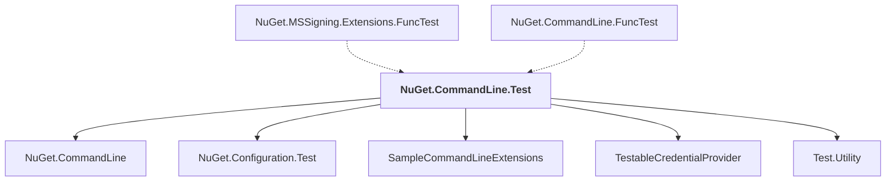

# NuGet.CommandLine.Test

## Overview

| Property | Value |
|----------|-------|
| Category | Test |
| Repository | NuGet.Client |
| Path | `test/NuGet.Clients.Tests/NuGet.CommandLine.Test/NuGet.CommandLine.Test.csproj` |
| Project References | 5 |
| NuGet Dependencies | 2 |
| Consumers | 2 |

## Dependency Diagram

## Project References
- NuGet.CommandLine
- NuGet.Configuration.Test
- SampleCommandLineExtensions
- TestableCredentialProvider
- Test.Utility

## Consumed By
- NuGet.MSSigning.Extensions.FuncTest
- NuGet.CommandLine.FuncTest

## External NuGet Packages
| Package | Version |
|---------|---------||
| Microsoft.Build.Framework |  |
| Microsoft.TestPlatform.Portable |  |

---

*[Back to Index](../index.md)*
