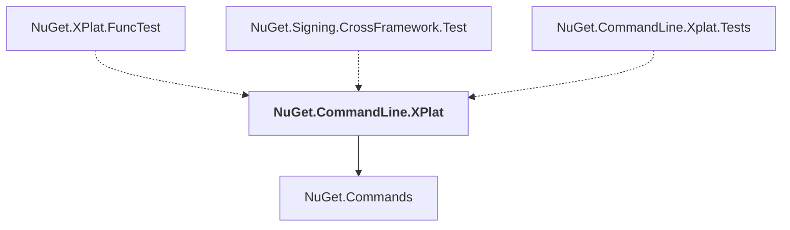

# NuGet.CommandLine.XPlat

## Overview

| Property | Value |
|----------|-------|
| Category | Application |
| Repository | NuGet.Client |
| Path | `src/NuGet.Core/NuGet.CommandLine.XPlat/NuGet.CommandLine.XPlat.csproj` |
| Project References | 1 |
| NuGet Dependencies | 5 |
| Consumers | 3 |

## Dependency Diagram

## Project References
- NuGet.Commands

## Consumed By
- NuGet.XPlat.FuncTest
- NuGet.Signing.CrossFramework.Test
- NuGet.CommandLine.Xplat.Tests

## External NuGet Packages
| Package | Version |
|---------|---------||
| Microsoft.Extensions.CommandLineUtils.Sources |  |
| Microsoft.Build |  |
| Spectre.Console |  |
| System.CommandLine |  |
| Microsoft.Build.Locator |  |

---

*[Back to Index](../index.md)*
