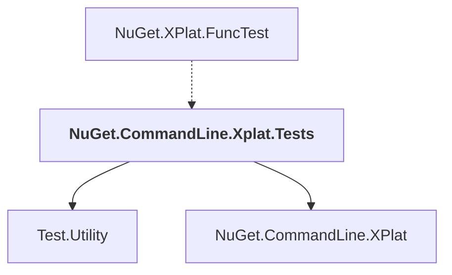

# NuGet.CommandLine.Xplat.Tests

## Overview

| Property | Value |
|----------|-------|
| Category | Test |
| Repository | NuGet.Client |
| Path | `test/NuGet.Core.Tests/NuGet.CommandLine.Xplat.Tests/NuGet.CommandLine.Xplat.Tests.csproj` |
| Project References | 2 |
| NuGet Dependencies | 5 |
| Consumers | 1 |

## Dependency Diagram

## Project References
- Test.Utility
- NuGet.CommandLine.XPlat

## Consumed By
- NuGet.XPlat.FuncTest

## External NuGet Packages
| Package | Version |
|---------|---------||
| Microsoft.Build |  |
| Microsoft.Build.Framework |  |
| Microsoft.Build.Locator |  |
| Spectre.Console.Testing |  |
| System.CommandLine |  |

---

*[Back to Index](../index.md)*
