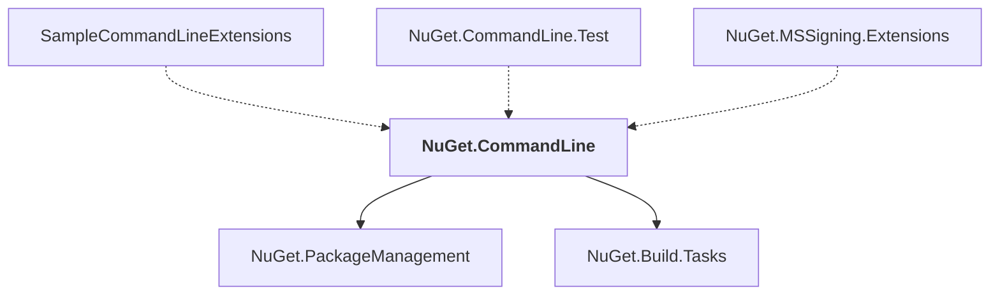

# NuGet.CommandLine

## Overview

| Property | Value |
|----------|-------|
| Category | Application |
| Repository | NuGet.Client |
| Path | `src/NuGet.Clients/NuGet.CommandLine/NuGet.CommandLine.csproj` |
| Project References | 2 |
| NuGet Dependencies | 4 |
| Consumers | 3 |

## Dependency Diagram

## Project References
- NuGet.PackageManagement
- NuGet.Build.Tasks

## Consumed By
- SampleCommandLineExtensions
- NuGet.CommandLine.Test
- NuGet.MSSigning.Extensions

## External NuGet Packages
| Package | Version |
|---------|---------||
| NuGet.Core |  |
| Microsoft.VisualStudio.Setup.Configuration.Interop |  |
| ILRepack |  |
| System.Memory |  |

---

*[Back to Index](../index.md)*
