# NuGet.Configuration.Test

## Overview

| Property | Value |
|----------|-------|
| Category | Test |
| Repository | NuGet.Client |
| Path | `test/NuGet.Core.Tests/NuGet.Configuration.Test/NuGet.Configuration.Test.csproj` |
| Project References | 2 |
| NuGet Dependencies | 0 |
| Consumers | 8 |

## Dependency Diagram

```mermaid
graph TD
    NuGet_Configuration_Test["<strong>NuGet.Configuration.Test</strong>"]
    NuGet_Configuration["NuGet.Configuration"]
    NuGet_Configuration_Test --> NuGet_Configuration
    Test_Utility["Test.Utility"]
    NuGet_Configuration_Test --> Test_Utility
    NuGet_Packaging_FuncTest["NuGet.Packaging.FuncTest"]
    NuGet_Packaging_FuncTest -.-> NuGet_Configuration_Test
    NuGet_XPlat_FuncTest["NuGet.XPlat.FuncTest"]
    NuGet_XPlat_FuncTest -.-> NuGet_Configuration_Test
    NuGet_Signing_CrossFramework_Test["NuGet.Signing.CrossFramework.Test"]
    NuGet_Signing_CrossFramework_Test -.-> NuGet_Configuration_Test
    NuGet_CommandLine_FuncTest["NuGet.CommandLine.FuncTest"]
    NuGet_CommandLine_FuncTest -.-> NuGet_Configuration_Test
    NuGet_Commands_Test["NuGet.Commands.Test"]
    NuGet_Commands_Test -.-> NuGet_Configuration_Test
    NuGet_Packaging_Test["NuGet.Packaging.Test"]
    NuGet_Packaging_Test -.-> NuGet_Configuration_Test
    NuGet_Build_Tasks_Test["NuGet.Build.Tasks.Test"]
    NuGet_Build_Tasks_Test -.-> NuGet_Configuration_Test
    NuGet_CommandLine_Test["NuGet.CommandLine.Test"]
    NuGet_CommandLine_Test -.-> NuGet_Configuration_Test
```

## Project References
- NuGet.Configuration
- Test.Utility

## Consumed By
- NuGet.Packaging.FuncTest
- NuGet.XPlat.FuncTest
- NuGet.Signing.CrossFramework.Test
- NuGet.CommandLine.FuncTest
- NuGet.Commands.Test
- NuGet.Packaging.Test
- NuGet.Build.Tasks.Test
- NuGet.CommandLine.Test

---

*[Back to Index](../index.md)*
