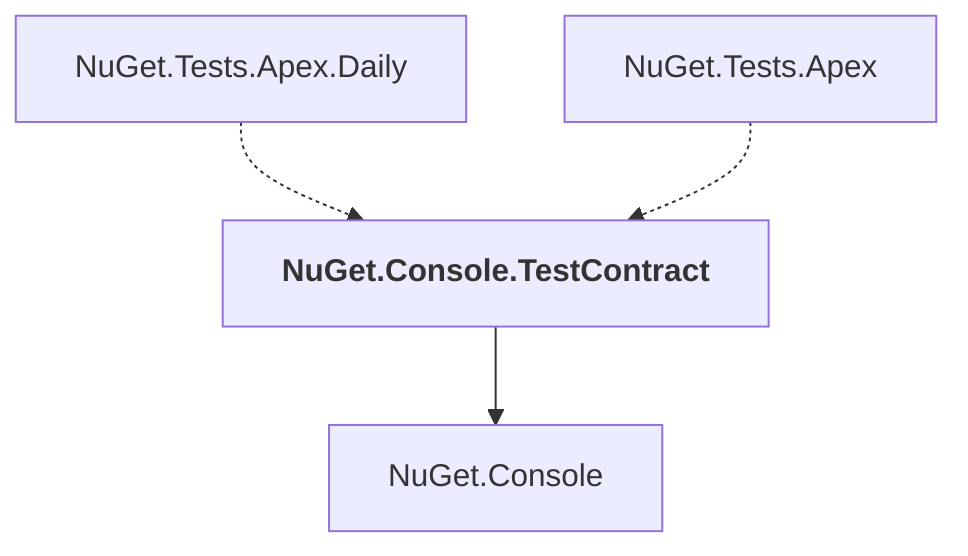

# NuGet.Console.TestContract

## Overview

| Property | Value |
|----------|-------|
| Category | Test |
| Repository | NuGet.Client |
| Path | `test/NuGet.Tests.Apex/NuGet.Console.TestContract/NuGet.Console.TestContract.csproj` |
| Project References | 1 |
| NuGet Dependencies | 0 |
| Consumers | 2 |

## Dependency Diagram

## Project References
- NuGet.Console

## Consumed By
- NuGet.Tests.Apex.Daily
- NuGet.Tests.Apex

---

*[Back to Index](../index.md)*
