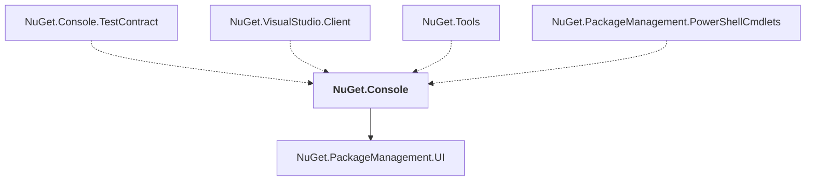

# NuGet.Console

## Overview

| Property | Value |
|----------|-------|
| Category | Tool |
| Repository | NuGet.Client |
| Path | `src/NuGet.Clients/NuGet.Console/NuGet.Console.csproj` |
| Project References | 1 |
| NuGet Dependencies | 2 |
| Consumers | 4 |

## Dependency Diagram

## Project References
- NuGet.PackageManagement.UI

## Consumed By
- NuGet.Console.TestContract
- NuGet.VisualStudio.Client
- NuGet.Tools
- NuGet.PackageManagement.PowerShellCmdlets

## External NuGet Packages
| Package | Version |
|---------|---------||
| Microsoft.VisualStudio.Sdk |  |
| Microsoft.PowerShell.3.ReferenceAssemblies |  |

---

*[Back to Index](../index.md)*
