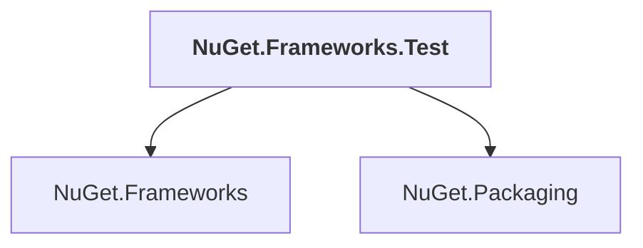

# NuGet.Frameworks.Test

## Overview

| Property | Value |
|----------|-------|
| Category | Test |
| Repository | NuGet.Client |
| Path | `test/NuGet.Core.Tests/NuGet.Frameworks.Test/NuGet.Frameworks.Test.csproj` |
| Project References | 2 |
| NuGet Dependencies | 0 |
| Consumers | 0 |

## Dependency Diagram

## Project References
- NuGet.Frameworks
- NuGet.Packaging

---

*[Back to Index](../index.md)*
