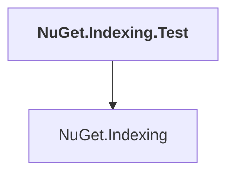

# NuGet.Indexing.Test

## Overview

| Property | Value |
|----------|-------|
| Category | Test |
| Repository | NuGet.Client |
| Path | `test/NuGet.Clients.Tests/NuGet.Indexing.Test/NuGet.Indexing.Test.csproj` |
| Project References | 1 |
| NuGet Dependencies | 0 |
| Consumers | 0 |

## Dependency Diagram

## Project References
- NuGet.Indexing

---

*[Back to Index](../index.md)*
