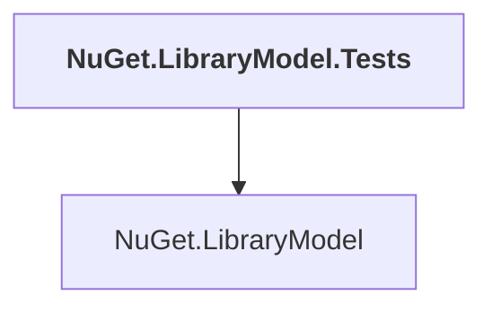

# NuGet.LibraryModel.Tests

## Overview

| Property | Value |
|----------|-------|
| Category | Test |
| Repository | NuGet.Client |
| Path | `test/NuGet.Core.Tests/NuGet.LibraryModel.Tests/NuGet.LibraryModel.Tests.csproj` |
| Project References | 1 |
| NuGet Dependencies | 1 |
| Consumers | 0 |

## Dependency Diagram

## Project References
- NuGet.LibraryModel

## External NuGet Packages
| Package | Version |
|---------|---------||
| Newtonsoft.Json |  |

---

*[Back to Index](../index.md)*
