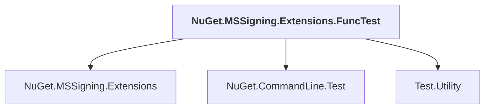

# NuGet.MSSigning.Extensions.FuncTest

## Overview

| Property | Value |
|----------|-------|
| Category | Test |
| Repository | NuGet.Client |
| Path | `test/NuGet.Clients.FuncTests/NuGet.MSSigning.Extensions.FuncTest/NuGet.MSSigning.Extensions.FuncTest.csproj` |
| Project References | 3 |
| NuGet Dependencies | 1 |
| Consumers | 0 |

## Dependency Diagram

## Project References
- NuGet.MSSigning.Extensions
- NuGet.CommandLine.Test
- Test.Utility

## External NuGet Packages
| Package | Version |
|---------|---------||
| Microsoft.Build.Framework |  |

---

*[Back to Index](../index.md)*
