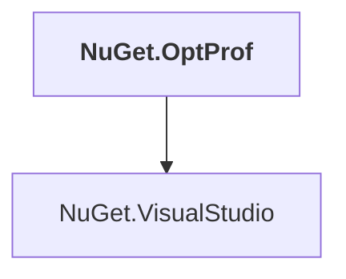

# NuGet.OptProf

## Overview

| Property | Value |
|----------|-------|
| Category | Test |
| Repository | NuGet.Client |
| Path | `test/NuGet.Tests.Apex/NuGet.OptProf/NuGet.OptProf.csproj` |
| Project References | 1 |
| NuGet Dependencies | 6 |
| Consumers | 0 |

## Dependency Diagram

## Project References
- NuGet.VisualStudio

## External NuGet Packages
| Package | Version |
|---------|---------||
| Microsoft.Test.Apex.VisualStudio |  |
| Microsoft.VisualStudio.Sdk |  |
| MSTest.TestAdapter |  |
| MSTest.TestFramework |  |
| Newtonsoft.Json |  |
| Xunit.StaFact |  |

---

*[Back to Index](../index.md)*
