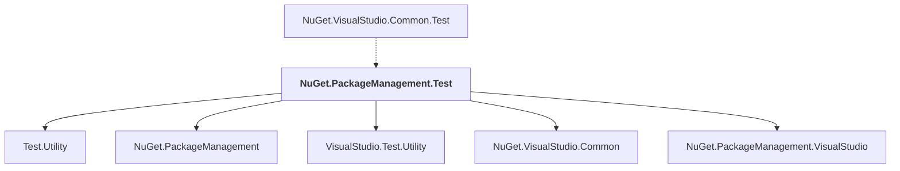

# NuGet.PackageManagement.Test

## Overview

| Property | Value |
|----------|-------|
| Category | Test |
| Repository | NuGet.Client |
| Path | `test/NuGet.Core.Tests/NuGet.PackageManagement.Test/NuGet.PackageManagement.Test.csproj` |
| Project References | 5 |
| NuGet Dependencies | 0 |
| Consumers | 1 |

## Dependency Diagram

## Project References
- Test.Utility
- NuGet.PackageManagement
- VisualStudio.Test.Utility
- NuGet.VisualStudio.Common
- NuGet.PackageManagement.VisualStudio

## Consumed By
- NuGet.VisualStudio.Common.Test

---

*[Back to Index](../index.md)*
