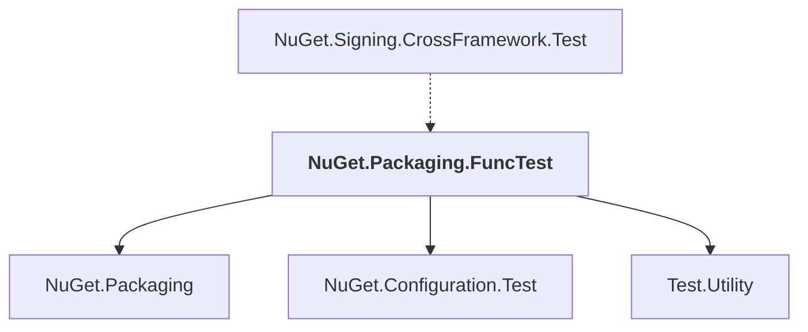

# NuGet.Packaging.FuncTest

## Overview

| Property | Value |
|----------|-------|
| Category | Test |
| Repository | NuGet.Client |
| Path | `test/NuGet.Core.FuncTests/NuGet.Packaging.FuncTest/NuGet.Packaging.FuncTest.csproj` |
| Project References | 3 |
| NuGet Dependencies | 0 |
| Consumers | 1 |

## Dependency Diagram

## Project References
- NuGet.Packaging
- NuGet.Configuration.Test
- Test.Utility

## Consumed By
- NuGet.Signing.CrossFramework.Test

---

*[Back to Index](../index.md)*
