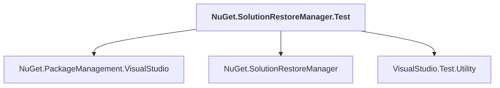

# NuGet.SolutionRestoreManager.Test

## Overview

| Property | Value |
|----------|-------|
| Category | Test |
| Repository | NuGet.Client |
| Path | `test/NuGet.Clients.Tests/NuGet.SolutionRestoreManager.Test/NuGet.SolutionRestoreManager.Test.csproj` |
| Project References | 3 |
| NuGet Dependencies | 2 |
| Consumers | 0 |

## Dependency Diagram

## Project References
- NuGet.PackageManagement.VisualStudio
- NuGet.SolutionRestoreManager
- VisualStudio.Test.Utility

## External NuGet Packages
| Package | Version |
|---------|---------||
| Microsoft.VisualStudio.Sdk.TestFramework.Xunit |  |
| Microsoft.Build.Framework |  |

---

*[Back to Index](../index.md)*
