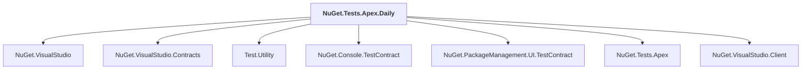

# NuGet.Tests.Apex.Daily

## Overview

| Property | Value |
|----------|-------|
| Category | Test |
| Repository | NuGet.Client |
| Path | `test/NuGet.Tests.Apex/NuGet.Tests.Apex.Daily/NuGet.Tests.Apex.Daily.csproj` |
| Project References | 7 |
| NuGet Dependencies | 4 |
| Consumers | 0 |

## Dependency Diagram

## Project References
- NuGet.VisualStudio
- NuGet.VisualStudio.Contracts
- Test.Utility
- NuGet.Console.TestContract
- NuGet.PackageManagement.UI.TestContract
- NuGet.Tests.Apex
- NuGet.VisualStudio.Client

## External NuGet Packages
| Package | Version |
|---------|---------||
| Microsoft.Test.Apex.VisualStudio |  |
| Microsoft.VisualStudio.Sdk |  |
| MSTest.TestAdapter |  |
| MSTest.TestFramework |  |

---

*[Back to Index](../index.md)*
