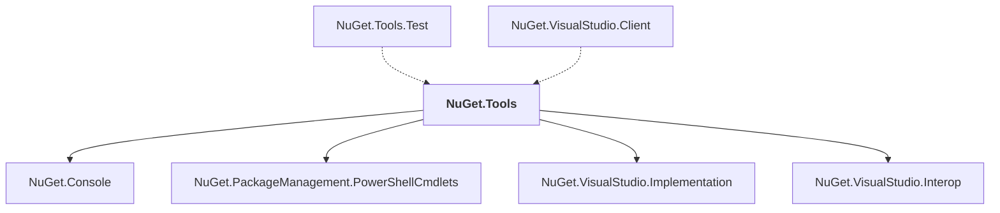

# NuGet.Tools

## Overview

| Property | Value |
|----------|-------|
| Category | Tool |
| Repository | NuGet.Client |
| Path | `src/NuGet.Clients/NuGet.Tools/NuGet.Tools.csproj` |
| Project References | 4 |
| NuGet Dependencies | 2 |
| Consumers | 2 |

## Dependency Diagram

## Project References
- NuGet.Console
- NuGet.PackageManagement.PowerShellCmdlets
- NuGet.VisualStudio.Implementation
- NuGet.VisualStudio.Interop

## Consumed By
- NuGet.Tools.Test
- NuGet.VisualStudio.Client

## External NuGet Packages
| Package | Version |
|---------|---------||
| Microsoft.VisualStudio.Sdk |  |
| Microsoft.VSSDK.BuildTools |  |

---

*[Back to Index](../index.md)*
