# NuGet.VisualStudio.Client

## Overview

| Property | Value |
|----------|-------|
| Category | Tool |
| Repository | NuGet.Client |
| Path | `src/NuGet.Clients/NuGet.VisualStudio.Client/NuGet.VisualStudio.Client.csproj` |
| Project References | 29 |
| NuGet Dependencies | 7 |
| Consumers | 2 |

## Dependency Diagram

```mermaid
graph TD
    NuGet_VisualStudio_Client["<strong>NuGet.VisualStudio.Client</strong>"]
    Microsoft_Build_NuGetSdkResolver["Microsoft.Build.NuGetSdkResolver"]
    NuGet_VisualStudio_Client --> Microsoft_Build_NuGetSdkResolver
    NuGet_Build_Tasks["NuGet.Build.Tasks"]
    NuGet_VisualStudio_Client --> NuGet_Build_Tasks
    NuGet_Build_Tasks_Console["NuGet.Build.Tasks.Console"]
    NuGet_VisualStudio_Client --> NuGet_Build_Tasks_Console
    NuGet_Common["NuGet.Common"]
    NuGet_VisualStudio_Client --> NuGet_Common
    NuGet_Configuration["NuGet.Configuration"]
    NuGet_VisualStudio_Client --> NuGet_Configuration
    NuGet_DependencyResolver_Core["NuGet.DependencyResolver.Core"]
    NuGet_VisualStudio_Client --> NuGet_DependencyResolver_Core
    NuGet_Frameworks["NuGet.Frameworks"]
    NuGet_VisualStudio_Client --> NuGet_Frameworks
    NuGet_LibraryModel["NuGet.LibraryModel"]
    NuGet_VisualStudio_Client --> NuGet_LibraryModel
    NuGet_PackageManagement["NuGet.PackageManagement"]
    NuGet_VisualStudio_Client --> NuGet_PackageManagement
    NuGet_Packaging["NuGet.Packaging"]
    NuGet_VisualStudio_Client --> NuGet_Packaging
    NuGet_ProjectModel["NuGet.ProjectModel"]
    NuGet_VisualStudio_Client --> NuGet_ProjectModel
    NuGet_Protocol["NuGet.Protocol"]
    NuGet_VisualStudio_Client --> NuGet_Protocol
    NuGet_Resolver["NuGet.Resolver"]
    NuGet_VisualStudio_Client --> NuGet_Resolver
    NuGet_Versioning["NuGet.Versioning"]
    NuGet_VisualStudio_Client --> NuGet_Versioning
    NuGet_Tools["NuGet.Tools"]
    NuGet_VisualStudio_Client --> NuGet_Tools
    NuGet_Indexing["NuGet.Indexing"]
    NuGet_VisualStudio_Client --> NuGet_Indexing
    NuGet_Commands["NuGet.Commands"]
    NuGet_VisualStudio_Client --> NuGet_Commands
    NuGet_Credentials["NuGet.Credentials"]
    NuGet_VisualStudio_Client --> NuGet_Credentials
    NuGet_SolutionRestoreManager["NuGet.SolutionRestoreManager"]
    NuGet_VisualStudio_Client --> NuGet_SolutionRestoreManager
    NuGet_VisualStudio_Contracts["NuGet.VisualStudio.Contracts"]
    NuGet_VisualStudio_Client --> NuGet_VisualStudio_Contracts
    NuGet_VisualStudio_Implementation["NuGet.VisualStudio.Implementation"]
    NuGet_VisualStudio_Client --> NuGet_VisualStudio_Implementation
    NuGet_PackageManagement_PowerShellCmdlets["NuGet.PackageManagement.PowerShellCmdlets"]
    NuGet_VisualStudio_Client --> NuGet_PackageManagement_PowerShellCmdlets
    NuGet_PackageManagement_UI["NuGet.PackageManagement.UI"]
    NuGet_VisualStudio_Client --> NuGet_PackageManagement_UI
    NuGet_PackageManagement_VisualStudio["NuGet.PackageManagement.VisualStudio"]
    NuGet_VisualStudio_Client --> NuGet_PackageManagement_VisualStudio
    NuGet_VisualStudio_Internal_Contracts["NuGet.VisualStudio.Internal.Contracts"]
    NuGet_VisualStudio_Client --> NuGet_VisualStudio_Internal_Contracts
    NuGet_VisualStudio_Interop["NuGet.VisualStudio.Interop"]
    NuGet_VisualStudio_Client --> NuGet_VisualStudio_Interop
    NuGet_VisualStudio_Common["NuGet.VisualStudio.Common"]
    NuGet_VisualStudio_Client --> NuGet_VisualStudio_Common
    NuGet_VisualStudio["NuGet.VisualStudio"]
    NuGet_VisualStudio_Client --> NuGet_VisualStudio
    NuGet_Console["NuGet.Console"]
    NuGet_VisualStudio_Client --> NuGet_Console
    NuGet_Tests_Apex_Daily["NuGet.Tests.Apex.Daily"]
    NuGet_Tests_Apex_Daily -.-> NuGet_VisualStudio_Client
    NuGet_Tests_Apex["NuGet.Tests.Apex"]
    NuGet_Tests_Apex -.-> NuGet_VisualStudio_Client
```

## Project References
- Microsoft.Build.NuGetSdkResolver
- NuGet.Build.Tasks
- NuGet.Build.Tasks.Console
- NuGet.Common
- NuGet.Configuration
- NuGet.DependencyResolver.Core
- NuGet.Frameworks
- NuGet.LibraryModel
- NuGet.PackageManagement
- NuGet.Packaging
- NuGet.ProjectModel
- NuGet.Protocol
- NuGet.Resolver
- NuGet.Versioning
- NuGet.Tools
- NuGet.Indexing
- NuGet.Commands
- NuGet.Credentials
- NuGet.SolutionRestoreManager
- NuGet.VisualStudio.Contracts
- NuGet.VisualStudio.Implementation
- NuGet.PackageManagement.PowerShellCmdlets
- NuGet.PackageManagement.UI
- NuGet.PackageManagement.VisualStudio
- NuGet.VisualStudio.Internal.Contracts
- NuGet.VisualStudio.Interop
- NuGet.VisualStudio.Common
- NuGet.VisualStudio
- NuGet.Console

## Consumed By
- NuGet.Tests.Apex.Daily
- NuGet.Tests.Apex

## External NuGet Packages
| Package | Version |
|---------|---------||
| Microsoft.VisualStudio.Extensibility.Sdk |  |
| Microsoft.VisualStudio.Extensibility.Build |  |
| Lucene.Net |  |
| SharpZipLib |  |
| Newtonsoft.Json |  |
| Microsoft.Web.Xdt |  |
| Microsoft.VSSDK.BuildTools |  |

---

*[Back to Index](../index.md)*
