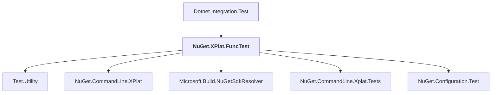

# NuGet.XPlat.FuncTest

## Overview

| Property | Value |
|----------|-------|
| Category | Test |
| Repository | NuGet.Client |
| Path | `test/NuGet.Core.FuncTests/NuGet.XPlat.FuncTest/NuGet.XPlat.FuncTest.csproj` |
| Project References | 5 |
| NuGet Dependencies | 1 |
| Consumers | 1 |

## Dependency Diagram

## Project References
- Test.Utility
- NuGet.CommandLine.XPlat
- Microsoft.Build.NuGetSdkResolver
- NuGet.CommandLine.Xplat.Tests
- NuGet.Configuration.Test

## Consumed By
- Dotnet.Integration.Test

## External NuGet Packages
| Package | Version |
|---------|---------||
| Spectre.Console.Testing |  |

---

*[Back to Index](../index.md)*
