# Test.Utility

## Overview

| Property | Value |
|----------|-------|
| Category | Test |
| Repository | NuGet.Client |
| Path | `test/TestUtilities/Test.Utility/Test.Utility.csproj` |
| Project References | 2 |
| NuGet Dependencies | 8 |
| Consumers | 30 |

## Dependency Diagram

```mermaid
graph TD
    Test_Utility["<strong>Test.Utility</strong>"]
    NuGet_PackageManagement["NuGet.PackageManagement"]
    Test_Utility --> NuGet_PackageManagement
    Microsoft_Internal_NuGet_Testing_SignedPackages["Microsoft.Internal.NuGet.Testing.SignedPackages"]
    Test_Utility --> Microsoft_Internal_NuGet_Testing_SignedPackages
    Dotnet_Integration_Test["Dotnet.Integration.Test"]
    Dotnet_Integration_Test -.-> Test_Utility
    NuGet_Packaging_FuncTest["NuGet.Packaging.FuncTest"]
    NuGet_Packaging_FuncTest -.-> Test_Utility
    NuGet_Protocol_FuncTest["NuGet.Protocol.FuncTest"]
    NuGet_Protocol_FuncTest -.-> Test_Utility
    Msbuild_Integration_Test["Msbuild.Integration.Test"]
    Msbuild_Integration_Test -.-> Test_Utility
    NuGet_XPlat_FuncTest["NuGet.XPlat.FuncTest"]
    NuGet_XPlat_FuncTest -.-> Test_Utility
    NuGet_Signing_CrossFramework_Test["NuGet.Signing.CrossFramework.Test"]
    NuGet_Signing_CrossFramework_Test -.-> Test_Utility
    NuGet_Commands_FuncTest["NuGet.Commands.FuncTest"]
    NuGet_Commands_FuncTest -.-> Test_Utility
    NuGet_MSSigning_Extensions_FuncTest["NuGet.MSSigning.Extensions.FuncTest"]
    NuGet_MSSigning_Extensions_FuncTest -.-> Test_Utility
    NuGet_CommandLine_FuncTest["NuGet.CommandLine.FuncTest"]
    NuGet_CommandLine_FuncTest -.-> Test_Utility
    NuGet_Build_Tasks_Pack_Test["NuGet.Build.Tasks.Pack.Test"]
    NuGet_Build_Tasks_Pack_Test -.-> Test_Utility
    Microsoft_Build_NuGetSdkResolver_Test["Microsoft.Build.NuGetSdkResolver.Test"]
    Microsoft_Build_NuGetSdkResolver_Test -.-> Test_Utility
    NuGet_CommandLine_Xplat_Tests["NuGet.CommandLine.Xplat.Tests"]
    NuGet_CommandLine_Xplat_Tests -.-> Test_Utility
    NuGet_Common_Test["NuGet.Common.Test"]
    NuGet_Common_Test -.-> Test_Utility
    NuGet_PackageManagement_Test["NuGet.PackageManagement.Test"]
    NuGet_PackageManagement_Test -.-> Test_Utility
    NuGet_DependencyResolver_Core_Tests["NuGet.DependencyResolver.Core.Tests"]
    NuGet_DependencyResolver_Core_Tests -.-> Test_Utility
    more_consumers["... +15 more"]
    more_consumers -.-> Test_Utility
```

## Project References
- NuGet.PackageManagement
- Microsoft.Internal.NuGet.Testing.SignedPackages

## Consumed By
- Dotnet.Integration.Test
- NuGet.Packaging.FuncTest
- NuGet.Protocol.FuncTest
- Msbuild.Integration.Test
- NuGet.XPlat.FuncTest
- NuGet.Signing.CrossFramework.Test
- NuGet.Commands.FuncTest
- NuGet.MSSigning.Extensions.FuncTest
- NuGet.CommandLine.FuncTest
- NuGet.Build.Tasks.Pack.Test
- Microsoft.Build.NuGetSdkResolver.Test
- NuGet.CommandLine.Xplat.Tests
- NuGet.Common.Test
- NuGet.PackageManagement.Test
- NuGet.DependencyResolver.Core.Tests
- NuGet.Build.Tasks.Console.Test
- NuGet.ProjectModel.Test
- NuGet.Commands.Test
- NuGet.Credentials.Test
- NuGet.Versioning.Test
- NuGet.Packaging.Test
- NuGet.Protocol.Tests
- NuGet.Build.Tasks.Test
- NuGet.Configuration.Test
- NuGet.Shared.Tests
- NuGet.CommandLine.Test
- NuGet.MSSigning.Extensions.Test
- VisualStudio.Test.Utility
- NuGet.Tests.Apex.Daily
- NuGet.Tests.Apex

## External NuGet Packages
| Package | Version |
|---------|---------||
| Moq |  |
| xunit |  |
| AwesomeAssertions |  |
| Microsoft.Build |  |
| Microsoft.Build.Tasks.Core |  |
| Microsoft.Build.Utilities.Core |  |
| System.Formats.Asn1 |  |
| System.Security.Cryptography.Pkcs |  |

---

*[Back to Index](../index.md)*
