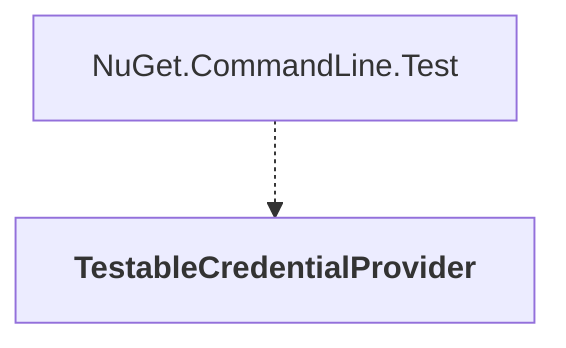

# TestableCredentialProvider

## Overview

| Property | Value |
|----------|-------|
| Category | Test |
| Repository | NuGet.Client |
| Path | `test/TestExtensions/TestablePluginCredentialProvider/TestableCredentialProvider.csproj` |
| Project References | 0 |
| NuGet Dependencies | 2 |
| Consumers | 1 |

## Dependency Diagram

## Consumed By
- NuGet.CommandLine.Test

## External NuGet Packages
| Package | Version |
|---------|---------||
| Newtonsoft.Json |  |
| Microsoft.CSharp |  |

---

*[Back to Index](../index.md)*
