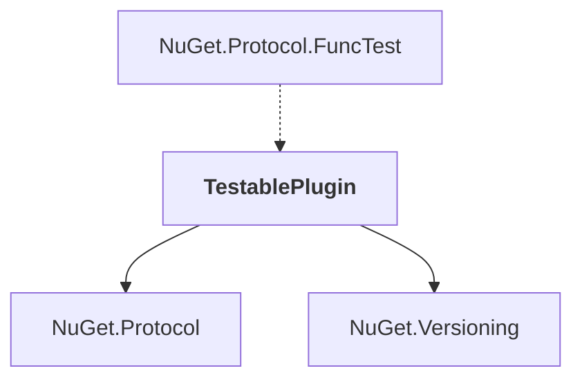

# TestablePlugin

## Overview

| Property | Value |
|----------|-------|
| Category | Test |
| Repository | NuGet.Client |
| Path | `test/TestExtensions/TestablePlugin/TestablePlugin.csproj` |
| Project References | 2 |
| NuGet Dependencies | 0 |
| Consumers | 1 |

## Dependency Diagram

## Project References
- NuGet.Protocol
- NuGet.Versioning

## Consumed By
- NuGet.Protocol.FuncTest

---

*[Back to Index](../index.md)*
