# VisualStudio.Test.Utility

## Overview

| Property | Value |
|----------|-------|
| Category | Test |
| Repository | NuGet.Client |
| Path | `test/TestUtilities/VisualStudio.Test.Utility/VisualStudio.Test.Utility.csproj` |
| Project References | 4 |
| NuGet Dependencies | 5 |
| Consumers | 9 |

## Dependency Diagram

```mermaid
graph TD
    VisualStudio_Test_Utility["<strong>VisualStudio.Test.Utility</strong>"]
    NuGet_PackageManagement_VisualStudio["NuGet.PackageManagement.VisualStudio"]
    VisualStudio_Test_Utility --> NuGet_PackageManagement_VisualStudio
    NuGet_PackageManagement["NuGet.PackageManagement"]
    VisualStudio_Test_Utility --> NuGet_PackageManagement
    Microsoft_Internal_NuGet_Testing_SignedPackages["Microsoft.Internal.NuGet.Testing.SignedPackages"]
    VisualStudio_Test_Utility --> Microsoft_Internal_NuGet_Testing_SignedPackages
    Test_Utility["Test.Utility"]
    VisualStudio_Test_Utility --> Test_Utility
    NuGet_PackageManagement_Test["NuGet.PackageManagement.Test"]
    NuGet_PackageManagement_Test -.-> VisualStudio_Test_Utility
    NuGet_VisualStudio_Test["NuGet.VisualStudio.Test"]
    NuGet_VisualStudio_Test -.-> VisualStudio_Test_Utility
    NuGet_SolutionRestoreManager_Test["NuGet.SolutionRestoreManager.Test"]
    NuGet_SolutionRestoreManager_Test -.-> VisualStudio_Test_Utility
    NuGet_Tools_Test["NuGet.Tools.Test"]
    NuGet_Tools_Test -.-> VisualStudio_Test_Utility
    NuGet_PackageManagement_VisualStudio_Test["NuGet.PackageManagement.VisualStudio.Test"]
    NuGet_PackageManagement_VisualStudio_Test -.-> VisualStudio_Test_Utility
    NuGetConsole_Host_PowerShell_Test["NuGetConsole.Host.PowerShell.Test"]
    NuGetConsole_Host_PowerShell_Test -.-> VisualStudio_Test_Utility
    NuGet_VisualStudio_Common_Test["NuGet.VisualStudio.Common.Test"]
    NuGet_VisualStudio_Common_Test -.-> VisualStudio_Test_Utility
    NuGet_VisualStudio_Implementation_Test["NuGet.VisualStudio.Implementation.Test"]
    NuGet_VisualStudio_Implementation_Test -.-> VisualStudio_Test_Utility
    NuGet_PackageManagement_UI_Test["NuGet.PackageManagement.UI.Test"]
    NuGet_PackageManagement_UI_Test -.-> VisualStudio_Test_Utility
```

## Project References
- NuGet.PackageManagement.VisualStudio
- NuGet.PackageManagement
- Microsoft.Internal.NuGet.Testing.SignedPackages
- Test.Utility

## Consumed By
- NuGet.PackageManagement.Test
- NuGet.VisualStudio.Test
- NuGet.SolutionRestoreManager.Test
- NuGet.Tools.Test
- NuGet.PackageManagement.VisualStudio.Test
- NuGetConsole.Host.PowerShell.Test
- NuGet.VisualStudio.Common.Test
- NuGet.VisualStudio.Implementation.Test
- NuGet.PackageManagement.UI.Test

## External NuGet Packages
| Package | Version |
|---------|---------||
| Microsoft.Build |  |
| Microsoft.Build.Tasks.Core |  |
| Microsoft.Build.Utilities.Core |  |
| Microsoft.VisualStudio.ProjectSystem |  |
| Microsoft.VisualStudio.Sdk |  |

---

*[Back to Index](../index.md)*
