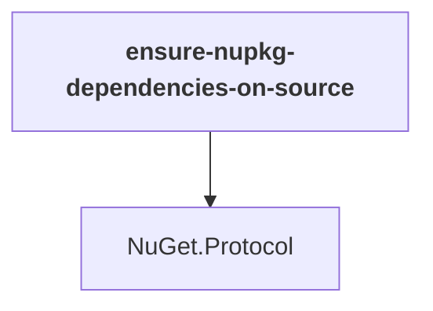

# ensure-nupkg-dependencies-on-source

## Overview

| Property | Value |
|----------|-------|
| Category | Application |
| Repository | NuGet.Client |
| Path | `tools-local/ensure-nupkg-dependencies-on-source/ensure-nupkg-dependencies-on-source.csproj` |
| Project References | 1 |
| NuGet Dependencies | 1 |
| Consumers | 0 |

## Dependency Diagram

## Project References
- NuGet.Protocol

## External NuGet Packages
| Package | Version |
|---------|---------||
| System.CommandLine |  |

---

*[Back to Index](../index.md)*
