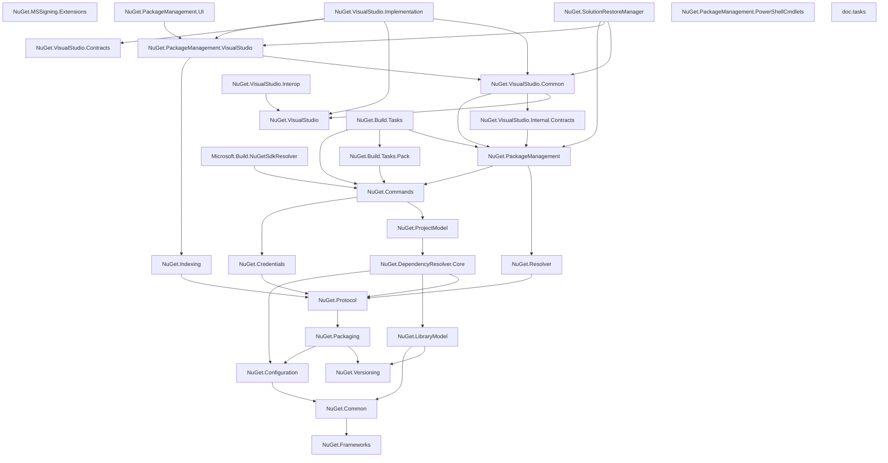
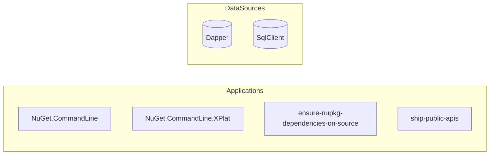
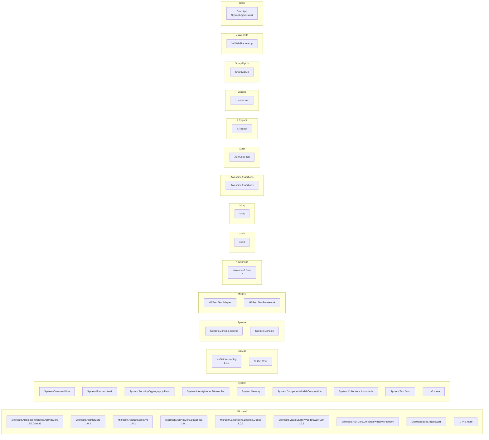

# Dependency Visualizations

## landscape

```mermaid
graph LR
    subgraph Tests
        NuGet_Client_UAPApp["UAPApp"]
        NuGet_Client_ClassLibrary1["ClassLibrary1"]
        NuGet_Client_WebApplication["WebApplication"]
        NuGet_Client_BuildIntegratedClassLibrary["BuildIntegratedClassLibrary"]
        NuGet_Client_EmptyMvcApplication["EmptyMvcApplication"]
        NuGet_Client_ConsoleApp["ConsoleApp"]
        NuGet_Client_ClassLibrary47["ClassLibrary47"]
        NuGet_Client_WPFApplication["WPFApplication"]
        NuGet_Client_ConsoleApp10["ConsoleApp10"]
        NuGet_Client_classlibrary["classlibrary"]
        NuGet_Client_consoleapplication["consoleapplication"]
        NuGet_Client_ClassLibrary6["ClassLibrary6"]
        NuGet_Client_BuildIntegratedProj["BuildIntegratedProj"]
        NuGet_Client_Dotnet_Integration_Test["Dotnet.Integration.Test"]
        NuGet_Client_NuGet_Packaging_FuncTest["NuGet.Packaging.FuncTest"]
        NuGet_Client_NuGet_Protocol_FuncTest["NuGet.Protocol.FuncTest"]
        NuGet_Client_Msbuild_Integration_Test["Msbuild.Integration.Test"]
        NuGet_Client_NuGet_XPlat_FuncTest["NuGet.XPlat.FuncTest"]
        NuGet_Client_NuGet_Signing_CrossFramework_Test["NuGet.Signing.CrossFramework.Test"]
        NuGet_Client_NuGet_Commands_FuncTest["NuGet.Commands.FuncTest"]
        NuGet_Client_NuGet_MSSigning_Extensions_FuncTest["NuGet.MSSigning.Extensions.FuncTest"]
        NuGet_Client_NuGet_CommandLine_FuncTest["NuGet.CommandLine.FuncTest"]
        NuGet_Client_NuGet_Build_Tasks_Pack_Test["NuGet.Build.Tasks.Pack.Test"]
        NuGet_Client_Microsoft_Build_NuGetSdkResolver_Test["Microsoft.Build.NuGetSdkResolver.Test"]
        NuGet_Client_NuGet_Frameworks_Test["NuGet.Frameworks.Test"]
        NuGet_Client_NuGet_CommandLine_Xplat_Tests["NuGet.CommandLine.Xplat.Tests"]
        NuGet_Client_NuGet_Common_Test["NuGet.Common.Test"]
        NuGet_Client_NuGet_PackageManagement_Test["NuGet.PackageManagement.Test"]
        NuGet_Client_NuGet_DependencyResolver_Core_Tests["NuGet.DependencyResolver.Core.Tests"]
        NuGet_Client_NuGet_Build_Tasks_Console_Test["NuGet.Build.Tasks.Console.Test"]
        NuGet_Client_NuGet_ProjectModel_Test["NuGet.ProjectModel.Test"]
        NuGet_Client_NuGet_Commands_Test["NuGet.Commands.Test"]
        NuGet_Client_NuGet_Credentials_Test["NuGet.Credentials.Test"]
        NuGet_Client_NuGet_LibraryModel_Tests["NuGet.LibraryModel.Tests"]
        NuGet_Client_NuGet_Versioning_Test["NuGet.Versioning.Test"]
        NuGet_Client_NuGet_Resolver_Test["NuGet.Resolver.Test"]
        NuGet_Client_NuGet_Packaging_Test["NuGet.Packaging.Test"]
        NuGet_Client_NuGet_Protocol_Tests["NuGet.Protocol.Tests"]
        NuGet_Client_NuGet_Build_Tasks_Test["NuGet.Build.Tasks.Test"]
        NuGet_Client_NuGet_Configuration_Test["NuGet.Configuration.Test"]
        NuGet_Client_NuGet_Shared_Tests["NuGet.Shared.Tests"]
        NuGet_Client_GenerateTestPackages["GenerateTestPackages"]
        NuGet_Client_GenerateLicenseList["GenerateLicenseList"]
        NuGet_Client_SampleCommandLineExtensions["SampleCommandLineExtensions"]
        NuGet_Client_API_Test["API.Test"]
        NuGet_Client_TestableCredentialProvider["TestableCredentialProvider"]
        NuGet_Client_TestablePlugin["TestablePlugin"]
        NuGet_Client_NuGet_VisualStudio_Test["NuGet.VisualStudio.Test"]
        NuGet_Client_NuGet_SolutionRestoreManager_Test["NuGet.SolutionRestoreManager.Test"]
        NuGet_Client_NuGet_Tools_Test["NuGet.Tools.Test"]
        NuGet_Client_NuGet_PackageManagement_VisualStudio_Test["NuGet.PackageManagement.VisualStudio.Test"]
        NuGet_Client_NuGet_CommandLine_Test["NuGet.CommandLine.Test"]
        NuGet_Client_NuGet_MSSigning_Extensions_Test["NuGet.MSSigning.Extensions.Test"]
        NuGet_Client_NuGet_Indexing_Test["NuGet.Indexing.Test"]
        NuGet_Client_NuGetConsole_Host_PowerShell_Test["NuGetConsole.Host.PowerShell.Test"]
        NuGet_Client_NuGet_VisualStudio_Internal_Contracts_Test["NuGet.VisualStudio.Internal.Contracts.Test"]
        NuGet_Client_NuGet_VisualStudio_Common_Test["NuGet.VisualStudio.Common.Test"]
        NuGet_Client_NuGet_VisualStudio_Implementation_Test["NuGet.VisualStudio.Implementation.Test"]
        NuGet_Client_NuGet_PackageManagement_UI_Test["NuGet.PackageManagement.UI.Test"]
        NuGet_Client_project1["project1"]
        NuGet_Client_project2["project2"]
        NuGet_Client_Microsoft_Internal_NuGet_Testing_SignedPackages["Microsoft.Internal.NuGet.Testing.SignedPackages"]
        NuGet_Client_Test_Utility["Test.Utility"]
        NuGet_Client_VisualStudio_Test_Utility["VisualStudio.Test.Utility"]
        NuGet_Client_NuGet_Tests_Apex_Daily["NuGet.Tests.Apex.Daily"]
        NuGet_Client_NuGet_Tests_Apex["NuGet.Tests.Apex"]
        NuGet_Client_NuGet_Console_TestContract["NuGet.Console.TestContract"]
        NuGet_Client_PackageReferenceSdk["PackageReferenceSdk"]
        NuGet_Client_NuGet_OptProf["NuGet.OptProf"]
        NuGet_Client_NuGet_PackageManagement_UI_TestContract["NuGet.PackageManagement.UI.TestContract"]
    end
    subgraph Librarys
        NuGet_Client_NuGet_MSSigning_Extensions["NuGet.MSSigning.Extensions"]
        NuGet_Client_NuGet_Indexing["NuGet.Indexing"]
        NuGet_Client_NuGet_VisualStudio_Internal_Contracts["NuGet.VisualStudio.Internal.Contracts"]
        NuGet_Client_NuGet_VisualStudio_Contracts["NuGet.VisualStudio.Contracts"]
        NuGet_Client_NuGet_PackageManagement_VisualStudio["NuGet.PackageManagement.VisualStudio"]
        NuGet_Client_NuGet_SolutionRestoreManager["NuGet.SolutionRestoreManager"]
        NuGet_Client_NuGet_PackageManagement_UI["NuGet.PackageManagement.UI"]
        NuGet_Client_NuGet_VisualStudio["NuGet.VisualStudio"]
        NuGet_Client_NuGet_VisualStudio_Implementation["NuGet.VisualStudio.Implementation"]
        NuGet_Client_NuGet_VisualStudio_Common["NuGet.VisualStudio.Common"]
        NuGet_Client_NuGet_VisualStudio_Interop["NuGet.VisualStudio.Interop"]
        NuGet_Client_NuGet_PackageManagement_PowerShellCmdlets["NuGet.PackageManagement.PowerShellCmdlets"]
        NuGet_Client_NuGet_PackageManagement["NuGet.PackageManagement"]
        NuGet_Client_NuGet_DependencyResolver_Core["NuGet.DependencyResolver.Core"]
        NuGet_Client_NuGet_Credentials["NuGet.Credentials"]
        NuGet_Client_NuGet_Resolver["NuGet.Resolver"]
        NuGet_Client_NuGet_Commands["NuGet.Commands"]
        NuGet_Client_NuGet_ProjectModel["NuGet.ProjectModel"]
        NuGet_Client_NuGet_Packaging["NuGet.Packaging"]
        NuGet_Client_NuGet_Frameworks["NuGet.Frameworks"]
        NuGet_Client_NuGet_Versioning["NuGet.Versioning"]
        NuGet_Client_NuGet_LibraryModel["NuGet.LibraryModel"]
        NuGet_Client_Microsoft_Build_NuGetSdkResolver["Microsoft.Build.NuGetSdkResolver"]
        NuGet_Client_NuGet_Build_Tasks_Pack["NuGet.Build.Tasks.Pack"]
        NuGet_Client_NuGet_Build_Tasks["NuGet.Build.Tasks"]
        NuGet_Client_NuGet_Protocol["NuGet.Protocol"]
        NuGet_Client_NuGet_Configuration["NuGet.Configuration"]
        NuGet_Client_NuGet_Common["NuGet.Common"]
        NuGet_Client_doc_tasks["doc.tasks"]
    end
    subgraph Tools
        NuGet_Client_NuGet_VisualStudio_Client["NuGet.VisualStudio.Client"]
        NuGet_Client_NuGet_Console["NuGet.Console"]
        NuGet_Client_NuGet_Tools["NuGet.Tools"]
        NuGet_Client_NuGet_Build_Tasks_Console["NuGet.Build.Tasks.Console"]
        NuGet_Client_Tools["Tools"]
    end
    subgraph Applications
        NuGet_Client_NuGet_CommandLine["NuGet.CommandLine"]
        NuGet_Client_NuGet_CommandLine_XPlat["NuGet.CommandLine.XPlat"]
        NuGet_Client_ensure_nupkg_dependencies_on_source["ensure-nupkg-dependencies-on-source"]
        NuGet_Client_ship_public_apis["ship-public-apis"]
    end
    NuGet_Client_Dotnet_Integration_Test --> NuGet_Client_NuGet_XPlat_FuncTest
    NuGet_Client_Dotnet_Integration_Test --> NuGet_Client_Test_Utility
    NuGet_Client_Dotnet_Integration_Test --> NuGet_Client_NuGet_Build_Tasks_Pack
    NuGet_Client_Dotnet_Integration_Test --> NuGet_Client_NuGet_Build_Tasks_Console
    NuGet_Client_Dotnet_Integration_Test --> NuGet_Client_Microsoft_Build_NuGetSdkResolver
    NuGet_Client_NuGet_Packaging_FuncTest --> NuGet_Client_NuGet_Packaging
    NuGet_Client_NuGet_Packaging_FuncTest --> NuGet_Client_NuGet_Configuration_Test
    NuGet_Client_NuGet_Packaging_FuncTest --> NuGet_Client_Test_Utility
    NuGet_Client_NuGet_Protocol_FuncTest --> NuGet_Client_TestablePlugin
    NuGet_Client_NuGet_Protocol_FuncTest --> NuGet_Client_Test_Utility
    NuGet_Client_Msbuild_Integration_Test --> NuGet_Client_Microsoft_Build_NuGetSdkResolver
    NuGet_Client_Msbuild_Integration_Test --> NuGet_Client_NuGet_Build_Tasks_Console
    NuGet_Client_Msbuild_Integration_Test --> NuGet_Client_NuGet_Build_Tasks_Pack
    NuGet_Client_Msbuild_Integration_Test --> NuGet_Client_NuGet_Build_Tasks
    NuGet_Client_Msbuild_Integration_Test --> NuGet_Client_Test_Utility
    NuGet_Client_NuGet_XPlat_FuncTest --> NuGet_Client_Test_Utility
    NuGet_Client_NuGet_XPlat_FuncTest --> NuGet_Client_NuGet_CommandLine_XPlat
    NuGet_Client_NuGet_XPlat_FuncTest --> NuGet_Client_Microsoft_Build_NuGetSdkResolver
    NuGet_Client_NuGet_XPlat_FuncTest --> NuGet_Client_NuGet_CommandLine_Xplat_Tests
    NuGet_Client_NuGet_XPlat_FuncTest --> NuGet_Client_NuGet_Configuration_Test
    NuGet_Client_NuGet_Signing_CrossFramework_Test --> NuGet_Client_NuGet_Build_Tasks_Console
    NuGet_Client_NuGet_Signing_CrossFramework_Test --> NuGet_Client_NuGet_Build_Tasks_Pack
    NuGet_Client_NuGet_Signing_CrossFramework_Test --> NuGet_Client_NuGet_CommandLine_XPlat
    NuGet_Client_NuGet_Signing_CrossFramework_Test --> NuGet_Client_NuGet_Packaging
    NuGet_Client_NuGet_Signing_CrossFramework_Test --> NuGet_Client_NuGet_Packaging_FuncTest
    NuGet_Client_NuGet_Signing_CrossFramework_Test --> NuGet_Client_NuGet_Configuration_Test
    NuGet_Client_NuGet_Signing_CrossFramework_Test --> NuGet_Client_Test_Utility
    NuGet_Client_NuGet_Commands_FuncTest --> NuGet_Client_Test_Utility
    NuGet_Client_NuGet_MSSigning_Extensions_FuncTest --> NuGet_Client_NuGet_MSSigning_Extensions
    NuGet_Client_NuGet_MSSigning_Extensions_FuncTest --> NuGet_Client_NuGet_CommandLine_Test
    NuGet_Client_NuGet_MSSigning_Extensions_FuncTest --> NuGet_Client_Test_Utility
    NuGet_Client_NuGet_CommandLine_FuncTest --> NuGet_Client_Test_Utility
    NuGet_Client_NuGet_CommandLine_FuncTest --> NuGet_Client_NuGet_CommandLine_Test
    NuGet_Client_NuGet_CommandLine_FuncTest --> NuGet_Client_NuGet_Configuration_Test
    NuGet_Client_NuGet_Build_Tasks_Pack_Test --> NuGet_Client_Test_Utility
    NuGet_Client_NuGet_Build_Tasks_Pack_Test --> NuGet_Client_NuGet_Build_Tasks_Pack
    NuGet_Client_Microsoft_Build_NuGetSdkResolver_Test --> NuGet_Client_Microsoft_Build_NuGetSdkResolver
    NuGet_Client_Microsoft_Build_NuGetSdkResolver_Test --> NuGet_Client_Test_Utility
    NuGet_Client_NuGet_Frameworks_Test --> NuGet_Client_NuGet_Frameworks
    NuGet_Client_NuGet_Frameworks_Test --> NuGet_Client_NuGet_Packaging
    NuGet_Client_NuGet_CommandLine_Xplat_Tests --> NuGet_Client_Test_Utility
    NuGet_Client_NuGet_CommandLine_Xplat_Tests --> NuGet_Client_NuGet_CommandLine_XPlat
    NuGet_Client_NuGet_Common_Test --> NuGet_Client_NuGet_Common
    NuGet_Client_NuGet_Common_Test --> NuGet_Client_Test_Utility
    NuGet_Client_NuGet_PackageManagement_Test --> NuGet_Client_Test_Utility
    NuGet_Client_NuGet_PackageManagement_Test --> NuGet_Client_NuGet_PackageManagement
    NuGet_Client_NuGet_PackageManagement_Test --> NuGet_Client_VisualStudio_Test_Utility
    NuGet_Client_NuGet_PackageManagement_Test --> NuGet_Client_NuGet_VisualStudio_Common
    NuGet_Client_NuGet_PackageManagement_Test --> NuGet_Client_NuGet_PackageManagement_VisualStudio
    NuGet_Client_NuGet_DependencyResolver_Core_Tests --> NuGet_Client_NuGet_DependencyResolver_Core
    NuGet_Client_NuGet_DependencyResolver_Core_Tests --> NuGet_Client_Test_Utility
    NuGet_Client_NuGet_Build_Tasks_Console_Test --> NuGet_Client_NuGet_Build_Tasks_Console
    NuGet_Client_NuGet_Build_Tasks_Console_Test --> NuGet_Client_Test_Utility
    NuGet_Client_NuGet_ProjectModel_Test --> NuGet_Client_NuGet_ProjectModel
    NuGet_Client_NuGet_ProjectModel_Test --> NuGet_Client_Test_Utility
    NuGet_Client_NuGet_Commands_Test --> NuGet_Client_NuGet_Commands
    NuGet_Client_NuGet_Commands_Test --> NuGet_Client_Test_Utility
    NuGet_Client_NuGet_Commands_Test --> NuGet_Client_NuGet_Configuration_Test
    NuGet_Client_NuGet_Credentials_Test --> NuGet_Client_NuGet_Credentials
    NuGet_Client_NuGet_Credentials_Test --> NuGet_Client_Test_Utility
    NuGet_Client_NuGet_LibraryModel_Tests --> NuGet_Client_NuGet_LibraryModel
    NuGet_Client_NuGet_Versioning_Test --> NuGet_Client_NuGet_Versioning
    NuGet_Client_NuGet_Versioning_Test --> NuGet_Client_Test_Utility
    NuGet_Client_NuGet_Resolver_Test --> NuGet_Client_NuGet_Resolver
    NuGet_Client_NuGet_Packaging_Test --> NuGet_Client_NuGet_Packaging
    NuGet_Client_NuGet_Packaging_Test --> NuGet_Client_Test_Utility
    NuGet_Client_NuGet_Packaging_Test --> NuGet_Client_NuGet_Configuration_Test
    NuGet_Client_NuGet_Protocol_Tests --> NuGet_Client_NuGet_Protocol
    NuGet_Client_NuGet_Protocol_Tests --> NuGet_Client_Test_Utility
    NuGet_Client_NuGet_Build_Tasks_Test --> NuGet_Client_Test_Utility
    NuGet_Client_NuGet_Build_Tasks_Test --> NuGet_Client_NuGet_Build_Tasks
    NuGet_Client_NuGet_Build_Tasks_Test --> NuGet_Client_NuGet_Build_Tasks_Console
    NuGet_Client_NuGet_Build_Tasks_Test --> NuGet_Client_NuGet_Configuration_Test
    NuGet_Client_NuGet_Configuration_Test --> NuGet_Client_NuGet_Configuration
    NuGet_Client_NuGet_Configuration_Test --> NuGet_Client_Test_Utility
    NuGet_Client_NuGet_Shared_Tests --> NuGet_Client_Test_Utility
    NuGet_Client_SampleCommandLineExtensions --> NuGet_Client_NuGet_CommandLine
    NuGet_Client_API_Test --> NuGet_Client_NuGet_PackageManagement_VisualStudio
    NuGet_Client_TestablePlugin --> NuGet_Client_NuGet_Protocol
    NuGet_Client_TestablePlugin --> NuGet_Client_NuGet_Versioning
    NuGet_Client_NuGet_VisualStudio_Test --> NuGet_Client_NuGet_VisualStudio
    NuGet_Client_NuGet_VisualStudio_Test --> NuGet_Client_VisualStudio_Test_Utility
    NuGet_Client_NuGet_SolutionRestoreManager_Test --> NuGet_Client_NuGet_PackageManagement_VisualStudio
    NuGet_Client_NuGet_SolutionRestoreManager_Test --> NuGet_Client_NuGet_SolutionRestoreManager
    NuGet_Client_NuGet_SolutionRestoreManager_Test --> NuGet_Client_VisualStudio_Test_Utility
    NuGet_Client_NuGet_Tools_Test --> NuGet_Client_NuGet_Tools
    NuGet_Client_NuGet_Tools_Test --> NuGet_Client_VisualStudio_Test_Utility
    NuGet_Client_NuGet_PackageManagement_VisualStudio_Test --> NuGet_Client_NuGet_PackageManagement_UI
    NuGet_Client_NuGet_PackageManagement_VisualStudio_Test --> NuGet_Client_NuGet_PackageManagement_VisualStudio
    NuGet_Client_NuGet_PackageManagement_VisualStudio_Test --> NuGet_Client_NuGet_VisualStudio_Common
    NuGet_Client_NuGet_PackageManagement_VisualStudio_Test --> NuGet_Client_NuGet_VisualStudio
    NuGet_Client_NuGet_PackageManagement_VisualStudio_Test --> NuGet_Client_VisualStudio_Test_Utility
    NuGet_Client_NuGet_CommandLine_Test --> NuGet_Client_NuGet_CommandLine
    NuGet_Client_NuGet_CommandLine_Test --> NuGet_Client_NuGet_Configuration_Test
    NuGet_Client_NuGet_CommandLine_Test --> NuGet_Client_SampleCommandLineExtensions
    NuGet_Client_NuGet_CommandLine_Test --> NuGet_Client_TestableCredentialProvider
    NuGet_Client_NuGet_CommandLine_Test --> NuGet_Client_Test_Utility
    NuGet_Client_NuGet_MSSigning_Extensions_Test --> NuGet_Client_Test_Utility
    NuGet_Client_NuGet_MSSigning_Extensions_Test --> NuGet_Client_NuGet_MSSigning_Extensions
    NuGet_Client_NuGet_Indexing_Test --> NuGet_Client_NuGet_Indexing
    NuGet_Client_NuGetConsole_Host_PowerShell_Test --> NuGet_Client_NuGet_PackageManagement_PowerShellCmdlets
    NuGet_Client_NuGetConsole_Host_PowerShell_Test --> NuGet_Client_VisualStudio_Test_Utility
    NuGet_Client_NuGet_VisualStudio_Internal_Contracts_Test --> NuGet_Client_NuGet_VisualStudio_Internal_Contracts
    NuGet_Client_NuGet_VisualStudio_Common_Test --> NuGet_Client_NuGet_PackageManagement_Test
    NuGet_Client_NuGet_VisualStudio_Common_Test --> NuGet_Client_VisualStudio_Test_Utility
    NuGet_Client_NuGet_VisualStudio_Implementation_Test --> NuGet_Client_NuGet_VisualStudio_Implementation
    NuGet_Client_NuGet_VisualStudio_Implementation_Test --> NuGet_Client_VisualStudio_Test_Utility
    NuGet_Client_NuGet_PackageManagement_UI_Test --> NuGet_Client_NuGet_PackageManagement_UI
    NuGet_Client_NuGet_PackageManagement_UI_Test --> NuGet_Client_NuGet_PackageManagement_VisualStudio
    NuGet_Client_NuGet_PackageManagement_UI_Test --> NuGet_Client_NuGet_VisualStudio
    NuGet_Client_NuGet_PackageManagement_UI_Test --> NuGet_Client_VisualStudio_Test_Utility
    NuGet_Client_Microsoft_Internal_NuGet_Testing_SignedPackages --> NuGet_Client_NuGet_Packaging
    NuGet_Client_Test_Utility --> NuGet_Client_NuGet_PackageManagement
    NuGet_Client_Test_Utility --> NuGet_Client_Microsoft_Internal_NuGet_Testing_SignedPackages
    NuGet_Client_VisualStudio_Test_Utility --> NuGet_Client_NuGet_PackageManagement_VisualStudio
    NuGet_Client_VisualStudio_Test_Utility --> NuGet_Client_NuGet_PackageManagement
    NuGet_Client_VisualStudio_Test_Utility --> NuGet_Client_Microsoft_Internal_NuGet_Testing_SignedPackages
    NuGet_Client_VisualStudio_Test_Utility --> NuGet_Client_Test_Utility
    NuGet_Client_NuGet_Tests_Apex_Daily --> NuGet_Client_NuGet_VisualStudio
    NuGet_Client_NuGet_Tests_Apex_Daily --> NuGet_Client_NuGet_VisualStudio_Contracts
    NuGet_Client_NuGet_Tests_Apex_Daily --> NuGet_Client_Test_Utility
    NuGet_Client_NuGet_Tests_Apex_Daily --> NuGet_Client_NuGet_Console_TestContract
    NuGet_Client_NuGet_Tests_Apex_Daily --> NuGet_Client_NuGet_PackageManagement_UI_TestContract
    NuGet_Client_NuGet_Tests_Apex_Daily --> NuGet_Client_NuGet_Tests_Apex
    NuGet_Client_NuGet_Tests_Apex_Daily --> NuGet_Client_NuGet_VisualStudio_Client
    NuGet_Client_NuGet_Tests_Apex --> NuGet_Client_NuGet_VisualStudio
    NuGet_Client_NuGet_Tests_Apex --> NuGet_Client_NuGet_VisualStudio_Contracts
    NuGet_Client_NuGet_Tests_Apex --> NuGet_Client_Test_Utility
    NuGet_Client_NuGet_Tests_Apex --> NuGet_Client_NuGet_Console_TestContract
    NuGet_Client_NuGet_Tests_Apex --> NuGet_Client_NuGet_PackageManagement_UI_TestContract
    NuGet_Client_NuGet_Tests_Apex --> NuGet_Client_NuGet_VisualStudio_Client
    NuGet_Client_NuGet_Console_TestContract --> NuGet_Client_NuGet_Console
    NuGet_Client_NuGet_OptProf --> NuGet_Client_NuGet_VisualStudio
    NuGet_Client_NuGet_PackageManagement_UI_TestContract --> NuGet_Client_NuGet_PackageManagement_UI
    NuGet_Client_NuGet_MSSigning_Extensions --> NuGet_Client_NuGet_CommandLine
    NuGet_Client_NuGet_VisualStudio_Client --> NuGet_Client_Microsoft_Build_NuGetSdkResolver
    NuGet_Client_NuGet_VisualStudio_Client --> NuGet_Client_NuGet_Build_Tasks
    NuGet_Client_NuGet_VisualStudio_Client --> NuGet_Client_NuGet_Build_Tasks_Console
    NuGet_Client_NuGet_VisualStudio_Client --> NuGet_Client_NuGet_Common
    NuGet_Client_NuGet_VisualStudio_Client --> NuGet_Client_NuGet_Configuration
    NuGet_Client_NuGet_VisualStudio_Client --> NuGet_Client_NuGet_DependencyResolver_Core
    NuGet_Client_NuGet_VisualStudio_Client --> NuGet_Client_NuGet_Frameworks
    NuGet_Client_NuGet_VisualStudio_Client --> NuGet_Client_NuGet_LibraryModel
    NuGet_Client_NuGet_VisualStudio_Client --> NuGet_Client_NuGet_PackageManagement
    NuGet_Client_NuGet_VisualStudio_Client --> NuGet_Client_NuGet_Packaging
    NuGet_Client_NuGet_VisualStudio_Client --> NuGet_Client_NuGet_ProjectModel
    NuGet_Client_NuGet_VisualStudio_Client --> NuGet_Client_NuGet_Protocol
    NuGet_Client_NuGet_VisualStudio_Client --> NuGet_Client_NuGet_Resolver
    NuGet_Client_NuGet_VisualStudio_Client --> NuGet_Client_NuGet_Versioning
    NuGet_Client_NuGet_VisualStudio_Client --> NuGet_Client_NuGet_Tools
    NuGet_Client_NuGet_VisualStudio_Client --> NuGet_Client_NuGet_Indexing
    NuGet_Client_NuGet_VisualStudio_Client --> NuGet_Client_NuGet_Commands
    NuGet_Client_NuGet_VisualStudio_Client --> NuGet_Client_NuGet_Credentials
    NuGet_Client_NuGet_VisualStudio_Client --> NuGet_Client_NuGet_SolutionRestoreManager
    NuGet_Client_NuGet_VisualStudio_Client --> NuGet_Client_NuGet_VisualStudio_Contracts
    NuGet_Client_NuGet_VisualStudio_Client --> NuGet_Client_NuGet_VisualStudio_Implementation
    NuGet_Client_NuGet_VisualStudio_Client --> NuGet_Client_NuGet_PackageManagement_PowerShellCmdlets
    NuGet_Client_NuGet_VisualStudio_Client --> NuGet_Client_NuGet_PackageManagement_UI
    NuGet_Client_NuGet_VisualStudio_Client --> NuGet_Client_NuGet_PackageManagement_VisualStudio
    NuGet_Client_NuGet_VisualStudio_Client --> NuGet_Client_NuGet_VisualStudio_Internal_Contracts
    NuGet_Client_NuGet_VisualStudio_Client --> NuGet_Client_NuGet_VisualStudio_Interop
    NuGet_Client_NuGet_VisualStudio_Client --> NuGet_Client_NuGet_VisualStudio_Common
    NuGet_Client_NuGet_VisualStudio_Client --> NuGet_Client_NuGet_VisualStudio
    NuGet_Client_NuGet_VisualStudio_Client --> NuGet_Client_NuGet_Console
    NuGet_Client_NuGet_Indexing --> NuGet_Client_NuGet_Protocol
    NuGet_Client_NuGet_VisualStudio_Internal_Contracts --> NuGet_Client_NuGet_PackageManagement
    NuGet_Client_NuGet_PackageManagement_VisualStudio --> NuGet_Client_NuGet_Indexing
    NuGet_Client_NuGet_PackageManagement_VisualStudio --> NuGet_Client_NuGet_VisualStudio_Common
    NuGet_Client_NuGet_CommandLine --> NuGet_Client_NuGet_PackageManagement
    NuGet_Client_NuGet_CommandLine --> NuGet_Client_NuGet_Build_Tasks
    NuGet_Client_NuGet_SolutionRestoreManager --> NuGet_Client_NuGet_PackageManagement
    NuGet_Client_NuGet_SolutionRestoreManager --> NuGet_Client_NuGet_PackageManagement_VisualStudio
    NuGet_Client_NuGet_SolutionRestoreManager --> NuGet_Client_NuGet_VisualStudio_Common
    NuGet_Client_NuGet_PackageManagement_UI --> NuGet_Client_NuGet_PackageManagement_VisualStudio
    NuGet_Client_NuGet_Console --> NuGet_Client_NuGet_PackageManagement_UI
    NuGet_Client_NuGet_VisualStudio_Implementation --> NuGet_Client_NuGet_PackageManagement_VisualStudio
    NuGet_Client_NuGet_VisualStudio_Implementation --> NuGet_Client_NuGet_VisualStudio_Contracts
    NuGet_Client_NuGet_VisualStudio_Implementation --> NuGet_Client_NuGet_VisualStudio
    NuGet_Client_NuGet_VisualStudio_Implementation --> NuGet_Client_NuGet_VisualStudio_Common
    NuGet_Client_NuGet_Tools --> NuGet_Client_NuGet_Console
    NuGet_Client_NuGet_Tools --> NuGet_Client_NuGet_PackageManagement_PowerShellCmdlets
    NuGet_Client_NuGet_Tools --> NuGet_Client_NuGet_VisualStudio_Implementation
    NuGet_Client_NuGet_Tools --> NuGet_Client_NuGet_VisualStudio_Interop
    NuGet_Client_NuGet_VisualStudio_Common --> NuGet_Client_NuGet_PackageManagement
    NuGet_Client_NuGet_VisualStudio_Common --> NuGet_Client_NuGet_VisualStudio_Internal_Contracts
    NuGet_Client_NuGet_VisualStudio_Common --> NuGet_Client_NuGet_VisualStudio
    NuGet_Client_NuGet_VisualStudio_Interop --> NuGet_Client_NuGet_VisualStudio
    NuGet_Client_NuGet_PackageManagement_PowerShellCmdlets --> NuGet_Client_NuGet_Console
    NuGet_Client_NuGet_PackageManagement --> NuGet_Client_NuGet_Commands
    NuGet_Client_NuGet_PackageManagement --> NuGet_Client_NuGet_Resolver
    NuGet_Client_NuGet_DependencyResolver_Core --> NuGet_Client_NuGet_Configuration
    NuGet_Client_NuGet_DependencyResolver_Core --> NuGet_Client_NuGet_LibraryModel
    NuGet_Client_NuGet_DependencyResolver_Core --> NuGet_Client_NuGet_Protocol
    NuGet_Client_NuGet_Credentials --> NuGet_Client_NuGet_Protocol
    NuGet_Client_NuGet_Resolver --> NuGet_Client_NuGet_Protocol
    NuGet_Client_NuGet_Commands --> NuGet_Client_NuGet_Credentials
    NuGet_Client_NuGet_Commands --> NuGet_Client_NuGet_ProjectModel
    NuGet_Client_NuGet_ProjectModel --> NuGet_Client_NuGet_DependencyResolver_Core
    NuGet_Client_NuGet_Packaging --> NuGet_Client_NuGet_Configuration
    NuGet_Client_NuGet_Packaging --> NuGet_Client_NuGet_Versioning
    NuGet_Client_NuGet_Build_Tasks_Console --> NuGet_Client_NuGet_Build_Tasks
    NuGet_Client_NuGet_CommandLine_XPlat --> NuGet_Client_NuGet_Commands
    NuGet_Client_NuGet_LibraryModel --> NuGet_Client_NuGet_Common
    NuGet_Client_NuGet_LibraryModel --> NuGet_Client_NuGet_Versioning
    NuGet_Client_Microsoft_Build_NuGetSdkResolver --> NuGet_Client_NuGet_Commands
    NuGet_Client_NuGet_Build_Tasks_Pack --> NuGet_Client_NuGet_Commands
    NuGet_Client_NuGet_Build_Tasks --> NuGet_Client_NuGet_Commands
    NuGet_Client_NuGet_Build_Tasks --> NuGet_Client_NuGet_Build_Tasks_Pack
    NuGet_Client_NuGet_Build_Tasks --> NuGet_Client_NuGet_PackageManagement
    NuGet_Client_NuGet_Protocol --> NuGet_Client_NuGet_Packaging
    NuGet_Client_NuGet_Configuration --> NuGet_Client_NuGet_Common
    NuGet_Client_NuGet_Common --> NuGet_Client_NuGet_Frameworks
    NuGet_Client_ensure_nupkg_dependencies_on_source --> NuGet_Client_NuGet_Protocol
```

## core libraries



## data infrastructure



## nuget groups


