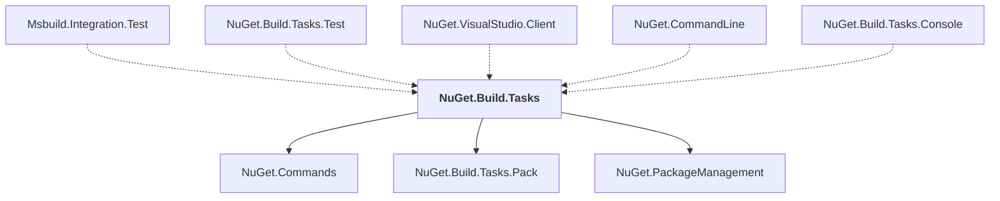

# NuGet.Build.Tasks

## Overview

| Property | Value |
|----------|-------|
| Category | Library |
| Repository | NuGet.Client |
| Path | `src/NuGet.Core/NuGet.Build.Tasks/NuGet.Build.Tasks.csproj` |
| Project References | 3 |
| NuGet Dependencies | 3 |
| Consumers | 5 |

## Dependency Diagram

## Project References
- NuGet.Commands
- NuGet.Build.Tasks.Pack
- NuGet.PackageManagement

## Consumed By
- Msbuild.Integration.Test
- NuGet.Build.Tasks.Test
- NuGet.VisualStudio.Client
- NuGet.CommandLine
- NuGet.Build.Tasks.Console

## External NuGet Packages
| Package | Version |
|---------|---------||
| System.Threading.Tasks.Dataflow |  |
| Microsoft.Build.Tasks.Core |  |
| Microsoft.Build.Utilities.Core |  |

---

*[Back to Index](../index.md)*
