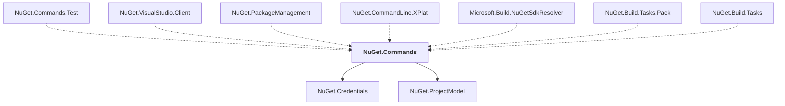

# NuGet.Commands

## Overview

| Property | Value |
|----------|-------|
| Category | Library |
| Repository | NuGet.Client |
| Path | `src/NuGet.Core/NuGet.Commands/NuGet.Commands.csproj` |
| Project References | 2 |
| NuGet Dependencies | 2 |
| Consumers | 7 |

## Dependency Diagram

## Project References
- NuGet.Credentials
- NuGet.ProjectModel

## Consumed By
- NuGet.Commands.Test
- NuGet.VisualStudio.Client
- NuGet.PackageManagement
- NuGet.CommandLine.XPlat
- Microsoft.Build.NuGetSdkResolver
- NuGet.Build.Tasks.Pack
- NuGet.Build.Tasks

## External NuGet Packages
| Package | Version |
|---------|---------||
| Microsoft.Extensions.FileSystemGlobbing |  |
| Microsoft.Extensions.FileProviders.Abstractions |  |

---

*[Back to Index](../index.md)*
