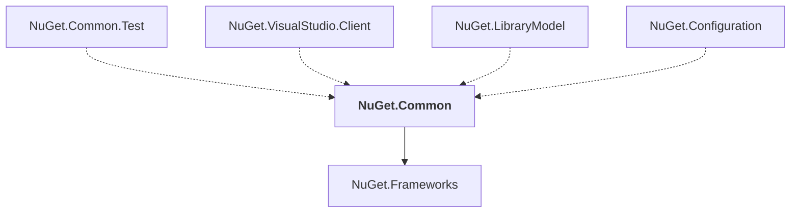

# NuGet.Common

## Overview

| Property | Value |
|----------|-------|
| Category | Library |
| Repository | NuGet.Client |
| Path | `src/NuGet.Core/NuGet.Common/NuGet.Common.csproj` |
| Project References | 1 |
| NuGet Dependencies | 1 |
| Consumers | 4 |

## Dependency Diagram

## Project References
- NuGet.Frameworks

## Consumed By
- NuGet.Common.Test
- NuGet.VisualStudio.Client
- NuGet.LibraryModel
- NuGet.Configuration

## External NuGet Packages
| Package | Version |
|---------|---------||
| System.Collections.Immutable |  |

---

*[Back to Index](../index.md)*
