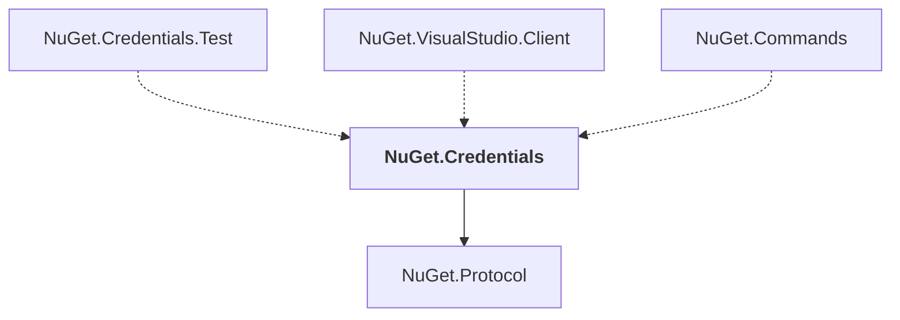

# NuGet.Credentials

## Overview

| Property | Value |
|----------|-------|
| Category | Library |
| Repository | NuGet.Client |
| Path | `src/NuGet.Core/NuGet.Credentials/NuGet.Credentials.csproj` |
| Project References | 1 |
| NuGet Dependencies | 0 |
| Consumers | 3 |

## Dependency Diagram

## Project References
- NuGet.Protocol

## Consumed By
- NuGet.Credentials.Test
- NuGet.VisualStudio.Client
- NuGet.Commands

---

*[Back to Index](../index.md)*
