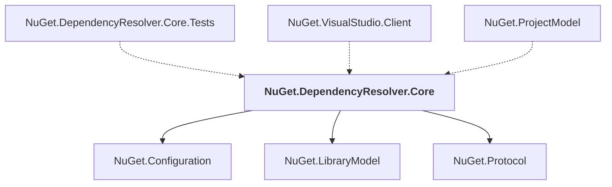

# NuGet.DependencyResolver.Core

## Overview

| Property | Value |
|----------|-------|
| Category | Library |
| Repository | NuGet.Client |
| Path | `src/NuGet.Core/NuGet.DependencyResolver.Core/NuGet.DependencyResolver.Core.csproj` |
| Project References | 3 |
| NuGet Dependencies | 0 |
| Consumers | 3 |

## Dependency Diagram

## Project References
- NuGet.Configuration
- NuGet.LibraryModel
- NuGet.Protocol

## Consumed By
- NuGet.DependencyResolver.Core.Tests
- NuGet.VisualStudio.Client
- NuGet.ProjectModel

---

*[Back to Index](../index.md)*
