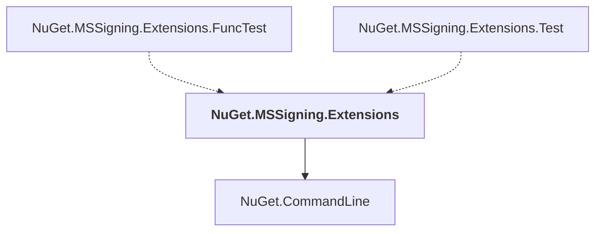

# NuGet.MSSigning.Extensions

## Overview

| Property | Value |
|----------|-------|
| Category | Library |
| Repository | NuGet.Client |
| Path | `src/NuGet.Clients/NuGet.MSSigning.Extensions/NuGet.MSSigning.Extensions.csproj` |
| Project References | 1 |
| NuGet Dependencies | 1 |
| Consumers | 2 |

## Dependency Diagram

## Project References
- NuGet.CommandLine

## Consumed By
- NuGet.MSSigning.Extensions.FuncTest
- NuGet.MSSigning.Extensions.Test

## External NuGet Packages
| Package | Version |
|---------|---------||
| ILRepack |  |

---

*[Back to Index](../index.md)*
