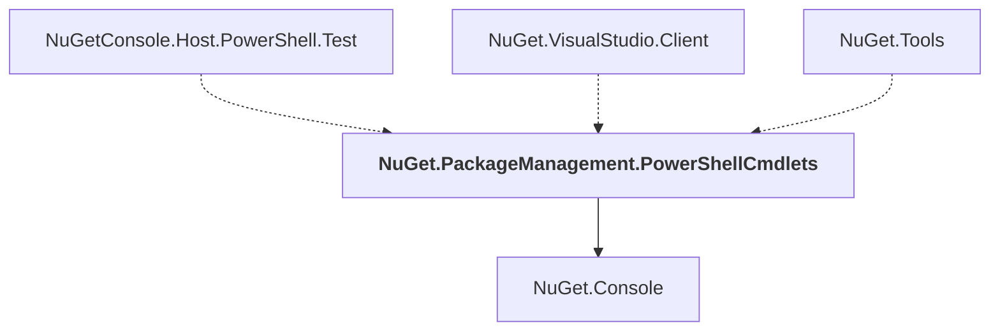

# NuGet.PackageManagement.PowerShellCmdlets

## Overview

| Property | Value |
|----------|-------|
| Category | Library |
| Repository | NuGet.Client |
| Path | `src/NuGet.Clients/NuGet.PackageManagement.PowerShellCmdlets/NuGet.PackageManagement.PowerShellCmdlets.csproj` |
| Project References | 1 |
| NuGet Dependencies | 1 |
| Consumers | 3 |

## Dependency Diagram

## Project References
- NuGet.Console

## Consumed By
- NuGetConsole.Host.PowerShell.Test
- NuGet.VisualStudio.Client
- NuGet.Tools

## External NuGet Packages
| Package | Version |
|---------|---------||
| Microsoft.VisualStudio.Sdk |  |

---

*[Back to Index](../index.md)*
