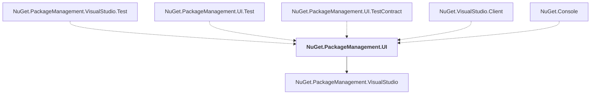

# NuGet.PackageManagement.UI

## Overview

| Property | Value |
|----------|-------|
| Category | Library |
| Repository | NuGet.Client |
| Path | `src/NuGet.Clients/NuGet.PackageManagement.UI/NuGet.PackageManagement.UI.csproj` |
| Project References | 1 |
| NuGet Dependencies | 4 |
| Consumers | 5 |

## Dependency Diagram

## Project References
- NuGet.PackageManagement.VisualStudio

## Consumed By
- NuGet.PackageManagement.VisualStudio.Test
- NuGet.PackageManagement.UI.Test
- NuGet.PackageManagement.UI.TestContract
- NuGet.VisualStudio.Client
- NuGet.Console

## External NuGet Packages
| Package | Version |
|---------|---------||
| Microsoft.VisualStudio.Copilot |  |
| Microsoft.VisualStudio.Markdown.Platform |  |
| Microsoft.VisualStudio.Sdk |  |
| Microsoft.VisualStudio.Shell.Styles |  |

---

*[Back to Index](../index.md)*
