# NuGet.PackageManagement.VisualStudio

## Overview

| Property | Value |
|----------|-------|
| Category | Library |
| Repository | NuGet.Client |
| Path | `src/NuGet.Clients/NuGet.PackageManagement.VisualStudio/NuGet.PackageManagement.VisualStudio.csproj` |
| Project References | 2 |
| NuGet Dependencies | 8 |
| Consumers | 10 |

## Dependency Diagram

```mermaid
graph TD
    NuGet_PackageManagement_VisualStudio["<strong>NuGet.PackageManagement.VisualStudio</strong>"]
    NuGet_Indexing["NuGet.Indexing"]
    NuGet_PackageManagement_VisualStudio --> NuGet_Indexing
    NuGet_VisualStudio_Common["NuGet.VisualStudio.Common"]
    NuGet_PackageManagement_VisualStudio --> NuGet_VisualStudio_Common
    NuGet_PackageManagement_Test["NuGet.PackageManagement.Test"]
    NuGet_PackageManagement_Test -.-> NuGet_PackageManagement_VisualStudio
    API_Test["API.Test"]
    API_Test -.-> NuGet_PackageManagement_VisualStudio
    NuGet_SolutionRestoreManager_Test["NuGet.SolutionRestoreManager.Test"]
    NuGet_SolutionRestoreManager_Test -.-> NuGet_PackageManagement_VisualStudio
    NuGet_PackageManagement_VisualStudio_Test["NuGet.PackageManagement.VisualStudio.Test"]
    NuGet_PackageManagement_VisualStudio_Test -.-> NuGet_PackageManagement_VisualStudio
    NuGet_PackageManagement_UI_Test["NuGet.PackageManagement.UI.Test"]
    NuGet_PackageManagement_UI_Test -.-> NuGet_PackageManagement_VisualStudio
    VisualStudio_Test_Utility["VisualStudio.Test.Utility"]
    VisualStudio_Test_Utility -.-> NuGet_PackageManagement_VisualStudio
    NuGet_VisualStudio_Client["NuGet.VisualStudio.Client"]
    NuGet_VisualStudio_Client -.-> NuGet_PackageManagement_VisualStudio
    NuGet_SolutionRestoreManager["NuGet.SolutionRestoreManager"]
    NuGet_SolutionRestoreManager -.-> NuGet_PackageManagement_VisualStudio
    NuGet_PackageManagement_UI["NuGet.PackageManagement.UI"]
    NuGet_PackageManagement_UI -.-> NuGet_PackageManagement_VisualStudio
    NuGet_VisualStudio_Implementation["NuGet.VisualStudio.Implementation"]
    NuGet_VisualStudio_Implementation -.-> NuGet_PackageManagement_VisualStudio
```

## Project References
- NuGet.Indexing
- NuGet.VisualStudio.Common

## Consumed By
- NuGet.PackageManagement.Test
- API.Test
- NuGet.SolutionRestoreManager.Test
- NuGet.PackageManagement.VisualStudio.Test
- NuGet.PackageManagement.UI.Test
- VisualStudio.Test.Utility
- NuGet.VisualStudio.Client
- NuGet.SolutionRestoreManager
- NuGet.PackageManagement.UI
- NuGet.VisualStudio.Implementation

## External NuGet Packages
| Package | Version |
|---------|---------||
| Microsoft.Build |  |
| Microsoft.Build.Utilities.Core |  |
| Microsoft.DataAI.NuGetRecommender.Contracts |  |
| Microsoft.TeamFoundationServer.ExtendedClient |  |
| Microsoft.VisualStudio.Sdk |  |
| VsWebSite.Interop |  |
| Microsoft.IdentityModel.JsonWebTokens |  |
| System.IdentityModel.Tokens.Jwt |  |

---

*[Back to Index](../index.md)*
