# NuGet.PackageManagement

## Overview

| Property | Value |
|----------|-------|
| Category | Library |
| Repository | NuGet.Client |
| Path | `src/NuGet.Core/NuGet.PackageManagement/NuGet.PackageManagement.csproj` |
| Project References | 2 |
| NuGet Dependencies | 3 |
| Consumers | 9 |

## Dependency Diagram

```mermaid
graph TD
    NuGet_PackageManagement["<strong>NuGet.PackageManagement</strong>"]
    NuGet_Commands["NuGet.Commands"]
    NuGet_PackageManagement --> NuGet_Commands
    NuGet_Resolver["NuGet.Resolver"]
    NuGet_PackageManagement --> NuGet_Resolver
    NuGet_PackageManagement_Test["NuGet.PackageManagement.Test"]
    NuGet_PackageManagement_Test -.-> NuGet_PackageManagement
    Test_Utility["Test.Utility"]
    Test_Utility -.-> NuGet_PackageManagement
    VisualStudio_Test_Utility["VisualStudio.Test.Utility"]
    VisualStudio_Test_Utility -.-> NuGet_PackageManagement
    NuGet_VisualStudio_Client["NuGet.VisualStudio.Client"]
    NuGet_VisualStudio_Client -.-> NuGet_PackageManagement
    NuGet_VisualStudio_Internal_Contracts["NuGet.VisualStudio.Internal.Contracts"]
    NuGet_VisualStudio_Internal_Contracts -.-> NuGet_PackageManagement
    NuGet_CommandLine["NuGet.CommandLine"]
    NuGet_CommandLine -.-> NuGet_PackageManagement
    NuGet_SolutionRestoreManager["NuGet.SolutionRestoreManager"]
    NuGet_SolutionRestoreManager -.-> NuGet_PackageManagement
    NuGet_VisualStudio_Common["NuGet.VisualStudio.Common"]
    NuGet_VisualStudio_Common -.-> NuGet_PackageManagement
    NuGet_Build_Tasks["NuGet.Build.Tasks"]
    NuGet_Build_Tasks -.-> NuGet_PackageManagement
```

## Project References
- NuGet.Commands
- NuGet.Resolver

## Consumed By
- NuGet.PackageManagement.Test
- Test.Utility
- VisualStudio.Test.Utility
- NuGet.VisualStudio.Client
- NuGet.VisualStudio.Internal.Contracts
- NuGet.CommandLine
- NuGet.SolutionRestoreManager
- NuGet.VisualStudio.Common
- NuGet.Build.Tasks

## External NuGet Packages
| Package | Version |
|---------|---------||
| Microsoft.Web.Xdt |  |
| Microsoft.CSharp |  |
| System.ComponentModel.Composition |  |

---

*[Back to Index](../index.md)*
