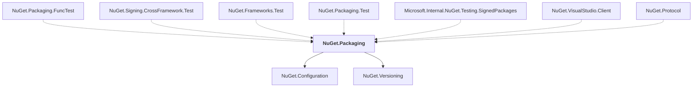

# NuGet.Packaging

## Overview

| Property | Value |
|----------|-------|
| Category | Library |
| Repository | NuGet.Client |
| Path | `src/NuGet.Core/NuGet.Packaging/NuGet.Packaging.csproj` |
| Project References | 2 |
| NuGet Dependencies | 3 |
| Consumers | 7 |

## Dependency Diagram

## Project References
- NuGet.Configuration
- NuGet.Versioning

## Consumed By
- NuGet.Packaging.FuncTest
- NuGet.Signing.CrossFramework.Test
- NuGet.Frameworks.Test
- NuGet.Packaging.Test
- Microsoft.Internal.NuGet.Testing.SignedPackages
- NuGet.VisualStudio.Client
- NuGet.Protocol

## External NuGet Packages
| Package | Version |
|---------|---------||
| Newtonsoft.Json |  |
| System.Text.Json |  |
| System.Security.Cryptography.Pkcs |  |

---

*[Back to Index](../index.md)*
