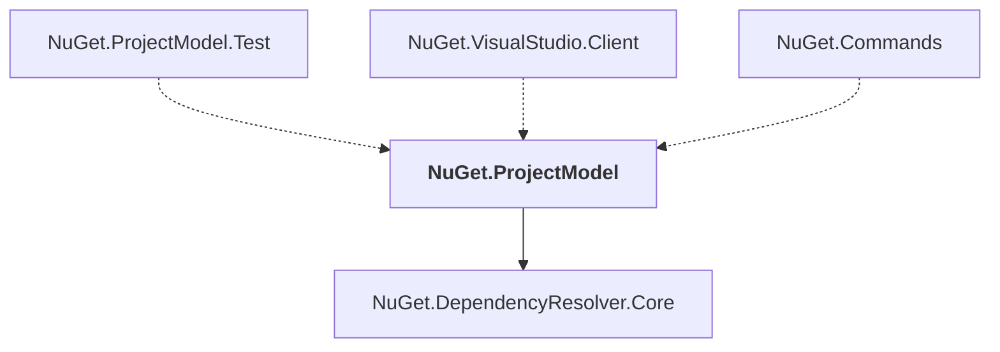

# NuGet.ProjectModel

## Overview

| Property | Value |
|----------|-------|
| Category | Library |
| Repository | NuGet.Client |
| Path | `src/NuGet.Core/NuGet.ProjectModel/NuGet.ProjectModel.csproj` |
| Project References | 1 |
| NuGet Dependencies | 2 |
| Consumers | 3 |

## Dependency Diagram

## Project References
- NuGet.DependencyResolver.Core

## Consumed By
- NuGet.ProjectModel.Test
- NuGet.VisualStudio.Client
- NuGet.Commands

## External NuGet Packages
| Package | Version |
|---------|---------||
| System.Collections.Immutable |  |
| System.Text.Json |  |

---

*[Back to Index](../index.md)*
