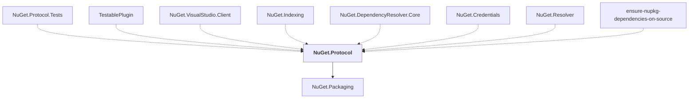

# NuGet.Protocol

## Overview

| Property | Value |
|----------|-------|
| Category | Library |
| Repository | NuGet.Client |
| Path | `src/NuGet.Core/NuGet.Protocol/NuGet.Protocol.csproj` |
| Project References | 1 |
| NuGet Dependencies | 1 |
| Consumers | 8 |

## Dependency Diagram

## Project References
- NuGet.Packaging

## Consumed By
- NuGet.Protocol.Tests
- TestablePlugin
- NuGet.VisualStudio.Client
- NuGet.Indexing
- NuGet.DependencyResolver.Core
- NuGet.Credentials
- NuGet.Resolver
- ensure-nupkg-dependencies-on-source

## External NuGet Packages
| Package | Version |
|---------|---------||
| System.Text.Json |  |

---

*[Back to Index](../index.md)*
