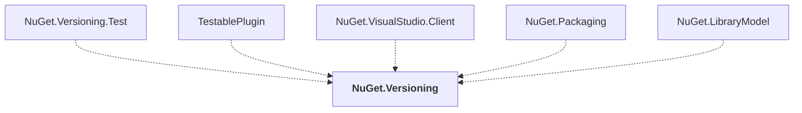

# NuGet.Versioning

## Overview

| Property | Value |
|----------|-------|
| Category | Library |
| Repository | NuGet.Client |
| Path | `src/NuGet.Core/NuGet.Versioning/NuGet.Versioning.csproj` |
| Project References | 0 |
| NuGet Dependencies | 0 |
| Consumers | 5 |

## Dependency Diagram

## Consumed By
- NuGet.Versioning.Test
- TestablePlugin
- NuGet.VisualStudio.Client
- NuGet.Packaging
- NuGet.LibraryModel

---

*[Back to Index](../index.md)*
