# NuGet.VisualStudio.Common

## Overview

| Property | Value |
|----------|-------|
| Category | Library |
| Repository | NuGet.Client |
| Path | `src/NuGet.Clients/NuGet.VisualStudio.Common/NuGet.VisualStudio.Common.csproj` |
| Project References | 3 |
| NuGet Dependencies | 6 |
| Consumers | 6 |

## Dependency Diagram

```mermaid
graph TD
    NuGet_VisualStudio_Common["<strong>NuGet.VisualStudio.Common</strong>"]
    NuGet_PackageManagement["NuGet.PackageManagement"]
    NuGet_VisualStudio_Common --> NuGet_PackageManagement
    NuGet_VisualStudio_Internal_Contracts["NuGet.VisualStudio.Internal.Contracts"]
    NuGet_VisualStudio_Common --> NuGet_VisualStudio_Internal_Contracts
    NuGet_VisualStudio["NuGet.VisualStudio"]
    NuGet_VisualStudio_Common --> NuGet_VisualStudio
    NuGet_PackageManagement_Test["NuGet.PackageManagement.Test"]
    NuGet_PackageManagement_Test -.-> NuGet_VisualStudio_Common
    NuGet_PackageManagement_VisualStudio_Test["NuGet.PackageManagement.VisualStudio.Test"]
    NuGet_PackageManagement_VisualStudio_Test -.-> NuGet_VisualStudio_Common
    NuGet_VisualStudio_Client["NuGet.VisualStudio.Client"]
    NuGet_VisualStudio_Client -.-> NuGet_VisualStudio_Common
    NuGet_PackageManagement_VisualStudio["NuGet.PackageManagement.VisualStudio"]
    NuGet_PackageManagement_VisualStudio -.-> NuGet_VisualStudio_Common
    NuGet_SolutionRestoreManager["NuGet.SolutionRestoreManager"]
    NuGet_SolutionRestoreManager -.-> NuGet_VisualStudio_Common
    NuGet_VisualStudio_Implementation["NuGet.VisualStudio.Implementation"]
    NuGet_VisualStudio_Implementation -.-> NuGet_VisualStudio_Common
```

## Project References
- NuGet.PackageManagement
- NuGet.VisualStudio.Internal.Contracts
- NuGet.VisualStudio

## Consumed By
- NuGet.PackageManagement.Test
- NuGet.PackageManagement.VisualStudio.Test
- NuGet.VisualStudio.Client
- NuGet.PackageManagement.VisualStudio
- NuGet.SolutionRestoreManager
- NuGet.VisualStudio.Implementation

## External NuGet Packages
| Package | Version |
|---------|---------||
| Microsoft.Build |  |
| Microsoft.Build.Tasks.Core |  |
| Microsoft.Build.Utilities.Core |  |
| Microsoft.Internal.VisualStudio.Shell.Framework |  |
| Microsoft.VisualStudio.ProjectSystem |  |
| Microsoft.VisualStudio.Sdk |  |

---

*[Back to Index](../index.md)*
