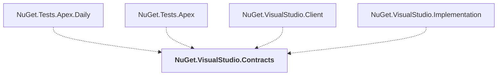

# NuGet.VisualStudio.Contracts

## Overview

| Property | Value |
|----------|-------|
| Category | Library |
| Repository | NuGet.Client |
| Path | `src/NuGet.Clients/NuGet.VisualStudio.Contracts/NuGet.VisualStudio.Contracts.csproj` |
| Project References | 0 |
| NuGet Dependencies | 2 |
| Consumers | 4 |

## Dependency Diagram

## Consumed By
- NuGet.Tests.Apex.Daily
- NuGet.Tests.Apex
- NuGet.VisualStudio.Client
- NuGet.VisualStudio.Implementation

## External NuGet Packages
| Package | Version |
|---------|---------||
| Microsoft.ServiceHub.Framework |  |
| Newtonsoft.Json |  |

---

*[Back to Index](../index.md)*
