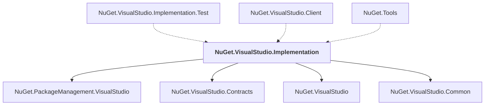

# NuGet.VisualStudio.Implementation

## Overview

| Property | Value |
|----------|-------|
| Category | Library |
| Repository | NuGet.Client |
| Path | `src/NuGet.Clients/NuGet.VisualStudio.Implementation/NuGet.VisualStudio.Implementation.csproj` |
| Project References | 4 |
| NuGet Dependencies | 13 |
| Consumers | 3 |

## Dependency Diagram

## Project References
- NuGet.PackageManagement.VisualStudio
- NuGet.VisualStudio.Contracts
- NuGet.VisualStudio
- NuGet.VisualStudio.Common

## Consumed By
- NuGet.VisualStudio.Implementation.Test
- NuGet.VisualStudio.Client
- NuGet.Tools

## External NuGet Packages
| Package | Version |
|---------|---------||
| Microsoft.Build |  |
| Microsoft.Build.Framework |  |
| Microsoft.Build.Tasks.Core |  |
| Microsoft.Build.Utilities.Core |  |
| Microsoft.CodeAnalysis |  |
| Microsoft.CodeAnalysis.Common |  |
| Microsoft.CodeAnalysis.Features |  |
| Microsoft.CodeAnalysis.Workspaces.Common |  |
| Microsoft.VisualStudio.LanguageServices |  |
| Microsoft.VisualStudio.ProjectSystem.Managed.VS |  |
| Microsoft.VisualStudio.ProjectSystem.VS |  |
| Microsoft.VisualStudio.Sdk |  |
| Microsoft.VSSDK.BuildTools |  |

---

*[Back to Index](../index.md)*
