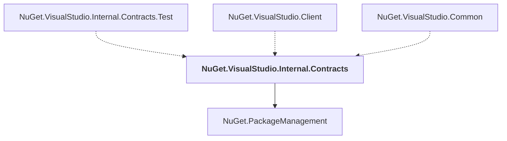

# NuGet.VisualStudio.Internal.Contracts

## Overview

| Property | Value |
|----------|-------|
| Category | Library |
| Repository | NuGet.Client |
| Path | `src/NuGet.Clients/NuGet.VisualStudio.Internal.Contracts/NuGet.VisualStudio.Internal.Contracts.csproj` |
| Project References | 1 |
| NuGet Dependencies | 1 |
| Consumers | 3 |

## Dependency Diagram

## Project References
- NuGet.PackageManagement

## Consumed By
- NuGet.VisualStudio.Internal.Contracts.Test
- NuGet.VisualStudio.Client
- NuGet.VisualStudio.Common

## External NuGet Packages
| Package | Version |
|---------|---------||
| Microsoft.VisualStudio.Sdk |  |

---

*[Back to Index](../index.md)*
