# NuGet.VisualStudio

## Overview

| Property | Value |
|----------|-------|
| Category | Library |
| Repository | NuGet.Client |
| Path | `src/NuGet.Clients/NuGet.VisualStudio/NuGet.VisualStudio.csproj` |
| Project References | 0 |
| NuGet Dependencies | 2 |
| Consumers | 10 |

## Dependency Diagram

```mermaid
graph TD
    NuGet_VisualStudio["<strong>NuGet.VisualStudio</strong>"]
    NuGet_VisualStudio_Test["NuGet.VisualStudio.Test"]
    NuGet_VisualStudio_Test -.-> NuGet_VisualStudio
    NuGet_PackageManagement_VisualStudio_Test["NuGet.PackageManagement.VisualStudio.Test"]
    NuGet_PackageManagement_VisualStudio_Test -.-> NuGet_VisualStudio
    NuGet_PackageManagement_UI_Test["NuGet.PackageManagement.UI.Test"]
    NuGet_PackageManagement_UI_Test -.-> NuGet_VisualStudio
    NuGet_Tests_Apex_Daily["NuGet.Tests.Apex.Daily"]
    NuGet_Tests_Apex_Daily -.-> NuGet_VisualStudio
    NuGet_Tests_Apex["NuGet.Tests.Apex"]
    NuGet_Tests_Apex -.-> NuGet_VisualStudio
    NuGet_OptProf["NuGet.OptProf"]
    NuGet_OptProf -.-> NuGet_VisualStudio
    NuGet_VisualStudio_Client["NuGet.VisualStudio.Client"]
    NuGet_VisualStudio_Client -.-> NuGet_VisualStudio
    NuGet_VisualStudio_Implementation["NuGet.VisualStudio.Implementation"]
    NuGet_VisualStudio_Implementation -.-> NuGet_VisualStudio
    NuGet_VisualStudio_Common["NuGet.VisualStudio.Common"]
    NuGet_VisualStudio_Common -.-> NuGet_VisualStudio
    NuGet_VisualStudio_Interop["NuGet.VisualStudio.Interop"]
    NuGet_VisualStudio_Interop -.-> NuGet_VisualStudio
```

## Consumed By
- NuGet.VisualStudio.Test
- NuGet.PackageManagement.VisualStudio.Test
- NuGet.PackageManagement.UI.Test
- NuGet.Tests.Apex.Daily
- NuGet.Tests.Apex
- NuGet.OptProf
- NuGet.VisualStudio.Client
- NuGet.VisualStudio.Implementation
- NuGet.VisualStudio.Common
- NuGet.VisualStudio.Interop

## External NuGet Packages
| Package | Version |
|---------|---------||
| Microsoft.VisualStudio.ComponentModelHost |  |
| Microsoft.VisualStudio.TemplateWizardInterface |  |

---

*[Back to Index](../index.md)*
