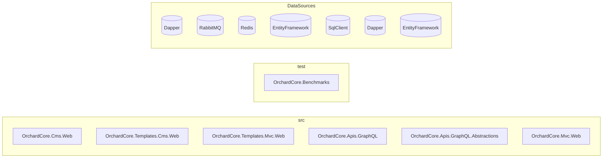
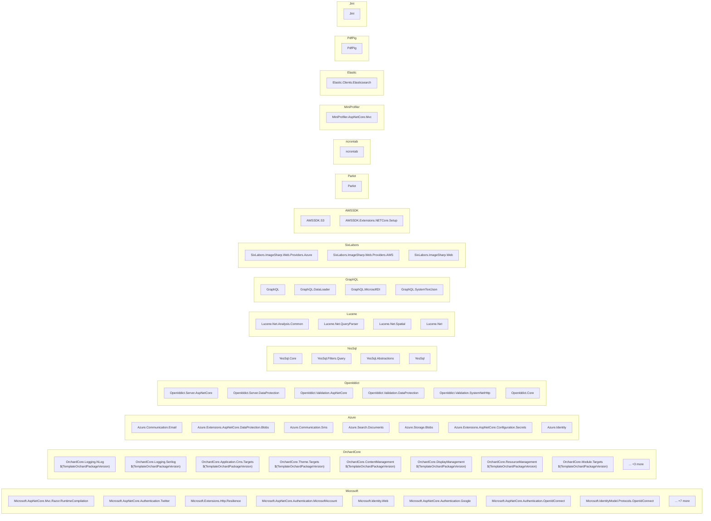

# Dependency Map

## Overview

| Metric | Count |
|--------|-------|
| Repositories | 2 |
| Total Projects | 230 |
| NuGet Packages | 84 |
| Project References | 1208 |
| Cross-Repo References | 40 |
| Data Access Findings | 462 |
| Config Files | 11 |

## Repositories

| Repo | Projects | Categories |
|------|----------|------------|
| **src** | 206 | WebApp:6, Library:192, Localization:6, Sample:1, Tool:1 |
| **test** | 24 | Test:23, Application:1 |

## Project Categories

| Category | Count |
|----------|-------|
| Library | 192 |
| Test | 23 |
| WebApp | 6 |
| Localization | 6 |
| Sample | 1 |
| Tool | 1 |
| Application | 1 |

## Full Landscape

```mermaid
graph LR
    subgraph src["src"]
        subgraph src_webapp["webapp"]
            src_OrchardCore_Cms_Web["OrchardCore.Cms.Web"]
            src_OrchardCore_Templates_Cms_Web["OrchardCore.Templates.Cms.Web"]
            src_OrchardCore_Templates_Mvc_Web["OrchardCore.Templates.Mvc.Web"]
            src_OrchardCore_Apis_GraphQL["OrchardCore.Apis.GraphQL"]
            src_OrchardCore_Apis_GraphQL_Abstractions["OrchardCore.Apis.GraphQL.Abstractions"]
            src_OrchardCore_Mvc_Web["OrchardCore.Mvc.Web"]
        end
        subgraph src_library["library"]
            src_TheComingSoonTheme["TheComingSoonTheme"]
            src_TheTheme["TheTheme"]
            src_TheBlogTheme["TheBlogTheme"]
            src_TheAdmin["TheAdmin"]
            src_TheAgencyTheme["TheAgencyTheme"]
            src_SafeMode["SafeMode"]
            src_OrchardCore_Docs["OrchardCore.Docs"]
            src_OrchardCore_ProjectTemplates["OrchardCore.ProjectTemplates"]
            src_OrchardCore_Templates_Theme["OrchardCore.Templates.Theme"]
            src_OrchardCore_Templates_Mvc_Module["OrchardCore.Templates.Mvc.Module"]
            src_OrchardCore_Templates_Cms_Module["OrchardCore.Templates.Cms.Module"]
            src_OrchardCore_Resources["OrchardCore.Resources"]
            src_OrchardCore_Queries["OrchardCore.Queries"]
            src_OrchardCore_AdminMenu["OrchardCore.AdminMenu"]
            src_OrchardCore_Deployment["OrchardCore.Deployment"]
            src_OrchardCore_Shortcodes["OrchardCore.Shortcodes"]
            src_OrchardCore_AuditTrail["OrchardCore.AuditTrail"]
            src_OrchardCore_ContentPreview["OrchardCore.ContentPreview"]
            src_OrchardCore_Email_Azure["OrchardCore.Email.Azure"]
            src_OrchardCore_Twitter["OrchardCore.Twitter"]
            src_OrchardCore_BackgroundTasks["OrchardCore.BackgroundTasks"]
            src_OrchardCore_Settings["OrchardCore.Settings"]
            src_OrchardCore_Navigation["OrchardCore.Navigation"]
            src_OrchardCore_Features["OrchardCore.Features"]
            src_OrchardCore_Media_Azure["OrchardCore.Media.Azure"]
            src_OrchardCore_Taxonomies["OrchardCore.Taxonomies"]
            src_OrchardCore_Setup["OrchardCore.Setup"]
            src_OrchardCore_Flows["OrchardCore.Flows"]
            src_OrchardCore_XmlRpc["OrchardCore.XmlRpc"]
            src_OrchardCore_PublishLater["OrchardCore.PublishLater"]
            src_OrchardCore_Sms["OrchardCore.Sms"]
            src_OrchardCore_Microsoft_Authentication["OrchardCore.Microsoft.Authentication"]
            src_OrchardCore_ArchiveLater["OrchardCore.ArchiveLater"]
            src_OrchardCore_Workflows["OrchardCore.Workflows"]
            src_OrchardCore_MiniProfiler["OrchardCore.MiniProfiler"]
            src_OrchardCore_ResponseCompression["OrchardCore.ResponseCompression"]
            src_OrchardCore_Google["OrchardCore.Google"]
            src_OrchardCore_Users["OrchardCore.Users"]
            src_OrchardCore_Search_Elasticsearch["OrchardCore.Search.Elasticsearch"]
            src_OrchardCore_Media_Indexing_Pdf["OrchardCore.Media.Indexing.Pdf"]
            src_OrchardCore_Themes["OrchardCore.Themes"]
            src_OrchardCore_DynamicCache["OrchardCore.DynamicCache"]
            src_OrchardCore_Mvc_HelloWorld["OrchardCore.Mvc.HelloWorld"]
            src_OrchardCore_ContentFields["OrchardCore.ContentFields"]
            src_OrchardCore_OpenId["OrchardCore.OpenId"]
            src_OrchardCore_Notifications["OrchardCore.Notifications"]
            src_OrchardCore_Rules["OrchardCore.Rules"]
            src_OrchardCore_AdminDashboard["OrchardCore.AdminDashboard"]
            src_OrchardCore_Admin["OrchardCore.Admin"]
            src_OrchardCore_ReverseProxy["OrchardCore.ReverseProxy"]
            src_OrchardCore_HealthChecks["OrchardCore.HealthChecks"]
            src_OrchardCore_Autoroute["OrchardCore.Autoroute"]
            src_OrchardCore_GitHub["OrchardCore.GitHub"]
            src_OrchardCore_Menu["OrchardCore.Menu"]
            src_OrchardCore_Alias["OrchardCore.Alias"]
            src_OrchardCore_Security["OrchardCore.Security"]
            src_OrchardCore_Liquid["OrchardCore.Liquid"]
            src_OrchardCore_Lists["OrchardCore.Lists"]
            src_OrchardCore_Contents["OrchardCore.Contents"]
            src_OrchardCore_Media_AmazonS3["OrchardCore.Media.AmazonS3"]
            src_OrchardCore_AutoSetup["OrchardCore.AutoSetup"]
            src_OrchardCore_Facebook["OrchardCore.Facebook"]
            src_OrchardCore_Layers["OrchardCore.Layers"]
            src_OrchardCore_Search_Lucene["OrchardCore.Search.Lucene"]
            src_OrchardCore_Deployment_Remote["OrchardCore.Deployment.Remote"]
            src_OrchardCore_Media["OrchardCore.Media"]
            src_OrchardCore_Sitemaps["OrchardCore.Sitemaps"]
            src_OrchardCore_Seo["OrchardCore.Seo"]
            src_OrchardCore_Media_Indexing_OpenXML["OrchardCore.Media.Indexing.OpenXML"]
            src_OrchardCore_DataProtection_Azure["OrchardCore.DataProtection.Azure"]
            src_OrchardCore_Html["OrchardCore.Html"]
            src_OrchardCore_Roles["OrchardCore.Roles"]
            src_OrchardCore_Diagnostics["OrchardCore.Diagnostics"]
            src_OrchardCore_Email["OrchardCore.Email"]
            src_OrchardCore_Https["OrchardCore.Https"]
            src_OrchardCore_Title["OrchardCore.Title"]
            src_OrchardCore_Recipes["OrchardCore.Recipes"]
            src_OrchardCore_Markdown["OrchardCore.Markdown"]
            src_OrchardCore_UrlRewriting["OrchardCore.UrlRewriting"]
            src_OrchardCore_Search["OrchardCore.Search"]
            src_OrchardCore_HomeRoute["OrchardCore.HomeRoute"]
            src_OrchardCore_CustomSettings["OrchardCore.CustomSettings"]
            src_OrchardCore_Widgets["OrchardCore.Widgets"]
            src_OrchardCore_Email_Smtp["OrchardCore.Email.Smtp"]
            src_OrchardCore_Templates["OrchardCore.Templates"]
            src_OrchardCore_Sms_Azure["OrchardCore.Sms.Azure"]
            src_OrchardCore_Scripting["OrchardCore.Scripting"]
            src_OrchardCore_Redis["OrchardCore.Redis"]
            src_OrchardCore_Spatial["OrchardCore.Spatial"]
            src_OrchardCore_Cors["OrchardCore.Cors"]
            src_OrchardCore_Indexing["OrchardCore.Indexing"]
            src_OrchardCore_Feeds["OrchardCore.Feeds"]
            src_OrchardCore_ReCaptcha["OrchardCore.ReCaptcha"]
            src_OrchardCore_Forms["OrchardCore.Forms"]
            src_OrchardCore_Search_AzureAI["OrchardCore.Search.AzureAI"]
            src_OrchardCore_ContentTypes["OrchardCore.ContentTypes"]
            src_OrchardCore_Tenants["OrchardCore.Tenants"]
            src_OrchardCore_Placements["OrchardCore.Placements"]
            src_OrchardCore_Setup_Core["OrchardCore.Setup.Core"]
            src_OrchardCore_Shortcodes_Abstractions["OrchardCore.Shortcodes.Abstractions"]
            src_OrchardCore_AdminMenu_Abstractions["OrchardCore.AdminMenu.Abstractions"]
            src_OrchardCore_Search_Abstractions["OrchardCore.Search.Abstractions"]
            src_OrchardCore_Indexing_Core["OrchardCore.Indexing.Core"]
            src_OrchardCore_Module_Targets["OrchardCore.Module.Targets"]
            src_OrchardCore_FileStorage_AzureBlob["OrchardCore.FileStorage.AzureBlob"]
            src_OrchardCore_Notifications_Core["OrchardCore.Notifications.Core"]
            src_OrchardCore_DisplayManagement["OrchardCore.DisplayManagement"]
            src_OrchardCore_Recipes_Core["OrchardCore.Recipes.Core"]
            src_OrchardCore_Application_Cms_Core_Targets["OrchardCore.Application.Cms.Core.Targets"]
            src_OrchardCore_UrlRewriting_Core["OrchardCore.UrlRewriting.Core"]
            src_OrchardCore_Sitemaps_Abstractions["OrchardCore.Sitemaps.Abstractions"]
            src_OrchardCore_Queries_Abstractions["OrchardCore.Queries.Abstractions"]
            src_OrchardCore_Data["OrchardCore.Data"]
            src_OrchardCore_Search_Elasticsearch_Core["OrchardCore.Search.Elasticsearch.Core"]
            src_OrchardCore_Mvc_Core["OrchardCore.Mvc.Core"]
            src_OrchardCore_Infrastructure_Abstractions["OrchardCore.Infrastructure.Abstractions"]
            src_OrchardCore_Search_Lucene_Abstractions["OrchardCore.Search.Lucene.Abstractions"]
            src_OrchardCore_Email_Core["OrchardCore.Email.Core"]
            src_OrchardCore_Liquid_Abstractions["OrchardCore.Liquid.Abstractions"]
            src_OrchardCore_Deployment_Abstractions["OrchardCore.Deployment.Abstractions"]
            src_OrchardCore_Workflows_Abstractions["OrchardCore.Workflows.Abstractions"]
            src_OrchardCore_Email_Abstractions["OrchardCore.Email.Abstractions"]
            src_OrchardCore_FileStorage_FileSystem["OrchardCore.FileStorage.FileSystem"]
            src_OrchardCore_ResourceManagement_Core["OrchardCore.ResourceManagement.Core"]
            src_OrchardCore_Redis_Abstractions["OrchardCore.Redis.Abstractions"]
            src_OrchardCore_Logging_NLog["OrchardCore.Logging.NLog"]
            src_OrchardCore_Search_Lucene_Core["OrchardCore.Search.Lucene.Core"]
            src_OrchardCore_Indexing_Abstractions["OrchardCore.Indexing.Abstractions"]
            src_OrchardCore_Recipes_Abstractions["OrchardCore.Recipes.Abstractions"]
            src_OrchardCore_MetaWeblog_Abstractions["OrchardCore.MetaWeblog.Abstractions"]
            src_OrchardCore_Search_Elasticsearch_Abstractions["OrchardCore.Search.Elasticsearch.Abstractions"]
            src_OrchardCore_Feeds_Abstractions["OrchardCore.Feeds.Abstractions"]
            src_OrchardCore_Shells_Azure["OrchardCore.Shells.Azure"]
            src_OrchardCore_Contents_TagHelpers["OrchardCore.Contents.TagHelpers"]
            src_OrchardCore_Configuration_KeyVault["OrchardCore.Configuration.KeyVault"]
            src_OrchardCore_ResourceManagement["OrchardCore.ResourceManagement"]
            src_OrchardCore_XmlRpc_Abstractions["OrchardCore.XmlRpc.Abstractions"]
            src_OrchardCore_Application_Mvc_Targets["OrchardCore.Application.Mvc.Targets"]
            src_OrchardCore_Search_AzureAI_Core["OrchardCore.Search.AzureAI.Core"]
            src_OrchardCore_ContentManagement_GraphQL["OrchardCore.ContentManagement.GraphQL"]
            src_OrchardCore_Seo_Abstractions["OrchardCore.Seo.Abstractions"]
            src_OrchardCore_Users_Abstractions["OrchardCore.Users.Abstractions"]
            src_OrchardCore_Media_Abstractions["OrchardCore.Media.Abstractions"]
            src_OrchardCore_DisplayManagement_Abstractions["OrchardCore.DisplayManagement.Abstractions"]
            src_OrchardCore_Rules_Core["OrchardCore.Rules.Core"]
            src_OrchardCore_Infrastructure["OrchardCore.Infrastructure"]
            src_OrchardCore_Data_YesSql["OrchardCore.Data.YesSql"]
            src_OrchardCore_Application_Cms_Targets["OrchardCore.Application.Cms.Targets"]
            src_OrchardCore_Navigation_Core["OrchardCore.Navigation.Core"]
            src_OrchardCore_Roles_Abstractions["OrchardCore.Roles.Abstractions"]
            src_OrchardCore_FileStorage_Abstractions["OrchardCore.FileStorage.Abstractions"]
            src_OrchardCore_HealthChecks_Abstractions["OrchardCore.HealthChecks.Abstractions"]
            src_OrchardCore_ContentPreview_Abstractions["OrchardCore.ContentPreview.Abstractions"]
            src_OrchardCore_Media_Core["OrchardCore.Media.Core"]
            src_OrchardCore_Roles_Core["OrchardCore.Roles.Core"]
            src_OrchardCore_Queries_Core["OrchardCore.Queries.Core"]
            src_OrchardCore_Theme_Targets["OrchardCore.Theme.Targets"]
            src_OrchardCore_Scripting_JavaScript["OrchardCore.Scripting.JavaScript"]
            src_OrchardCore_DisplayManagement_Liquid["OrchardCore.DisplayManagement.Liquid"]
            src_OrchardCore_ContentManagement_Abstractions["OrchardCore.ContentManagement.Abstractions"]
            src_OrchardCore_Contents_Core["OrchardCore.Contents.Core"]
            src_OrchardCore_Data_Abstractions["OrchardCore.Data.Abstractions"]
            src_OrchardCore_Flows_Core["OrchardCore.Flows.Core"]
            src_OrchardCore_Users_Core["OrchardCore.Users.Core"]
            src_OrchardCore_FileStorage_AmazonS3["OrchardCore.FileStorage.AmazonS3"]
            src_OrchardCore_Taxonomies_Core["OrchardCore.Taxonomies.Core"]
            src_OrchardCore_Data_YesSql_Abstractions["OrchardCore.Data.YesSql.Abstractions"]
            src_OrchardCore["OrchardCore"]
            src_OrchardCore_Abstractions["OrchardCore.Abstractions"]
            src_OrchardCore_Settings_Core["OrchardCore.Settings.Core"]
            src_OrchardCore_Autoroute_Core["OrchardCore.Autoroute.Core"]
            src_OrchardCore_Setup_Abstractions["OrchardCore.Setup.Abstractions"]
            src_OrchardCore_Feeds_Core["OrchardCore.Feeds.Core"]
            src_OrchardCore_Rules_Abstractions["OrchardCore.Rules.Abstractions"]
            src_OrchardCore_ContentManagement_Display["OrchardCore.ContentManagement.Display"]
            src_OrchardCore_Application_Targets["OrchardCore.Application.Targets"]
            src_OrchardCore_Notifications_Abstractions["OrchardCore.Notifications.Abstractions"]
            src_OrchardCore_ReCaptcha_Core["OrchardCore.ReCaptcha.Core"]
            src_OrchardCore_Features_Core["OrchardCore.Features.Core"]
            src_OrchardCore_Deployment_Core["OrchardCore.Deployment.Core"]
            src_OrchardCore_Markdown_Abstractions["OrchardCore.Markdown.Abstractions"]
            src_OrchardCore_ContentManagement["OrchardCore.ContentManagement"]
            src_OrchardCore_Sms_Core["OrchardCore.Sms.Core"]
            src_OrchardCore_ResourceManagement_Abstractions["OrchardCore.ResourceManagement.Abstractions"]
            src_OrchardCore_OpenId_Core["OrchardCore.OpenId.Core"]
            src_OrchardCore_AuditTrail_Abstractions["OrchardCore.AuditTrail.Abstractions"]
            src_OrchardCore_DynamicCache_Abstractions["OrchardCore.DynamicCache.Abstractions"]
            src_OrchardCore_Admin_Abstractions["OrchardCore.Admin.Abstractions"]
            src_OrchardCore_Sms_Abstractions["OrchardCore.Sms.Abstractions"]
            src_OrchardCore_Logging_Serilog["OrchardCore.Logging.Serilog"]
            src_OrchardCore_ContentTypes_Abstractions["OrchardCore.ContentTypes.Abstractions"]
            src_OrchardCore_UrlRewriting_Abstractions["OrchardCore.UrlRewriting.Abstractions"]
        end
        subgraph src_tool["tool"]
            src_OrchardCore_Apis_GraphQL_Client["OrchardCore.Apis.GraphQL.Client"]
        end
    end
    subgraph test["test"]
        subgraph test_test["test"]
            test_OrchardCore_Tests["OrchardCore.Tests"]
            test_ModuleSample["ModuleSample"]
            test_DerivedThemeSample["DerivedThemeSample"]
            test_Errors_OrchardCoreModules_TwoPlus["Errors.OrchardCoreModules.TwoPlus"]
            test_BaseThemeSample2["BaseThemeSample2"]
            test_Examples_Modules_AssyAttrib_Charlie["Examples.Modules.AssyAttrib.Charlie"]
            test_Examples_Modules_AssyAttrib_Bravo["Examples.Modules.AssyAttrib.Bravo"]
            test_DerivedThemeSample2["DerivedThemeSample2"]
            test_Examples_Modules_AssyAttrib_Alpha["Examples.Modules.AssyAttrib.Alpha"]
            test_BaseThemeSample["BaseThemeSample"]
            test_Examples_OrchardCoreModules_Alpha["Examples.OrchardCoreModules.Alpha"]
            test_Examples_Features_AssyAttrib["Examples.Features.AssyAttrib"]
            test_OrchardCore_Application_Pages["OrchardCore.Application.Pages"]
            test_Theme_Pages["Theme.Pages"]
            test_Module_Pages["Module.Pages"]
            test_Examples_Themes_AssyAttrib_Charlie["Examples.Themes.AssyAttrib.Charlie"]
            test_Examples_Themes_AssyAttrib_Bravo["Examples.Themes.AssyAttrib.Bravo"]
            test_Errors_OrchardCoreThemes_ThemeAndModule["Errors.OrchardCoreThemes.ThemeAndModule"]
            test_Examples_Themes_AssyAttrib_Alpha["Examples.Themes.AssyAttrib.Alpha"]
            test_Examples_OrchardCoreThemes_Alpha["Examples.OrchardCoreThemes.Alpha"]
            test_Errors_OrchardCoreThemes_TwoPlus["Errors.OrchardCoreThemes.TwoPlus"]
            test_OrchardCore_Tests_Functional["OrchardCore.Tests.Functional"]
            test_OrchardCore_Abstractions_Tests["OrchardCore.Abstractions.Tests"]
        end
        subgraph test_application["application"]
            test_OrchardCore_Benchmarks["OrchardCore.Benchmarks"]
        end
    end
    src_OrchardCore_Cms_Web --> src_OrchardCore_Application_Cms_Targets
    src_OrchardCore_Cms_Web --> src_OrchardCore_Logging_NLog
    src_TheComingSoonTheme --> src_OrchardCore_ResourceManagement_Abstractions
    src_TheComingSoonTheme --> src_OrchardCore_Theme_Targets
    src_TheComingSoonTheme --> src_OrchardCore_DisplayManagement
    src_TheTheme --> src_OrchardCore_Flows
    src_TheTheme --> src_OrchardCore_Notifications
    src_TheTheme --> src_OrchardCore_Themes
    src_TheTheme --> src_OrchardCore_Theme_Targets
    src_TheTheme --> src_OrchardCore_Admin_Abstractions
    src_TheTheme --> src_OrchardCore_ContentManagement
    src_TheTheme --> src_OrchardCore_ResourceManagement
    src_TheTheme --> src_OrchardCore_DisplayManagement
    src_TheTheme --> src_OrchardCore_Users_Abstractions
    src_TheTheme --> src_OrchardCore_Users
    src_TheTheme --> src_OrchardCore_Menu
    src_TheBlogTheme --> src_OrchardCore_Queries
    src_TheBlogTheme --> src_OrchardCore_Theme_Targets
    src_TheBlogTheme --> src_OrchardCore_DisplayManagement
    src_TheBlogTheme --> src_OrchardCore_ResourceManagement_Abstractions
    src_TheAdmin --> src_OrchardCore_Theme_Targets
    src_TheAdmin --> src_OrchardCore_DisplayManagement
    src_TheAdmin --> src_OrchardCore_ResourceManagement
    src_TheAdmin --> src_OrchardCore_Admin
    src_TheAdmin --> src_OrchardCore_Themes
    src_TheAdmin --> src_OrchardCore_Users_Core
    src_TheAgencyTheme --> src_OrchardCore_ResourceManagement_Abstractions
    src_TheAgencyTheme --> src_OrchardCore_Theme_Targets
    src_TheAgencyTheme --> src_OrchardCore_DisplayManagement
    src_SafeMode --> src_OrchardCore_Theme_Targets
    src_SafeMode --> src_OrchardCore_DisplayManagement
    src_OrchardCore_Resources --> src_OrchardCore_DisplayManagement_Liquid
    src_OrchardCore_Resources --> src_OrchardCore_Module_Targets
    src_OrchardCore_Resources --> src_OrchardCore_ResourceManagement_Core
    src_OrchardCore_Queries --> src_OrchardCore_Admin_Abstractions
    src_OrchardCore_Queries --> src_OrchardCore_ContentManagement_Abstractions
    src_OrchardCore_Queries --> src_OrchardCore_ContentManagement_Display
    src_OrchardCore_Queries --> src_OrchardCore_ContentManagement_GraphQL
    src_OrchardCore_Queries --> src_OrchardCore_Data_Abstractions
    src_OrchardCore_Queries --> src_OrchardCore_Deployment_Abstractions
    src_OrchardCore_Queries --> src_OrchardCore_DisplayManagement
    src_OrchardCore_Queries --> src_OrchardCore_Liquid_Abstractions
    src_OrchardCore_Queries --> src_OrchardCore_Module_Targets
    src_OrchardCore_Queries --> src_OrchardCore_Navigation_Core
    src_OrchardCore_Queries --> src_OrchardCore_Queries_Core
    src_OrchardCore_Queries --> src_OrchardCore_ResourceManagement
    src_OrchardCore_AdminMenu --> src_OrchardCore_Admin_Abstractions
    src_OrchardCore_AdminMenu --> src_OrchardCore_AdminMenu_Abstractions
    src_OrchardCore_AdminMenu --> src_OrchardCore_ContentManagement
    src_OrchardCore_AdminMenu --> src_OrchardCore_ContentTypes_Abstractions
    src_OrchardCore_AdminMenu --> src_OrchardCore_ContentManagement_Display
    src_OrchardCore_AdminMenu --> src_OrchardCore_Deployment_Abstractions
    src_OrchardCore_AdminMenu --> src_OrchardCore_Module_Targets
    src_OrchardCore_AdminMenu --> src_OrchardCore_Navigation_Core
    src_OrchardCore_AdminMenu --> src_OrchardCore_ResourceManagement
    src_OrchardCore_Deployment --> src_OrchardCore_Admin_Abstractions
    src_OrchardCore_Deployment --> src_OrchardCore_Data_Abstractions
    src_OrchardCore_Deployment --> src_OrchardCore_Data_YesSql
    src_OrchardCore_Deployment --> src_OrchardCore_Deployment_Core
    src_OrchardCore_Deployment --> src_OrchardCore_DisplayManagement
    src_OrchardCore_Deployment --> src_OrchardCore_Module_Targets
    src_OrchardCore_Deployment --> src_OrchardCore_Navigation_Core
    src_OrchardCore_Deployment --> src_OrchardCore_ResourceManagement
    src_OrchardCore_Shortcodes --> src_OrchardCore_Admin_Abstractions
    src_OrchardCore_Shortcodes --> src_OrchardCore_Data_Abstractions
    src_OrchardCore_Shortcodes --> src_OrchardCore_Deployment_Abstractions
    src_OrchardCore_Shortcodes --> src_OrchardCore_DisplayManagement
    src_OrchardCore_Shortcodes --> src_OrchardCore_Liquid_Abstractions
    src_OrchardCore_Shortcodes --> src_OrchardCore_Module_Targets
    src_OrchardCore_Shortcodes --> src_OrchardCore_Navigation_Core
    src_OrchardCore_Shortcodes --> src_OrchardCore_Shortcodes_Abstractions
    src_OrchardCore_Shortcodes --> src_OrchardCore_ResourceManagement
    src_OrchardCore_AuditTrail --> src_OrchardCore_Admin_Abstractions
    src_OrchardCore_AuditTrail --> src_OrchardCore_AuditTrail_Abstractions
    src_OrchardCore_AuditTrail --> src_OrchardCore_Data_YesSql_Abstractions
    src_OrchardCore_AuditTrail --> src_OrchardCore_Module_Targets
    src_OrchardCore_AuditTrail --> src_OrchardCore_Navigation_Core
    src_OrchardCore_AuditTrail --> src_OrchardCore_ResourceManagement
    src_OrchardCore_AuditTrail --> src_OrchardCore_Settings_Core
    src_OrchardCore_ContentPreview --> src_OrchardCore_ContentManagement_Abstractions
    src_OrchardCore_ContentPreview --> src_OrchardCore_ContentManagement_Display
    src_OrchardCore_ContentPreview --> src_OrchardCore_Contents_Core
    src_OrchardCore_ContentPreview --> src_OrchardCore_ContentTypes_Abstractions
    src_OrchardCore_ContentPreview --> src_OrchardCore_ContentPreview_Abstractions
    src_OrchardCore_ContentPreview --> src_OrchardCore_Module_Targets
    src_OrchardCore_ContentPreview --> src_OrchardCore_ResourceManagement
    src_OrchardCore_Email_Azure --> src_OrchardCore_Admin_Abstractions
    src_OrchardCore_Email_Azure --> src_OrchardCore_DisplayManagement
    src_OrchardCore_Email_Azure --> src_OrchardCore_Email_Core
    src_OrchardCore_Email_Azure --> src_OrchardCore_Navigation_Core
    src_OrchardCore_Email_Azure --> src_OrchardCore_Module_Targets
    src_OrchardCore_Twitter --> src_OrchardCore_Admin_Abstractions
    src_OrchardCore_Twitter --> src_OrchardCore_ContentManagement_Abstractions
    src_OrchardCore_Twitter --> src_OrchardCore_Data_Abstractions
    src_OrchardCore_Twitter --> src_OrchardCore_DisplayManagement
    src_OrchardCore_Twitter --> src_OrchardCore_Module_Targets
    src_OrchardCore_Twitter --> src_OrchardCore_Navigation_Core
    src_OrchardCore_Twitter --> src_OrchardCore_ResourceManagement
    src_OrchardCore_Twitter --> src_OrchardCore_Recipes_Abstractions
    src_OrchardCore_Twitter --> src_OrchardCore_Workflows_Abstractions
    src_OrchardCore_BackgroundTasks --> src_OrchardCore_Admin_Abstractions
    src_OrchardCore_BackgroundTasks --> src_OrchardCore_Data_Abstractions
    src_OrchardCore_BackgroundTasks --> src_OrchardCore_DisplayManagement
    src_OrchardCore_BackgroundTasks --> src_OrchardCore_Module_Targets
    src_OrchardCore_BackgroundTasks --> src_OrchardCore_Navigation_Core
    src_OrchardCore_BackgroundTasks --> src_OrchardCore_ResourceManagement
    src_OrchardCore_Settings --> src_OrchardCore_Admin_Abstractions
    src_OrchardCore_Settings --> src_OrchardCore_Data_Abstractions
    src_OrchardCore_Settings --> src_OrchardCore_Deployment_Abstractions
    src_OrchardCore_Settings --> src_OrchardCore_DisplayManagement
    src_OrchardCore_Settings --> src_OrchardCore_Module_Targets
    src_OrchardCore_Settings --> src_OrchardCore_Navigation_Core
    src_OrchardCore_Settings --> src_OrchardCore_Liquid_Abstractions
    src_OrchardCore_Settings --> src_OrchardCore_Recipes_Abstractions
    src_OrchardCore_Settings --> src_OrchardCore_Roles_Core
    src_OrchardCore_Settings --> src_OrchardCore_Settings_Core
    src_OrchardCore_Settings --> src_OrchardCore_Setup_Abstractions
    src_OrchardCore_Navigation --> src_OrchardCore_Data_Abstractions
    src_OrchardCore_Navigation --> src_OrchardCore_DisplayManagement
    src_OrchardCore_Navigation --> src_OrchardCore_Module_Targets
    src_OrchardCore_Navigation --> src_OrchardCore_Navigation_Core
    src_OrchardCore_Features --> src_OrchardCore_Admin_Abstractions
    src_OrchardCore_Features --> src_OrchardCore_ContentManagement_Abstractions
    src_OrchardCore_Features --> src_OrchardCore_Deployment_Abstractions
    src_OrchardCore_Features --> src_OrchardCore_DisplayManagement
    src_OrchardCore_Features --> src_OrchardCore_Features_Core
    src_OrchardCore_Features --> src_OrchardCore_Module_Targets
    src_OrchardCore_Features --> src_OrchardCore_Navigation_Core
    src_OrchardCore_Features --> src_OrchardCore_Recipes_Abstractions
    src_OrchardCore_Features --> src_OrchardCore_ResourceManagement
    src_OrchardCore_Media_Azure --> src_OrchardCore_Admin_Abstractions
    src_OrchardCore_Media_Azure --> src_OrchardCore_ContentManagement_Display
    src_OrchardCore_Media_Azure --> src_OrchardCore_FileStorage_AzureBlob
    src_OrchardCore_Media_Azure --> src_OrchardCore_Infrastructure_Abstractions
    src_OrchardCore_Media_Azure --> src_OrchardCore_Media_Core
    src_OrchardCore_Media_Azure --> src_OrchardCore_Navigation_Core
    src_OrchardCore_Media_Azure --> src_OrchardCore_Module_Targets
    src_OrchardCore_Media_Azure --> src_OrchardCore_Media
    src_OrchardCore_Taxonomies --> src_OrchardCore_Admin_Abstractions
    src_OrchardCore_Taxonomies --> src_OrchardCore_Apis_GraphQL_Abstractions
    src_OrchardCore_Taxonomies --> src_OrchardCore_ContentManagement_Abstractions
    src_OrchardCore_Taxonomies --> src_OrchardCore_ContentManagement_GraphQL
    src_OrchardCore_Taxonomies --> src_OrchardCore_ContentManagement
    src_OrchardCore_Taxonomies --> src_OrchardCore_Contents_Core
    src_OrchardCore_Taxonomies --> src_OrchardCore_ContentTypes_Abstractions
    src_OrchardCore_Taxonomies --> src_OrchardCore_Data_Abstractions
    src_OrchardCore_Taxonomies --> src_OrchardCore_DisplayManagement
    src_OrchardCore_Taxonomies --> src_OrchardCore_Indexing_Abstractions
    src_OrchardCore_Taxonomies --> src_OrchardCore_Liquid_Abstractions
    src_OrchardCore_Taxonomies --> src_OrchardCore_Module_Targets
    src_OrchardCore_Taxonomies --> src_OrchardCore_Navigation_Core
    src_OrchardCore_Taxonomies --> src_OrchardCore_ResourceManagement
    src_OrchardCore_Taxonomies --> src_OrchardCore_Settings_Core
    src_OrchardCore_Taxonomies --> src_OrchardCore_Taxonomies_Core
    src_OrchardCore_Setup --> src_OrchardCore_Data
    src_OrchardCore_Setup --> src_OrchardCore_DisplayManagement
    src_OrchardCore_Setup --> src_OrchardCore_Infrastructure_Abstractions
    src_OrchardCore_Setup --> src_OrchardCore_Module_Targets
    src_OrchardCore_Setup --> src_OrchardCore_Recipes_Abstractions
    src_OrchardCore_Setup --> src_OrchardCore_Setup_Core
    src_OrchardCore_Flows --> src_OrchardCore_Admin_Abstractions
    src_OrchardCore_Flows --> src_OrchardCore_ContentManagement_Abstractions
    src_OrchardCore_Flows --> src_OrchardCore_ContentManagement_Display
    src_OrchardCore_Flows --> src_OrchardCore_ContentManagement_GraphQL
    src_OrchardCore_Flows --> src_OrchardCore_ContentTypes_Abstractions
    src_OrchardCore_Flows --> src_OrchardCore_Data_Abstractions
    src_OrchardCore_Flows --> src_OrchardCore_Flows_Core
    src_OrchardCore_Flows --> src_OrchardCore_Indexing_Abstractions
    src_OrchardCore_Flows --> src_OrchardCore_Liquid_Abstractions
    src_OrchardCore_Flows --> src_OrchardCore_Module_Targets
    src_OrchardCore_Flows --> src_OrchardCore_ResourceManagement
    src_OrchardCore_XmlRpc --> src_OrchardCore_Module_Targets
    src_OrchardCore_XmlRpc --> src_OrchardCore_XmlRpc_Abstractions
    src_OrchardCore_PublishLater --> src_OrchardCore_ContentManagement
    src_OrchardCore_PublishLater --> src_OrchardCore_ContentManagement_Display
    src_OrchardCore_PublishLater --> src_OrchardCore_Contents_Core
    src_OrchardCore_PublishLater --> src_OrchardCore_Data_Abstractions
    src_OrchardCore_PublishLater --> src_OrchardCore_Data_YesSql
    src_OrchardCore_PublishLater --> src_OrchardCore_DisplayManagement
    src_OrchardCore_PublishLater --> src_OrchardCore_Module_Targets
    src_OrchardCore_PublishLater --> src_OrchardCore_ResourceManagement
    src_OrchardCore_Sms --> src_OrchardCore_DisplayManagement
    src_OrchardCore_Sms --> src_OrchardCore_Module_Targets
    src_OrchardCore_Sms --> src_OrchardCore_Navigation_Core
    src_OrchardCore_Sms --> src_OrchardCore_ResourceManagement
    src_OrchardCore_Sms --> src_OrchardCore_Sms_Core
    src_OrchardCore_Sms --> src_OrchardCore_Workflows_Abstractions
    src_OrchardCore_Microsoft_Authentication --> src_OrchardCore_Admin_Abstractions
    src_OrchardCore_Microsoft_Authentication --> src_OrchardCore_ContentManagement_Abstractions
    src_OrchardCore_Microsoft_Authentication --> src_OrchardCore_Data_Abstractions
    src_OrchardCore_Microsoft_Authentication --> src_OrchardCore_Deployment_Abstractions
    src_OrchardCore_Microsoft_Authentication --> src_OrchardCore_DisplayManagement
    src_OrchardCore_Microsoft_Authentication --> src_OrchardCore_Module_Targets
    src_OrchardCore_Microsoft_Authentication --> src_OrchardCore_Navigation_Core
    src_OrchardCore_Microsoft_Authentication --> src_OrchardCore_ResourceManagement
    src_OrchardCore_Microsoft_Authentication --> src_OrchardCore_Recipes_Abstractions
    src_OrchardCore_ArchiveLater --> src_OrchardCore_ContentManagement
    src_OrchardCore_ArchiveLater --> src_OrchardCore_ContentManagement_Display
    src_OrchardCore_ArchiveLater --> src_OrchardCore_Contents_Core
    src_OrchardCore_ArchiveLater --> src_OrchardCore_Data_Abstractions
    src_OrchardCore_ArchiveLater --> src_OrchardCore_Data_YesSql
    src_OrchardCore_ArchiveLater --> src_OrchardCore_DisplayManagement
    src_OrchardCore_ArchiveLater --> src_OrchardCore_Module_Targets
    src_OrchardCore_ArchiveLater --> src_OrchardCore_ResourceManagement
    src_OrchardCore_Workflows --> src_OrchardCore_Admin_Abstractions
    src_OrchardCore_Workflows --> src_OrchardCore_ContentManagement_Abstractions
    src_OrchardCore_Workflows --> src_OrchardCore_ContentManagement_Display
    src_OrchardCore_Workflows --> src_OrchardCore_Data_Abstractions
    src_OrchardCore_Workflows --> src_OrchardCore_Data_YesSql
    src_OrchardCore_Workflows --> src_OrchardCore_Deployment_Core
    src_OrchardCore_Workflows --> src_OrchardCore_DisplayManagement_Liquid
    src_OrchardCore_Workflows --> src_OrchardCore_DisplayManagement
    src_OrchardCore_Workflows --> src_OrchardCore_Navigation_Core
    src_OrchardCore_Workflows --> src_OrchardCore_Liquid_Abstractions
    src_OrchardCore_Workflows --> src_OrchardCore_Module_Targets
    src_OrchardCore_Workflows --> src_OrchardCore_ResourceManagement
    src_OrchardCore_Workflows --> src_OrchardCore_ResourceManagement_Abstractions
    src_OrchardCore_Workflows --> src_OrchardCore_Workflows_Abstractions
    src_OrchardCore_MiniProfiler --> src_OrchardCore_Admin_Abstractions
    src_OrchardCore_MiniProfiler --> src_OrchardCore_DisplayManagement
    src_OrchardCore_ResponseCompression --> src_OrchardCore_Module_Targets
    src_OrchardCore_Google --> src_OrchardCore_Admin_Abstractions
    src_OrchardCore_Google --> src_OrchardCore_Data_Abstractions
    src_OrchardCore_Google --> src_OrchardCore_Deployment_Abstractions
    src_OrchardCore_Google --> src_OrchardCore_DisplayManagement
    src_OrchardCore_Google --> src_OrchardCore_Module_Targets
    src_OrchardCore_Google --> src_OrchardCore_Navigation_Core
    src_OrchardCore_Google --> src_OrchardCore_Recipes_Abstractions
    src_OrchardCore_Google --> src_OrchardCore_ResourceManagement
    src_OrchardCore_Google --> src_OrchardCore_Settings_Core
    src_OrchardCore_Users --> src_OrchardCore_Admin_Abstractions
    src_OrchardCore_Users --> src_OrchardCore_Apis_GraphQL_Abstractions
    src_OrchardCore_Users --> src_OrchardCore_AuditTrail_Abstractions
    src_OrchardCore_Users --> src_OrchardCore_ContentManagement_Display
    src_OrchardCore_Users --> src_OrchardCore_ContentManagement_GraphQL
    src_OrchardCore_Users --> src_OrchardCore_Data_Abstractions
    src_OrchardCore_Users --> src_OrchardCore_DisplayManagement
    src_OrchardCore_Users --> src_OrchardCore_Email_Abstractions
    src_OrchardCore_Users --> src_OrchardCore_Infrastructure_Abstractions
    src_OrchardCore_Users --> src_OrchardCore_Liquid_Abstractions
    src_OrchardCore_Users --> src_OrchardCore_Module_Targets
    src_OrchardCore_Users --> src_OrchardCore_Sms_Abstractions
    src_OrchardCore_Users --> src_OrchardCore_Sms_Core
    src_OrchardCore_Users --> src_OrchardCore_Users_Core
    src_OrchardCore_Users --> src_OrchardCore_Navigation_Core
    src_OrchardCore_Users --> src_OrchardCore_Recipes_Abstractions
    src_OrchardCore_Users --> src_OrchardCore_ResourceManagement
    src_OrchardCore_Users --> src_OrchardCore_Roles_Core
    src_OrchardCore_Users --> src_OrchardCore_Settings_Core
    src_OrchardCore_Users --> src_OrchardCore_Setup_Abstractions
    src_OrchardCore_Users --> src_OrchardCore_Workflows_Abstractions
    src_OrchardCore_Search_Elasticsearch --> src_OrchardCore_Admin_Abstractions
    src_OrchardCore_Search_Elasticsearch --> src_OrchardCore_Module_Targets
    src_OrchardCore_Search_Elasticsearch --> src_OrchardCore_ContentManagement_GraphQL
    src_OrchardCore_Search_Elasticsearch --> src_OrchardCore_DisplayManagement
    src_OrchardCore_Search_Elasticsearch --> src_OrchardCore_Navigation_Core
    src_OrchardCore_Search_Elasticsearch --> src_OrchardCore_Queries_Core
    src_OrchardCore_Search_Elasticsearch --> src_OrchardCore_ResourceManagement
    src_OrchardCore_Search_Elasticsearch --> src_OrchardCore_Search_Elasticsearch_Core
    src_OrchardCore_Media_Indexing_Pdf --> src_OrchardCore_Indexing_Abstractions
    src_OrchardCore_Media_Indexing_Pdf --> src_OrchardCore_Media_Abstractions
    src_OrchardCore_Media_Indexing_Pdf --> src_OrchardCore_Module_Targets
    src_OrchardCore_Media_Indexing_Pdf --> src_OrchardCore_ResourceManagement
    src_OrchardCore_Themes --> src_OrchardCore_Admin_Abstractions
    src_OrchardCore_Themes --> src_OrchardCore_Deployment_Abstractions
    src_OrchardCore_Themes --> src_OrchardCore_DisplayManagement
    src_OrchardCore_Themes --> src_OrchardCore_Module_Targets
    src_OrchardCore_Themes --> src_OrchardCore_Navigation_Core
    src_OrchardCore_Themes --> src_OrchardCore_Recipes_Abstractions
    src_OrchardCore_Themes --> src_OrchardCore_ResourceManagement
    src_OrchardCore_DynamicCache --> src_OrchardCore_DisplayManagement
    src_OrchardCore_DynamicCache --> src_OrchardCore_DynamicCache_Abstractions
    src_OrchardCore_DynamicCache --> src_OrchardCore_Module_Targets
    src_OrchardCore_Mvc_HelloWorld --> src_OrchardCore_Module_Targets
    src_OrchardCore_ContentFields --> src_OrchardCore_Admin_Abstractions
    src_OrchardCore_ContentFields --> src_OrchardCore_ContentManagement_Abstractions
    src_OrchardCore_ContentFields --> src_OrchardCore_ContentManagement_Display
    src_OrchardCore_ContentFields --> src_OrchardCore_ContentManagement_GraphQL
    src_OrchardCore_ContentFields --> src_OrchardCore_Contents_Core
    src_OrchardCore_ContentFields --> src_OrchardCore_Contents_TagHelpers
    src_OrchardCore_ContentFields --> src_OrchardCore_ContentTypes_Abstractions
    src_OrchardCore_ContentFields --> src_OrchardCore_Indexing_Abstractions
    src_OrchardCore_ContentFields --> src_OrchardCore_Liquid_Abstractions
    src_OrchardCore_ContentFields --> src_OrchardCore_Module_Targets
    src_OrchardCore_ContentFields --> src_OrchardCore_Shortcodes_Abstractions
    src_OrchardCore_ContentFields --> src_OrchardCore_ResourceManagement
    src_OrchardCore_ContentFields --> src_OrchardCore_Users_Core
    src_OrchardCore_OpenId --> src_OrchardCore_Admin_Abstractions
    src_OrchardCore_OpenId --> src_OrchardCore_ContentManagement_Abstractions
    src_OrchardCore_OpenId --> src_OrchardCore_Data_Abstractions
    src_OrchardCore_OpenId --> src_OrchardCore_Deployment_Abstractions
    src_OrchardCore_OpenId --> src_OrchardCore_DisplayManagement
    src_OrchardCore_OpenId --> src_OrchardCore_Module_Targets
    src_OrchardCore_OpenId --> src_OrchardCore_Navigation_Core
    src_OrchardCore_OpenId --> src_OrchardCore_OpenId_Core
    src_OrchardCore_OpenId --> src_OrchardCore_Recipes_Abstractions
    src_OrchardCore_OpenId --> src_OrchardCore_ResourceManagement
    src_OrchardCore_OpenId --> src_OrchardCore_Roles_Core
    src_OrchardCore_OpenId --> src_OrchardCore_Users_Abstractions
    src_OrchardCore_Notifications --> src_OrchardCore_Admin_Abstractions
    src_OrchardCore_Notifications --> src_OrchardCore_ContentManagement_Display
    src_OrchardCore_Notifications --> src_OrchardCore_ContentManagement
    src_OrchardCore_Notifications --> src_OrchardCore_Contents_Core
    src_OrchardCore_Notifications --> src_OrchardCore_Module_Targets
    src_OrchardCore_Notifications --> src_OrchardCore_Navigation_Core
    src_OrchardCore_Notifications --> src_OrchardCore_Notifications_Core
    src_OrchardCore_Notifications --> src_OrchardCore_ResourceManagement
    src_OrchardCore_Notifications --> src_OrchardCore_Users_Core
    src_OrchardCore_Notifications --> src_OrchardCore_Workflows_Abstractions
    src_OrchardCore_Rules --> src_OrchardCore_ContentManagement_Display
    src_OrchardCore_Rules --> src_OrchardCore_DisplayManagement
    src_OrchardCore_Rules --> src_OrchardCore_Module_Targets
    src_OrchardCore_Rules --> src_OrchardCore_ResourceManagement
    src_OrchardCore_Rules --> src_OrchardCore_Rules_Core
    src_OrchardCore_AdminDashboard --> src_OrchardCore_Admin_Abstractions
    src_OrchardCore_AdminDashboard --> src_OrchardCore_ContentManagement
    src_OrchardCore_AdminDashboard --> src_OrchardCore_Contents_Core
    src_OrchardCore_AdminDashboard --> src_OrchardCore_Contents_TagHelpers
    src_OrchardCore_AdminDashboard --> src_OrchardCore_ContentTypes_Abstractions
    src_OrchardCore_AdminDashboard --> src_OrchardCore_ContentManagement_Display
    src_OrchardCore_AdminDashboard --> src_OrchardCore_Data_Abstractions
    src_OrchardCore_AdminDashboard --> src_OrchardCore_Module_Targets
    src_OrchardCore_AdminDashboard --> src_OrchardCore_Navigation_Core
    src_OrchardCore_AdminDashboard --> src_OrchardCore_ResourceManagement
    src_OrchardCore_Admin --> src_OrchardCore_Admin_Abstractions
    src_OrchardCore_Admin --> src_OrchardCore_Data_Abstractions
    src_OrchardCore_Admin --> src_OrchardCore_DisplayManagement
    src_OrchardCore_Admin --> src_OrchardCore_Module_Targets
    src_OrchardCore_Admin --> src_OrchardCore_Navigation_Core
    src_OrchardCore_Admin --> src_OrchardCore_ResourceManagement
    src_OrchardCore_Admin --> src_OrchardCore_Settings_Core
    src_OrchardCore_ReverseProxy --> src_OrchardCore_DisplayManagement
    src_OrchardCore_ReverseProxy --> src_OrchardCore_Module_Targets
    src_OrchardCore_ReverseProxy --> src_OrchardCore_Navigation_Core
    src_OrchardCore_ReverseProxy --> src_OrchardCore_Settings_Core
    src_OrchardCore_HealthChecks --> src_OrchardCore_HealthChecks_Abstractions
    src_OrchardCore_HealthChecks --> src_OrchardCore_Module_Targets
    src_OrchardCore_Autoroute --> src_OrchardCore_Apis_GraphQL_Abstractions
    src_OrchardCore_Autoroute --> src_OrchardCore_Autoroute_Core
    src_OrchardCore_Autoroute --> src_OrchardCore_ContentManagement_GraphQL
    src_OrchardCore_Autoroute --> src_OrchardCore_ContentManagement_Abstractions
    src_OrchardCore_Autoroute --> src_OrchardCore_ContentManagement_Display
    src_OrchardCore_Autoroute --> src_OrchardCore_ContentTypes_Abstractions
    src_OrchardCore_Autoroute --> src_OrchardCore_Contents_TagHelpers
    src_OrchardCore_Autoroute --> src_OrchardCore_DisplayManagement_Liquid
    src_OrchardCore_Autoroute --> src_OrchardCore_Indexing_Abstractions
    src_OrchardCore_Autoroute --> src_OrchardCore_Liquid_Abstractions
    src_OrchardCore_Autoroute --> src_OrchardCore_MetaWeblog_Abstractions
    src_OrchardCore_Autoroute --> src_OrchardCore_Module_Targets
    src_OrchardCore_Autoroute --> src_OrchardCore_ResourceManagement
    src_OrchardCore_Autoroute --> src_OrchardCore_Sitemaps_Abstractions
    src_OrchardCore_GitHub --> src_OrchardCore_Admin_Abstractions
    src_OrchardCore_GitHub --> src_OrchardCore_ContentManagement_Abstractions
    src_OrchardCore_GitHub --> src_OrchardCore_Data_Abstractions
    src_OrchardCore_GitHub --> src_OrchardCore_DisplayManagement
    src_OrchardCore_GitHub --> src_OrchardCore_Module_Targets
    src_OrchardCore_GitHub --> src_OrchardCore_Navigation_Core
    src_OrchardCore_GitHub --> src_OrchardCore_Recipes_Abstractions
    src_OrchardCore_GitHub --> src_OrchardCore_ResourceManagement
    src_OrchardCore_Menu --> src_OrchardCore_Admin_Abstractions
    src_OrchardCore_Menu --> src_OrchardCore_ContentManagement_Abstractions
    src_OrchardCore_Menu --> src_OrchardCore_ContentManagement_GraphQL
    src_OrchardCore_Menu --> src_OrchardCore_ContentManagement_Display
    src_OrchardCore_Menu --> src_OrchardCore_ContentTypes_Abstractions
    src_OrchardCore_Menu --> src_OrchardCore_Data_Abstractions
    src_OrchardCore_Menu --> src_OrchardCore_DisplayManagement
    src_OrchardCore_Menu --> src_OrchardCore_Module_Targets
    src_OrchardCore_Menu --> src_OrchardCore_Navigation_Core
    src_OrchardCore_Menu --> src_OrchardCore_Recipes_Abstractions
    src_OrchardCore_Menu --> src_OrchardCore_ResourceManagement
    src_OrchardCore_Alias --> src_OrchardCore_Apis_GraphQL_Abstractions
    src_OrchardCore_Alias --> src_OrchardCore_ContentManagement_Abstractions
    src_OrchardCore_Alias --> src_OrchardCore_ContentManagement_GraphQL
    src_OrchardCore_Alias --> src_OrchardCore_ContentTypes_Abstractions
    src_OrchardCore_Alias --> src_OrchardCore_Data_Abstractions
    src_OrchardCore_Alias --> src_OrchardCore_DisplayManagement
    src_OrchardCore_Alias --> src_OrchardCore_Indexing_Abstractions
    src_OrchardCore_Alias --> src_OrchardCore_Liquid_Abstractions
    src_OrchardCore_Alias --> src_OrchardCore_Module_Targets
    src_OrchardCore_Alias --> src_OrchardCore_ResourceManagement
    src_OrchardCore_Security --> src_OrchardCore_DisplayManagement
    src_OrchardCore_Security --> src_OrchardCore_Module_Targets
    src_OrchardCore_Security --> src_OrchardCore_Navigation_Core
    src_OrchardCore_Liquid --> src_OrchardCore_Admin_Abstractions
    src_OrchardCore_Liquid --> src_OrchardCore_ContentTypes_Abstractions
    src_OrchardCore_Liquid --> src_OrchardCore_Data_Abstractions
    src_OrchardCore_Liquid --> src_OrchardCore_DisplayManagement
    src_OrchardCore_Liquid --> src_OrchardCore_DisplayManagement_Liquid
    src_OrchardCore_Liquid --> src_OrchardCore_Indexing_Abstractions
    src_OrchardCore_Liquid --> src_OrchardCore_Module_Targets
    src_OrchardCore_Liquid --> src_OrchardCore_Shortcodes_Abstractions
    src_OrchardCore_Liquid --> src_OrchardCore_ResourceManagement
    src_OrchardCore_Lists --> src_OrchardCore_Admin_Abstractions
    src_OrchardCore_Lists --> src_OrchardCore_AdminMenu_Abstractions
    src_OrchardCore_Lists --> src_OrchardCore_Apis_GraphQL_Abstractions
    src_OrchardCore_Lists --> src_OrchardCore_ContentManagement
    src_OrchardCore_Lists --> src_OrchardCore_ContentManagement_Display
    src_OrchardCore_Lists --> src_OrchardCore_ContentManagement_GraphQL
    src_OrchardCore_Lists --> src_OrchardCore_Contents_Core
    src_OrchardCore_Lists --> src_OrchardCore_Contents_TagHelpers
    src_OrchardCore_Lists --> src_OrchardCore_ContentTypes_Abstractions
    src_OrchardCore_Lists --> src_OrchardCore_Data_YesSql_Abstractions
    src_OrchardCore_Lists --> src_OrchardCore_Feeds_Abstractions
    src_OrchardCore_Lists --> src_OrchardCore_Indexing_Abstractions
    src_OrchardCore_Lists --> src_OrchardCore_Media_Abstractions
    src_OrchardCore_Lists --> src_OrchardCore_MetaWeblog_Abstractions
    src_OrchardCore_Lists --> src_OrchardCore_Module_Targets
    src_OrchardCore_Lists --> src_OrchardCore_Users_Abstractions
    src_OrchardCore_Lists --> src_OrchardCore_ResourceManagement
    src_OrchardCore_Contents --> src_OrchardCore_Admin_Abstractions
    src_OrchardCore_Contents --> src_OrchardCore_AdminMenu_Abstractions
    src_OrchardCore_Contents --> src_OrchardCore_AuditTrail_Abstractions
    src_OrchardCore_Contents --> src_OrchardCore_ContentManagement_GraphQL
    src_OrchardCore_Contents --> src_OrchardCore_Contents_Core
    src_OrchardCore_Contents --> src_OrchardCore_Contents_TagHelpers
    src_OrchardCore_Contents --> src_OrchardCore_ContentManagement
    src_OrchardCore_Contents --> src_OrchardCore_ContentManagement_Display
    src_OrchardCore_Contents --> src_OrchardCore_ContentTypes_Abstractions
    src_OrchardCore_Contents --> src_OrchardCore_Deployment_Abstractions
    src_OrchardCore_Contents --> src_OrchardCore_Deployment_Core
    src_OrchardCore_Contents --> src_OrchardCore_DisplayManagement_Liquid
    src_OrchardCore_Contents --> src_OrchardCore_Feeds_Abstractions
    src_OrchardCore_Contents --> src_OrchardCore_Indexing_Abstractions
    src_OrchardCore_Contents --> src_OrchardCore_Module_Targets
    src_OrchardCore_Contents --> src_OrchardCore_Liquid_Abstractions
    src_OrchardCore_Contents --> src_OrchardCore_Navigation_Core
    src_OrchardCore_Contents --> src_OrchardCore_Recipes_Abstractions
    src_OrchardCore_Contents --> src_OrchardCore_ResourceManagement
    src_OrchardCore_Contents --> src_OrchardCore_Settings_Core
    src_OrchardCore_Contents --> src_OrchardCore_Sitemaps_Abstractions
    src_OrchardCore_Contents --> src_OrchardCore_Users_Abstractions
    src_OrchardCore_Contents --> src_OrchardCore_Workflows_Abstractions
    src_OrchardCore_Media_AmazonS3 --> src_OrchardCore_Admin_Abstractions
    src_OrchardCore_Media_AmazonS3 --> src_OrchardCore_ContentManagement_Display
    src_OrchardCore_Media_AmazonS3 --> src_OrchardCore_FileStorage_AmazonS3
    src_OrchardCore_Media_AmazonS3 --> src_OrchardCore_Infrastructure_Abstractions
    src_OrchardCore_Media_AmazonS3 --> src_OrchardCore_Media_Abstractions
    src_OrchardCore_Media_AmazonS3 --> src_OrchardCore_Media_Core
    src_OrchardCore_Media_AmazonS3 --> src_OrchardCore_Module_Targets
    src_OrchardCore_Media_AmazonS3 --> src_OrchardCore_Navigation_Core
    src_OrchardCore_Media_AmazonS3 --> src_OrchardCore_Media
    src_OrchardCore_AutoSetup --> src_OrchardCore_Setup_Abstractions
    src_OrchardCore_Facebook --> src_OrchardCore_Admin_Abstractions
    src_OrchardCore_Facebook --> src_OrchardCore_ContentManagement_Abstractions
    src_OrchardCore_Facebook --> src_OrchardCore_ContentTypes_Abstractions
    src_OrchardCore_Facebook --> src_OrchardCore_Data_Abstractions
    src_OrchardCore_Facebook --> src_OrchardCore_Deployment_Abstractions
    src_OrchardCore_Facebook --> src_OrchardCore_DisplayManagement
    src_OrchardCore_Facebook --> src_OrchardCore_DisplayManagement_Liquid
    src_OrchardCore_Facebook --> src_OrchardCore_Liquid_Abstractions
    src_OrchardCore_Facebook --> src_OrchardCore_Module_Targets
    src_OrchardCore_Facebook --> src_OrchardCore_Navigation_Core
    src_OrchardCore_Facebook --> src_OrchardCore_ResourceManagement
    src_OrchardCore_Facebook --> src_OrchardCore_Recipes_Abstractions
    src_OrchardCore_Layers --> src_OrchardCore_Admin_Abstractions
    src_OrchardCore_Layers --> src_OrchardCore_Apis_GraphQL_Abstractions
    src_OrchardCore_Layers --> src_OrchardCore_ContentManagement_Abstractions
    src_OrchardCore_Layers --> src_OrchardCore_ContentManagement_Display
    src_OrchardCore_Layers --> src_OrchardCore_ContentManagement
    src_OrchardCore_Layers --> src_OrchardCore_ContentManagement_GraphQL
    src_OrchardCore_Layers --> src_OrchardCore_Deployment_Abstractions
    src_OrchardCore_Layers --> src_OrchardCore_DisplayManagement
    src_OrchardCore_Layers --> src_OrchardCore_Data_Abstractions
    src_OrchardCore_Layers --> src_OrchardCore_Module_Targets
    src_OrchardCore_Layers --> src_OrchardCore_Navigation_Core
    src_OrchardCore_Layers --> src_OrchardCore_Recipes_Abstractions
    src_OrchardCore_Layers --> src_OrchardCore_ResourceManagement
    src_OrchardCore_Layers --> src_OrchardCore_Rules_Abstractions
    src_OrchardCore_Search_Lucene --> src_OrchardCore_Admin_Abstractions
    src_OrchardCore_Search_Lucene --> src_OrchardCore_ContentManagement_Display
    src_OrchardCore_Search_Lucene --> src_OrchardCore_ContentManagement_GraphQL
    src_OrchardCore_Search_Lucene --> src_OrchardCore_ContentManagement
    src_OrchardCore_Search_Lucene --> src_OrchardCore_ContentPreview_Abstractions
    src_OrchardCore_Search_Lucene --> src_OrchardCore_ContentTypes_Abstractions
    src_OrchardCore_Search_Lucene --> src_OrchardCore_Contents_Core
    src_OrchardCore_Search_Lucene --> src_OrchardCore_Data_Abstractions
    src_OrchardCore_Search_Lucene --> src_OrchardCore_Deployment_Abstractions
    src_OrchardCore_Search_Lucene --> src_OrchardCore_DisplayManagement
    src_OrchardCore_Search_Lucene --> src_OrchardCore_Indexing_Abstractions
    src_OrchardCore_Search_Lucene --> src_OrchardCore_Indexing_Core
    src_OrchardCore_Search_Lucene --> src_OrchardCore_Liquid_Abstractions
    src_OrchardCore_Search_Lucene --> src_OrchardCore_Module_Targets
    src_OrchardCore_Search_Lucene --> src_OrchardCore_Navigation_Core
    src_OrchardCore_Search_Lucene --> src_OrchardCore_Queries_Core
    src_OrchardCore_Search_Lucene --> src_OrchardCore_Recipes_Abstractions
    src_OrchardCore_Search_Lucene --> src_OrchardCore_ResourceManagement
    src_OrchardCore_Search_Lucene --> src_OrchardCore_Search_Abstractions
    src_OrchardCore_Search_Lucene --> src_OrchardCore_Search_Lucene_Core
    src_OrchardCore_Deployment_Remote --> src_OrchardCore_Admin_Abstractions
    src_OrchardCore_Deployment_Remote --> src_OrchardCore_Data_Abstractions
    src_OrchardCore_Deployment_Remote --> src_OrchardCore_Deployment_Core
    src_OrchardCore_Deployment_Remote --> src_OrchardCore_DisplayManagement
    src_OrchardCore_Deployment_Remote --> src_OrchardCore_Module_Targets
    src_OrchardCore_Deployment_Remote --> src_OrchardCore_Navigation_Core
    src_OrchardCore_Deployment_Remote --> src_OrchardCore_ResourceManagement
    src_OrchardCore_Media --> src_OrchardCore_Admin_Abstractions
    src_OrchardCore_Media --> src_OrchardCore_Apis_GraphQL_Abstractions
    src_OrchardCore_Media --> src_OrchardCore_ContentManagement_Abstractions
    src_OrchardCore_Media --> src_OrchardCore_ContentManagement_Display
    src_OrchardCore_Media --> src_OrchardCore_ContentManagement_GraphQL
    src_OrchardCore_Media --> src_OrchardCore_ContentPreview_Abstractions
    src_OrchardCore_Media --> src_OrchardCore_ContentTypes_Abstractions
    src_OrchardCore_Media --> src_OrchardCore_Data_Abstractions
    src_OrchardCore_Media --> src_OrchardCore_Deployment_Abstractions
    src_OrchardCore_Media --> src_OrchardCore_DisplayManagement_Liquid
    src_OrchardCore_Media --> src_OrchardCore_FileStorage_FileSystem
    src_OrchardCore_Media --> src_OrchardCore_Indexing_Abstractions
    src_OrchardCore_Media --> src_OrchardCore_Liquid_Abstractions
    src_OrchardCore_Media --> src_OrchardCore_Media_Core
    src_OrchardCore_Media --> src_OrchardCore_MetaWeblog_Abstractions
    src_OrchardCore_Media --> src_OrchardCore_Module_Targets
    src_OrchardCore_Media --> src_OrchardCore_Navigation_Core
    src_OrchardCore_Media --> src_OrchardCore_Recipes_Abstractions
    src_OrchardCore_Media --> src_OrchardCore_ResourceManagement
    src_OrchardCore_Media --> src_OrchardCore_Shortcodes_Abstractions
    src_OrchardCore_Media --> src_OrchardCore_XmlRpc_Abstractions
    src_OrchardCore_Sitemaps --> src_OrchardCore_Admin_Abstractions
    src_OrchardCore_Sitemaps --> src_OrchardCore_ContentManagement_Abstractions
    src_OrchardCore_Sitemaps --> src_OrchardCore_ContentTypes_Abstractions
    src_OrchardCore_Sitemaps --> src_OrchardCore_Data_Abstractions
    src_OrchardCore_Sitemaps --> src_OrchardCore_Deployment_Abstractions
    src_OrchardCore_Sitemaps --> src_OrchardCore_Liquid_Abstractions
    src_OrchardCore_Sitemaps --> src_OrchardCore_Module_Targets
    src_OrchardCore_Sitemaps --> src_OrchardCore_Navigation_Core
    src_OrchardCore_Sitemaps --> src_OrchardCore_ResourceManagement
    src_OrchardCore_Sitemaps --> src_OrchardCore_Seo_Abstractions
    src_OrchardCore_Sitemaps --> src_OrchardCore_Sitemaps_Abstractions
    src_OrchardCore_Seo --> src_OrchardCore_Admin_Abstractions
    src_OrchardCore_Seo --> src_OrchardCore_Apis_GraphQL_Abstractions
    src_OrchardCore_Seo --> src_OrchardCore_ContentManagement
    src_OrchardCore_Seo --> src_OrchardCore_ContentManagement_Display
    src_OrchardCore_Seo --> src_OrchardCore_ContentManagement_Abstractions
    src_OrchardCore_Seo --> src_OrchardCore_ContentTypes_Abstractions
    src_OrchardCore_Seo --> src_OrchardCore_DisplayManagement
    src_OrchardCore_Seo --> src_OrchardCore_Media_Core
    src_OrchardCore_Seo --> src_OrchardCore_Module_Targets
    src_OrchardCore_Seo --> src_OrchardCore_Navigation_Core
    src_OrchardCore_Seo --> src_OrchardCore_Recipes_Abstractions
    src_OrchardCore_Seo --> src_OrchardCore_ResourceManagement
    src_OrchardCore_Seo --> src_OrchardCore_Seo_Abstractions
    src_OrchardCore_Seo --> src_OrchardCore_Shortcodes_Abstractions
    src_OrchardCore_Seo --> src_OrchardCore_Indexing
    src_OrchardCore_Media_Indexing_OpenXML --> src_OrchardCore_Indexing_Abstractions
    src_OrchardCore_Media_Indexing_OpenXML --> src_OrchardCore_Media_Abstractions
    src_OrchardCore_Media_Indexing_OpenXML --> src_OrchardCore_Module_Targets
    src_OrchardCore_Media_Indexing_OpenXML --> src_OrchardCore_ResourceManagement
    src_OrchardCore_DataProtection_Azure --> src_OrchardCore_Liquid_Abstractions
    src_OrchardCore_DataProtection_Azure --> src_OrchardCore_Module_Targets
    src_OrchardCore_Html --> src_OrchardCore_Admin_Abstractions
    src_OrchardCore_Html --> src_OrchardCore_Apis_GraphQL_Abstractions
    src_OrchardCore_Html --> src_OrchardCore_ContentManagement
    src_OrchardCore_Html --> src_OrchardCore_ContentManagement_Abstractions
    src_OrchardCore_Html --> src_OrchardCore_ContentManagement_Display
    src_OrchardCore_Html --> src_OrchardCore_ContentTypes_Abstractions
    src_OrchardCore_Html --> src_OrchardCore_Data_Abstractions
    src_OrchardCore_Html --> src_OrchardCore_DisplayManagement
    src_OrchardCore_Html --> src_OrchardCore_Indexing_Abstractions
    src_OrchardCore_Html --> src_OrchardCore_Liquid_Abstractions
    src_OrchardCore_Html --> src_OrchardCore_MetaWeblog_Abstractions
    src_OrchardCore_Html --> src_OrchardCore_Module_Targets
    src_OrchardCore_Html --> src_OrchardCore_Shortcodes_Abstractions
    src_OrchardCore_Html --> src_OrchardCore_ResourceManagement
    src_OrchardCore_Roles --> src_OrchardCore_Admin_Abstractions
    src_OrchardCore_Roles --> src_OrchardCore_Data_Abstractions
    src_OrchardCore_Roles --> src_OrchardCore_Deployment_Abstractions
    src_OrchardCore_Roles --> src_OrchardCore_DisplayManagement
    src_OrchardCore_Roles --> src_OrchardCore_Module_Targets
    src_OrchardCore_Roles --> src_OrchardCore_Navigation_Core
    src_OrchardCore_Roles --> src_OrchardCore_Recipes_Abstractions
    src_OrchardCore_Roles --> src_OrchardCore_ResourceManagement
    src_OrchardCore_Roles --> src_OrchardCore_Roles_Core
    src_OrchardCore_Roles --> src_OrchardCore_Users_Core
    src_OrchardCore_Roles --> src_OrchardCore_Workflows_Abstractions
    src_OrchardCore_Diagnostics --> src_OrchardCore_DisplayManagement
    src_OrchardCore_Diagnostics --> src_OrchardCore_Module_Targets
    src_OrchardCore_Email --> src_OrchardCore_Admin_Abstractions
    src_OrchardCore_Email --> src_OrchardCore_Data_YesSql_Abstractions
    src_OrchardCore_Email --> src_OrchardCore_DisplayManagement
    src_OrchardCore_Email --> src_OrchardCore_Email_Core
    src_OrchardCore_Email --> src_OrchardCore_Navigation_Core
    src_OrchardCore_Email --> src_OrchardCore_Module_Targets
    src_OrchardCore_Email --> src_OrchardCore_ResourceManagement
    src_OrchardCore_Email --> src_OrchardCore_Workflows_Abstractions
    src_OrchardCore_Https --> src_OrchardCore_DisplayManagement
    src_OrchardCore_Https --> src_OrchardCore_Module_Targets
    src_OrchardCore_Https --> src_OrchardCore_Navigation_Core
    src_OrchardCore_Https --> src_OrchardCore_Settings_Core
    src_OrchardCore_Title --> src_OrchardCore_ContentManagement_Abstractions
    src_OrchardCore_Title --> src_OrchardCore_ContentManagement_Display
    src_OrchardCore_Title --> src_OrchardCore_ContentManagement
    src_OrchardCore_Title --> src_OrchardCore_Contents_TagHelpers
    src_OrchardCore_Title --> src_OrchardCore_ContentTypes_Abstractions
    src_OrchardCore_Title --> src_OrchardCore_Data_Abstractions
    src_OrchardCore_Title --> src_OrchardCore_Indexing_Abstractions
    src_OrchardCore_Title --> src_OrchardCore_Liquid_Abstractions
    src_OrchardCore_Title --> src_OrchardCore_Module_Targets
    src_OrchardCore_Title --> src_OrchardCore_MetaWeblog_Abstractions
    src_OrchardCore_Title --> src_OrchardCore_ResourceManagement
    src_OrchardCore_Recipes --> src_OrchardCore_Admin_Abstractions
    src_OrchardCore_Recipes --> src_OrchardCore_Data_Abstractions
    src_OrchardCore_Recipes --> src_OrchardCore_Deployment_Abstractions
    src_OrchardCore_Recipes --> src_OrchardCore_DisplayManagement
    src_OrchardCore_Recipes --> src_OrchardCore_Module_Targets
    src_OrchardCore_Recipes --> src_OrchardCore_Navigation_Core
    src_OrchardCore_Recipes --> src_OrchardCore_Recipes_Core
    src_OrchardCore_Recipes --> src_OrchardCore_ResourceManagement
    src_OrchardCore_Markdown --> src_OrchardCore_Admin_Abstractions
    src_OrchardCore_Markdown --> src_OrchardCore_Apis_GraphQL_Abstractions
    src_OrchardCore_Markdown --> src_OrchardCore_ContentManagement_Abstractions
    src_OrchardCore_Markdown --> src_OrchardCore_ContentManagement_Display
    src_OrchardCore_Markdown --> src_OrchardCore_ContentTypes_Abstractions
    src_OrchardCore_Markdown --> src_OrchardCore_Data_Abstractions
    src_OrchardCore_Markdown --> src_OrchardCore_DisplayManagement
    src_OrchardCore_Markdown --> src_OrchardCore_Indexing_Abstractions
    src_OrchardCore_Markdown --> src_OrchardCore_Liquid_Abstractions
    src_OrchardCore_Markdown --> src_OrchardCore_Markdown_Abstractions
    src_OrchardCore_Markdown --> src_OrchardCore_MetaWeblog_Abstractions
    src_OrchardCore_Markdown --> src_OrchardCore_Module_Targets
    src_OrchardCore_Markdown --> src_OrchardCore_Shortcodes_Abstractions
    src_OrchardCore_Markdown --> src_OrchardCore_ResourceManagement
    src_OrchardCore_UrlRewriting --> src_OrchardCore_Module_Targets
    src_OrchardCore_UrlRewriting --> src_OrchardCore_Navigation_Core
    src_OrchardCore_UrlRewriting --> src_OrchardCore_Recipes_Abstractions
    src_OrchardCore_UrlRewriting --> src_OrchardCore_ResourceManagement
    src_OrchardCore_UrlRewriting --> src_OrchardCore_UrlRewriting_Core
    src_OrchardCore_Search --> src_OrchardCore_ContentManagement
    src_OrchardCore_Search --> src_OrchardCore_ContentTypes_Abstractions
    src_OrchardCore_Search --> src_OrchardCore_DisplayManagement
    src_OrchardCore_Search --> src_OrchardCore_Indexing_Abstractions
    src_OrchardCore_Search --> src_OrchardCore_Indexing_Core
    src_OrchardCore_Search --> src_OrchardCore_Module_Targets
    src_OrchardCore_Search --> src_OrchardCore_Navigation_Core
    src_OrchardCore_Search --> src_OrchardCore_Search_Abstractions
    src_OrchardCore_Search --> src_OrchardCore_Deployment
    src_OrchardCore_HomeRoute --> src_OrchardCore_Infrastructure_Abstractions
    src_OrchardCore_HomeRoute --> src_OrchardCore_Module_Targets
    src_OrchardCore_HomeRoute --> src_OrchardCore_Mvc_Core
    src_OrchardCore_Apis_GraphQL --> src_OrchardCore_Admin_Abstractions
    src_OrchardCore_Apis_GraphQL --> src_OrchardCore_Apis_GraphQL_Abstractions
    src_OrchardCore_Apis_GraphQL --> src_OrchardCore_DisplayManagement
    src_OrchardCore_Apis_GraphQL --> src_OrchardCore_Module_Targets
    src_OrchardCore_Apis_GraphQL --> src_OrchardCore_Navigation_Core
    src_OrchardCore_Apis_GraphQL --> src_OrchardCore_ResourceManagement
    src_OrchardCore_CustomSettings --> src_OrchardCore_ContentManagement_Abstractions
    src_OrchardCore_CustomSettings --> src_OrchardCore_ContentTypes_Abstractions
    src_OrchardCore_CustomSettings --> src_OrchardCore_Deployment_Abstractions
    src_OrchardCore_CustomSettings --> src_OrchardCore_DisplayManagement
    src_OrchardCore_CustomSettings --> src_OrchardCore_Module_Targets
    src_OrchardCore_CustomSettings --> src_OrchardCore_Navigation_Core
    src_OrchardCore_CustomSettings --> src_OrchardCore_Recipes_Abstractions
    src_OrchardCore_CustomSettings --> src_OrchardCore_ResourceManagement
    src_OrchardCore_Widgets --> src_OrchardCore_Admin_Abstractions
    src_OrchardCore_Widgets --> src_OrchardCore_ContentManagement_Abstractions
    src_OrchardCore_Widgets --> src_OrchardCore_ContentManagement_Display
    src_OrchardCore_Widgets --> src_OrchardCore_Contents_Core
    src_OrchardCore_Widgets --> src_OrchardCore_Contents_TagHelpers
    src_OrchardCore_Widgets --> src_OrchardCore_ContentTypes_Abstractions
    src_OrchardCore_Widgets --> src_OrchardCore_Data_Abstractions
    src_OrchardCore_Widgets --> src_OrchardCore_Module_Targets
    src_OrchardCore_Widgets --> src_OrchardCore_ResourceManagement
    src_OrchardCore_Email_Smtp --> src_OrchardCore_Abstractions
    src_OrchardCore_Email_Smtp --> src_OrchardCore_Admin_Abstractions
    src_OrchardCore_Email_Smtp --> src_OrchardCore_DisplayManagement
    src_OrchardCore_Email_Smtp --> src_OrchardCore_Email_Abstractions
    src_OrchardCore_Email_Smtp --> src_OrchardCore_Email_Core
    src_OrchardCore_Email_Smtp --> src_OrchardCore_Navigation_Core
    src_OrchardCore_Email_Smtp --> src_OrchardCore_Module_Targets
    src_OrchardCore_Email_Smtp --> src_OrchardCore_ResourceManagement
    src_OrchardCore_Templates --> src_OrchardCore_Admin_Abstractions
    src_OrchardCore_Templates --> src_OrchardCore_Autoroute_Core
    src_OrchardCore_Templates --> src_OrchardCore_ContentPreview_Abstractions
    src_OrchardCore_Templates --> src_OrchardCore_Data_Abstractions
    src_OrchardCore_Templates --> src_OrchardCore_Deployment_Abstractions
    src_OrchardCore_Templates --> src_OrchardCore_DisplayManagement
    src_OrchardCore_Templates --> src_OrchardCore_DisplayManagement_Liquid
    src_OrchardCore_Templates --> src_OrchardCore_ContentManagement_Abstractions
    src_OrchardCore_Templates --> src_OrchardCore_ContentTypes_Abstractions
    src_OrchardCore_Templates --> src_OrchardCore_Module_Targets
    src_OrchardCore_Templates --> src_OrchardCore_Navigation_Core
    src_OrchardCore_Templates --> src_OrchardCore_Recipes_Abstractions
    src_OrchardCore_Templates --> src_OrchardCore_ResourceManagement
    src_OrchardCore_Sms_Azure --> src_OrchardCore_DisplayManagement
    src_OrchardCore_Sms_Azure --> src_OrchardCore_Module_Targets
    src_OrchardCore_Sms_Azure --> src_OrchardCore_ResourceManagement
    src_OrchardCore_Sms_Azure --> src_OrchardCore_Sms_Core
    src_OrchardCore_Scripting --> src_OrchardCore_Module_Targets
    src_OrchardCore_Scripting --> src_OrchardCore_Scripting_JavaScript
    src_OrchardCore_Redis --> src_OrchardCore_Infrastructure_Abstractions
    src_OrchardCore_Redis --> src_OrchardCore_Module_Targets
    src_OrchardCore_Redis --> src_OrchardCore_Redis_Abstractions
    src_OrchardCore_Spatial --> src_OrchardCore_ContentManagement_GraphQL
    src_OrchardCore_Spatial --> src_OrchardCore_Data_Abstractions
    src_OrchardCore_Spatial --> src_OrchardCore_Liquid_Abstractions
    src_OrchardCore_Spatial --> src_OrchardCore_Module_Targets
    src_OrchardCore_Spatial --> src_OrchardCore_ContentManagement_Abstractions
    src_OrchardCore_Spatial --> src_OrchardCore_ContentManagement_Display
    src_OrchardCore_Spatial --> src_OrchardCore_ContentTypes_Abstractions
    src_OrchardCore_Spatial --> src_OrchardCore_Indexing_Abstractions
    src_OrchardCore_Spatial --> src_OrchardCore_ResourceManagement
    src_OrchardCore_Cors --> src_OrchardCore_Module_Targets
    src_OrchardCore_Cors --> src_OrchardCore_Navigation_Core
    src_OrchardCore_Cors --> src_OrchardCore_Admin_Abstractions
    src_OrchardCore_Cors --> src_OrchardCore_DisplayManagement
    src_OrchardCore_Cors --> src_OrchardCore_Roles_Abstractions
    src_OrchardCore_Cors --> src_OrchardCore_Users_Core
    src_OrchardCore_Cors --> src_OrchardCore_ResourceManagement
    src_OrchardCore_Indexing --> src_OrchardCore_Admin_Abstractions
    src_OrchardCore_Indexing --> src_OrchardCore_ContentPreview_Abstractions
    src_OrchardCore_Indexing --> src_OrchardCore_ContentTypes_Abstractions
    src_OrchardCore_Indexing --> src_OrchardCore_Data_YesSql
    src_OrchardCore_Indexing --> src_OrchardCore_Deployment_Abstractions
    src_OrchardCore_Indexing --> src_OrchardCore_DisplayManagement
    src_OrchardCore_Indexing --> src_OrchardCore_Indexing_Core
    src_OrchardCore_Indexing --> src_OrchardCore_Module_Targets
    src_OrchardCore_Indexing --> src_OrchardCore_Navigation_Core
    src_OrchardCore_Indexing --> src_OrchardCore_Recipes_Abstractions
    src_OrchardCore_Indexing --> src_OrchardCore_ResourceManagement
    src_OrchardCore_Feeds --> src_OrchardCore_DisplayManagement
    src_OrchardCore_Feeds --> src_OrchardCore_Module_Targets
    src_OrchardCore_Feeds --> src_OrchardCore_Feeds_Core
    src_OrchardCore_ReCaptcha --> src_OrchardCore_ContentManagement_Abstractions
    src_OrchardCore_ReCaptcha --> src_OrchardCore_ContentManagement_Display
    src_OrchardCore_ReCaptcha --> src_OrchardCore_Module_Targets
    src_OrchardCore_ReCaptcha --> src_OrchardCore_Navigation_Core
    src_OrchardCore_ReCaptcha --> src_OrchardCore_ReCaptcha_Core
    src_OrchardCore_ReCaptcha --> src_OrchardCore_Settings_Core
    src_OrchardCore_ReCaptcha --> src_OrchardCore_Users_Abstractions
    src_OrchardCore_ReCaptcha --> src_OrchardCore_Users_Core
    src_OrchardCore_ReCaptcha --> src_OrchardCore_Workflows_Abstractions
    src_OrchardCore_Forms --> src_OrchardCore_Apis_GraphQL_Abstractions
    src_OrchardCore_Forms --> src_OrchardCore_ContentManagement_Display
    src_OrchardCore_Forms --> src_OrchardCore_DisplayManagement_Abstractions
    src_OrchardCore_Forms --> src_OrchardCore_DisplayManagement
    src_OrchardCore_Forms --> src_OrchardCore_Navigation_Core
    src_OrchardCore_Forms --> src_OrchardCore_Module_Targets
    src_OrchardCore_Forms --> src_OrchardCore_ResourceManagement
    src_OrchardCore_Forms --> src_OrchardCore_Workflows_Abstractions
    src_OrchardCore_Search_AzureAI --> src_OrchardCore_Admin_Abstractions
    src_OrchardCore_Search_AzureAI --> src_OrchardCore_DisplayManagement
    src_OrchardCore_Search_AzureAI --> src_OrchardCore_Flows_Core
    src_OrchardCore_Search_AzureAI --> src_OrchardCore_Navigation_Core
    src_OrchardCore_Search_AzureAI --> src_OrchardCore_Module_Targets
    src_OrchardCore_Search_AzureAI --> src_OrchardCore_Search_AzureAI_Core
    src_OrchardCore_ContentTypes --> src_OrchardCore_Admin_Abstractions
    src_OrchardCore_ContentTypes --> src_OrchardCore_ContentManagement_GraphQL
    src_OrchardCore_ContentTypes --> src_OrchardCore_ContentManagement
    src_OrchardCore_ContentTypes --> src_OrchardCore_ContentManagement_Display
    src_OrchardCore_ContentTypes --> src_OrchardCore_ContentTypes_Abstractions
    src_OrchardCore_ContentTypes --> src_OrchardCore_ContentManagement_Abstractions
    src_OrchardCore_ContentTypes --> src_OrchardCore_Deployment_Abstractions
    src_OrchardCore_ContentTypes --> src_OrchardCore_Module_Targets
    src_OrchardCore_ContentTypes --> src_OrchardCore_Navigation_Core
    src_OrchardCore_ContentTypes --> src_OrchardCore_ResourceManagement
    src_OrchardCore_Tenants --> src_OrchardCore_Admin_Abstractions
    src_OrchardCore_Tenants --> src_OrchardCore_Data_Abstractions
    src_OrchardCore_Tenants --> src_OrchardCore_Deployment_Abstractions
    src_OrchardCore_Tenants --> src_OrchardCore_DisplayManagement
    src_OrchardCore_Tenants --> src_OrchardCore_Infrastructure_Abstractions
    src_OrchardCore_Tenants --> src_OrchardCore_Module_Targets
    src_OrchardCore_Tenants --> src_OrchardCore_Navigation_Core
    src_OrchardCore_Tenants --> src_OrchardCore_Recipes_Abstractions
    src_OrchardCore_Tenants --> src_OrchardCore_ResourceManagement
    src_OrchardCore_Tenants --> src_OrchardCore_Setup_Abstractions
    src_OrchardCore_Tenants --> src_OrchardCore_Setup_Core
    src_OrchardCore_Tenants --> src_OrchardCore_Workflows_Abstractions
    src_OrchardCore_Placements --> src_OrchardCore_Admin_Abstractions
    src_OrchardCore_Placements --> src_OrchardCore_ContentManagement_Abstractions
    src_OrchardCore_Placements --> src_OrchardCore_ContentTypes_Abstractions
    src_OrchardCore_Placements --> src_OrchardCore_Data_Abstractions
    src_OrchardCore_Placements --> src_OrchardCore_Deployment_Abstractions
    src_OrchardCore_Placements --> src_OrchardCore_DisplayManagement
    src_OrchardCore_Placements --> src_OrchardCore_Module_Targets
    src_OrchardCore_Placements --> src_OrchardCore_Navigation_Core
    src_OrchardCore_Placements --> src_OrchardCore_Recipes_Abstractions
    src_OrchardCore_Placements --> src_OrchardCore_ResourceManagement
    src_OrchardCore_Setup_Core --> src_OrchardCore_Abstractions
    src_OrchardCore_Setup_Core --> src_OrchardCore_Infrastructure_Abstractions
    src_OrchardCore_Setup_Core --> src_OrchardCore_Recipes_Abstractions
    src_OrchardCore_Setup_Core --> src_OrchardCore_Setup_Abstractions
    src_OrchardCore_Shortcodes_Abstractions --> src_OrchardCore_Infrastructure_Abstractions
    src_OrchardCore_AdminMenu_Abstractions --> src_OrchardCore_Navigation_Core
    src_OrchardCore_Search_Abstractions --> src_OrchardCore_ContentManagement
    src_OrchardCore_Search_Abstractions --> src_OrchardCore_DisplayManagement
    src_OrchardCore_Search_Abstractions --> src_OrchardCore_Indexing_Abstractions
    src_OrchardCore_Indexing_Core --> src_OrchardCore_ContentManagement
    src_OrchardCore_Indexing_Core --> src_OrchardCore_ContentPreview_Abstractions
    src_OrchardCore_Indexing_Core --> src_OrchardCore_Deployment_Abstractions
    src_OrchardCore_Indexing_Core --> src_OrchardCore_Indexing_Abstractions
    src_OrchardCore_Indexing_Core --> src_OrchardCore_Infrastructure_Abstractions
    src_OrchardCore_Indexing_Core --> src_OrchardCore_Search_Abstractions
    src_OrchardCore_Apis_GraphQL_Abstractions --> src_OrchardCore_DisplayManagement_Abstractions
    src_OrchardCore_Apis_GraphQL_Abstractions --> src_OrchardCore_Infrastructure_Abstractions
    src_OrchardCore_Module_Targets --> src_OrchardCore_Abstractions
    src_OrchardCore_FileStorage_AzureBlob --> src_OrchardCore_Abstractions
    src_OrchardCore_FileStorage_AzureBlob --> src_OrchardCore_FileStorage_Abstractions
    src_OrchardCore_FileStorage_AzureBlob --> src_OrchardCore_Liquid_Abstractions
    src_OrchardCore_Notifications_Core --> src_OrchardCore_ContentManagement_Abstractions
    src_OrchardCore_Notifications_Core --> src_OrchardCore_Email_Abstractions
    src_OrchardCore_Notifications_Core --> src_OrchardCore_Infrastructure
    src_OrchardCore_Notifications_Core --> src_OrchardCore_Notifications_Abstractions
    src_OrchardCore_Notifications_Core --> src_OrchardCore_Users_Core
    src_OrchardCore_DisplayManagement --> src_OrchardCore_Infrastructure_Abstractions
    src_OrchardCore_DisplayManagement --> src_OrchardCore_DisplayManagement_Abstractions
    src_OrchardCore_DisplayManagement --> src_OrchardCore_Liquid_Abstractions
    src_OrchardCore_DisplayManagement --> src_OrchardCore_Mvc_Core
    src_OrchardCore_Recipes_Core --> src_OrchardCore_Data_Abstractions
    src_OrchardCore_Recipes_Core --> src_OrchardCore_Infrastructure_Abstractions
    src_OrchardCore_Recipes_Core --> src_OrchardCore_Recipes_Abstractions
    src_OrchardCore_Application_Cms_Core_Targets --> src_OrchardCore_Application_Targets
    src_OrchardCore_Application_Cms_Core_Targets --> src_OrchardCore_Admin
    src_OrchardCore_Application_Cms_Core_Targets --> src_OrchardCore_AdminDashboard
    src_OrchardCore_Application_Cms_Core_Targets --> src_OrchardCore_AdminMenu
    src_OrchardCore_Application_Cms_Core_Targets --> src_OrchardCore_Alias
    src_OrchardCore_Application_Cms_Core_Targets --> src_OrchardCore_Apis_GraphQL
    src_OrchardCore_Application_Cms_Core_Targets --> src_OrchardCore_ArchiveLater
    src_OrchardCore_Application_Cms_Core_Targets --> src_OrchardCore_AuditTrail
    src_OrchardCore_Application_Cms_Core_Targets --> src_OrchardCore_Autoroute
    src_OrchardCore_Application_Cms_Core_Targets --> src_OrchardCore_AutoSetup
    src_OrchardCore_Application_Cms_Core_Targets --> src_OrchardCore_BackgroundTasks
    src_OrchardCore_Application_Cms_Core_Targets --> src_OrchardCore_ContentFields
    src_OrchardCore_Application_Cms_Core_Targets --> src_OrchardCore_ContentPreview
    src_OrchardCore_Application_Cms_Core_Targets --> src_OrchardCore_Contents
    src_OrchardCore_Application_Cms_Core_Targets --> src_OrchardCore_ContentTypes
    src_OrchardCore_Application_Cms_Core_Targets --> src_OrchardCore_Cors
    src_OrchardCore_Application_Cms_Core_Targets --> src_OrchardCore_CustomSettings
    src_OrchardCore_Application_Cms_Core_Targets --> src_OrchardCore_DataProtection_Azure
    src_OrchardCore_Application_Cms_Core_Targets --> src_OrchardCore_Deployment
    src_OrchardCore_Application_Cms_Core_Targets --> src_OrchardCore_Deployment_Remote
    src_OrchardCore_Application_Cms_Core_Targets --> src_OrchardCore_Diagnostics
    src_OrchardCore_Application_Cms_Core_Targets --> src_OrchardCore_DynamicCache
    src_OrchardCore_Application_Cms_Core_Targets --> src_OrchardCore_Email
    src_OrchardCore_Application_Cms_Core_Targets --> src_OrchardCore_Email_Azure
    src_OrchardCore_Application_Cms_Core_Targets --> src_OrchardCore_Email_Smtp
    src_OrchardCore_Application_Cms_Core_Targets --> src_OrchardCore_Facebook
    src_OrchardCore_Application_Cms_Core_Targets --> src_OrchardCore_Features
    src_OrchardCore_Application_Cms_Core_Targets --> src_OrchardCore_Feeds
    src_OrchardCore_Application_Cms_Core_Targets --> src_OrchardCore_Flows
    src_OrchardCore_Application_Cms_Core_Targets --> src_OrchardCore_Forms
    src_OrchardCore_Application_Cms_Core_Targets --> src_OrchardCore_GitHub
    src_OrchardCore_Application_Cms_Core_Targets --> src_OrchardCore_Google
    src_OrchardCore_Application_Cms_Core_Targets --> src_OrchardCore_HealthChecks
    src_OrchardCore_Application_Cms_Core_Targets --> src_OrchardCore_HomeRoute
    src_OrchardCore_Application_Cms_Core_Targets --> src_OrchardCore_Html
    src_OrchardCore_Application_Cms_Core_Targets --> src_OrchardCore_Https
    src_OrchardCore_Application_Cms_Core_Targets --> src_OrchardCore_Indexing
    src_OrchardCore_Application_Cms_Core_Targets --> src_OrchardCore_Infrastructure
    src_OrchardCore_Application_Cms_Core_Targets --> src_OrchardCore_Layers
    src_OrchardCore_Application_Cms_Core_Targets --> src_OrchardCore_Liquid
    src_OrchardCore_Application_Cms_Core_Targets --> src_OrchardCore_Lists
    src_OrchardCore_Application_Cms_Core_Targets --> src_OrchardCore_Markdown
    src_OrchardCore_Application_Cms_Core_Targets --> src_OrchardCore_Media
    src_OrchardCore_Application_Cms_Core_Targets --> src_OrchardCore_Media_AmazonS3
    src_OrchardCore_Application_Cms_Core_Targets --> src_OrchardCore_Media_Azure
    src_OrchardCore_Application_Cms_Core_Targets --> src_OrchardCore_Media_Indexing_OpenXML
    src_OrchardCore_Application_Cms_Core_Targets --> src_OrchardCore_Media_Indexing_Pdf
    src_OrchardCore_Application_Cms_Core_Targets --> src_OrchardCore_Microsoft_Authentication
    src_OrchardCore_Application_Cms_Core_Targets --> src_OrchardCore_MiniProfiler
    src_OrchardCore_Application_Cms_Core_Targets --> src_OrchardCore_Menu
    src_OrchardCore_Application_Cms_Core_Targets --> src_OrchardCore_Navigation
    src_OrchardCore_Application_Cms_Core_Targets --> src_OrchardCore_Notifications
    src_OrchardCore_Application_Cms_Core_Targets --> src_OrchardCore_OpenId
    src_OrchardCore_Application_Cms_Core_Targets --> src_OrchardCore_Placements
    src_OrchardCore_Application_Cms_Core_Targets --> src_OrchardCore_PublishLater
    src_OrchardCore_Application_Cms_Core_Targets --> src_OrchardCore_Queries
    src_OrchardCore_Application_Cms_Core_Targets --> src_OrchardCore_ReCaptcha
    src_OrchardCore_Application_Cms_Core_Targets --> src_OrchardCore_Recipes
    src_OrchardCore_Application_Cms_Core_Targets --> src_OrchardCore_Redis
    src_OrchardCore_Application_Cms_Core_Targets --> src_OrchardCore_Resources
    src_OrchardCore_Application_Cms_Core_Targets --> src_OrchardCore_ResponseCompression
    src_OrchardCore_Application_Cms_Core_Targets --> src_OrchardCore_UrlRewriting
    src_OrchardCore_Application_Cms_Core_Targets --> src_OrchardCore_ReverseProxy
    src_OrchardCore_Application_Cms_Core_Targets --> src_OrchardCore_Rules
    src_OrchardCore_Application_Cms_Core_Targets --> src_OrchardCore_Roles
    src_OrchardCore_Application_Cms_Core_Targets --> src_OrchardCore_Scripting
    src_OrchardCore_Application_Cms_Core_Targets --> src_OrchardCore_Search
    src_OrchardCore_Application_Cms_Core_Targets --> src_OrchardCore_Search_AzureAI
    src_OrchardCore_Application_Cms_Core_Targets --> src_OrchardCore_Search_Elasticsearch
    src_OrchardCore_Application_Cms_Core_Targets --> src_OrchardCore_Search_Lucene
    src_OrchardCore_Application_Cms_Core_Targets --> src_OrchardCore_Security
    src_OrchardCore_Application_Cms_Core_Targets --> src_OrchardCore_Seo
    src_OrchardCore_Application_Cms_Core_Targets --> src_OrchardCore_Settings
    src_OrchardCore_Application_Cms_Core_Targets --> src_OrchardCore_Setup
    src_OrchardCore_Application_Cms_Core_Targets --> src_OrchardCore_Sitemaps
    src_OrchardCore_Application_Cms_Core_Targets --> src_OrchardCore_Shortcodes
    src_OrchardCore_Application_Cms_Core_Targets --> src_OrchardCore_Sms
    src_OrchardCore_Application_Cms_Core_Targets --> src_OrchardCore_Sms_Azure
    src_OrchardCore_Application_Cms_Core_Targets --> src_OrchardCore_Spatial
    src_OrchardCore_Application_Cms_Core_Targets --> src_OrchardCore_Taxonomies
    src_OrchardCore_Application_Cms_Core_Targets --> src_OrchardCore_Templates
    src_OrchardCore_Application_Cms_Core_Targets --> src_OrchardCore_Tenants
    src_OrchardCore_Application_Cms_Core_Targets --> src_OrchardCore_Themes
    src_OrchardCore_Application_Cms_Core_Targets --> src_OrchardCore_Title
    src_OrchardCore_Application_Cms_Core_Targets --> src_OrchardCore_Twitter
    src_OrchardCore_Application_Cms_Core_Targets --> src_OrchardCore_Users
    src_OrchardCore_Application_Cms_Core_Targets --> src_OrchardCore_Widgets
    src_OrchardCore_Application_Cms_Core_Targets --> src_OrchardCore_Workflows
    src_OrchardCore_Application_Cms_Core_Targets --> src_OrchardCore_XmlRpc
    src_OrchardCore_Application_Cms_Core_Targets --> src_TheAdmin
    src_OrchardCore_UrlRewriting_Core --> src_OrchardCore_Admin_Abstractions
    src_OrchardCore_UrlRewriting_Core --> src_OrchardCore_Data_Abstractions
    src_OrchardCore_UrlRewriting_Core --> src_OrchardCore_Infrastructure_Abstractions
    src_OrchardCore_UrlRewriting_Core --> src_OrchardCore_UrlRewriting_Abstractions
    src_OrchardCore_Sitemaps_Abstractions --> src_OrchardCore_ContentManagement_Abstractions
    src_OrchardCore_Sitemaps_Abstractions --> src_OrchardCore_DisplayManagement_Abstractions
    src_OrchardCore_Sitemaps_Abstractions --> src_OrchardCore_Infrastructure_Abstractions
    src_OrchardCore_Queries_Abstractions --> src_OrchardCore_Infrastructure_Abstractions
    src_OrchardCore_Data --> src_OrchardCore_Data_Abstractions
    src_OrchardCore_Data --> src_OrchardCore_Abstractions
    src_OrchardCore_Search_Elasticsearch_Core --> src_OrchardCore_ContentManagement
    src_OrchardCore_Search_Elasticsearch_Core --> src_OrchardCore_ContentPreview_Abstractions
    src_OrchardCore_Search_Elasticsearch_Core --> src_OrchardCore_Contents_Core
    src_OrchardCore_Search_Elasticsearch_Core --> src_OrchardCore_ContentTypes_Abstractions
    src_OrchardCore_Search_Elasticsearch_Core --> src_OrchardCore_Deployment_Abstractions
    src_OrchardCore_Search_Elasticsearch_Core --> src_OrchardCore_Indexing_Abstractions
    src_OrchardCore_Search_Elasticsearch_Core --> src_OrchardCore_Indexing_Core
    src_OrchardCore_Search_Elasticsearch_Core --> src_OrchardCore_Liquid_Abstractions
    src_OrchardCore_Search_Elasticsearch_Core --> src_OrchardCore_Queries_Abstractions
    src_OrchardCore_Search_Elasticsearch_Core --> src_OrchardCore_Search_Abstractions
    src_OrchardCore_Mvc_Core --> src_OrchardCore_Abstractions
    src_OrchardCore_Mvc_Core --> src_OrchardCore_DisplayManagement_Abstractions
    src_OrchardCore_Infrastructure_Abstractions --> src_OrchardCore_Abstractions
    src_OrchardCore_Infrastructure_Abstractions --> src_OrchardCore_Data_Abstractions
    src_OrchardCore_Infrastructure_Abstractions --> src_OrchardCore_ResourceManagement_Abstractions
    src_OrchardCore_Search_Lucene_Abstractions --> src_OrchardCore_Queries_Abstractions
    src_OrchardCore_Apis_GraphQL_Client --> src_OrchardCore_Abstractions
    src_OrchardCore_Email_Core --> src_OrchardCore_Email_Abstractions
    src_OrchardCore_Email_Core --> src_OrchardCore_Infrastructure_Abstractions
    src_OrchardCore_Liquid_Abstractions --> src_OrchardCore_Abstractions
    src_OrchardCore_Deployment_Abstractions --> src_OrchardCore_Recipes_Abstractions
    src_OrchardCore_Deployment_Abstractions --> src_OrchardCore_DisplayManagement
    src_OrchardCore_Workflows_Abstractions --> src_OrchardCore_DisplayManagement
    src_OrchardCore_Workflows_Abstractions --> src_OrchardCore_Liquid_Abstractions
    src_OrchardCore_FileStorage_FileSystem --> src_OrchardCore_FileStorage_Abstractions
    src_OrchardCore_ResourceManagement_Core --> src_OrchardCore_Abstractions
    src_OrchardCore_ResourceManagement_Core --> src_OrchardCore_ResourceManagement_Abstractions
    src_OrchardCore_Redis_Abstractions --> src_OrchardCore_Abstractions
    src_OrchardCore_Logging_NLog --> src_OrchardCore_Abstractions
    src_OrchardCore_Search_Lucene_Core --> src_OrchardCore_Abstractions
    src_OrchardCore_Search_Lucene_Core --> src_OrchardCore_Contents_Core
    src_OrchardCore_Search_Lucene_Core --> src_OrchardCore_Indexing_Abstractions
    src_OrchardCore_Search_Lucene_Core --> src_OrchardCore_Indexing_Core
    src_OrchardCore_Search_Lucene_Core --> src_OrchardCore_Queries_Abstractions
    src_OrchardCore_Search_Lucene_Core --> src_OrchardCore_Search_Lucene_Abstractions
    src_OrchardCore_Indexing_Abstractions --> src_OrchardCore_ContentManagement_Abstractions
    src_OrchardCore_Indexing_Abstractions --> src_OrchardCore_Infrastructure_Abstractions
    src_OrchardCore_Recipes_Abstractions --> src_OrchardCore_Data_YesSql_Abstractions
    src_OrchardCore_MetaWeblog_Abstractions --> src_OrchardCore_XmlRpc_Abstractions
    src_OrchardCore_MetaWeblog_Abstractions --> src_OrchardCore_ContentManagement_Abstractions
    src_OrchardCore_Search_Elasticsearch_Abstractions --> src_OrchardCore_Queries_Abstractions
    src_OrchardCore_Feeds_Abstractions --> src_OrchardCore_DisplayManagement_Abstractions
    src_OrchardCore_Shells_Azure --> src_OrchardCore_Abstractions
    src_OrchardCore_Shells_Azure --> src_OrchardCore_FileStorage_AzureBlob
    src_OrchardCore_Contents_TagHelpers --> src_OrchardCore_ContentManagement_Abstractions
    src_OrchardCore_Contents_TagHelpers --> src_OrchardCore_DisplayManagement_Abstractions
    src_OrchardCore_Contents_TagHelpers --> src_OrchardCore_DisplayManagement
    src_OrchardCore_Contents_TagHelpers --> src_OrchardCore_Infrastructure_Abstractions
    src_OrchardCore_Configuration_KeyVault --> src_OrchardCore_Abstractions
    src_OrchardCore_ResourceManagement --> src_OrchardCore_ResourceManagement_Core
    src_OrchardCore_Application_Mvc_Targets --> src_OrchardCore_Application_Targets
    src_OrchardCore_Application_Mvc_Targets --> src_OrchardCore_Mvc_Core
    src_OrchardCore_Search_AzureAI_Core --> src_OrchardCore_Indexing
    src_OrchardCore_Search_AzureAI_Core --> src_OrchardCore_Abstractions
    src_OrchardCore_Search_AzureAI_Core --> src_OrchardCore_ContentManagement_Abstractions
    src_OrchardCore_Search_AzureAI_Core --> src_OrchardCore_ContentPreview_Abstractions
    src_OrchardCore_Search_AzureAI_Core --> src_OrchardCore_Contents_Core
    src_OrchardCore_Search_AzureAI_Core --> src_OrchardCore_Deployment_Abstractions
    src_OrchardCore_Search_AzureAI_Core --> src_OrchardCore_Indexing_Core
    src_OrchardCore_Search_AzureAI_Core --> src_OrchardCore_Infrastructure_Abstractions
    src_OrchardCore_Search_AzureAI_Core --> src_OrchardCore_Search_Abstractions
    src_OrchardCore_ContentManagement_GraphQL --> src_OrchardCore_Apis_GraphQL_Abstractions
    src_OrchardCore_ContentManagement_GraphQL --> src_OrchardCore_ContentManagement_Abstractions
    src_OrchardCore_ContentManagement_GraphQL --> src_OrchardCore_ContentTypes_Abstractions
    src_OrchardCore_ContentManagement_GraphQL --> src_OrchardCore_ContentManagement_Display
    src_OrchardCore_ContentManagement_GraphQL --> src_OrchardCore_ContentManagement
    src_OrchardCore_ContentManagement_GraphQL --> src_OrchardCore_Contents_Core
    src_OrchardCore_Seo_Abstractions --> src_OrchardCore_Infrastructure_Abstractions
    src_OrchardCore_Users_Abstractions --> src_OrchardCore_Abstractions
    src_OrchardCore_Users_Abstractions --> src_OrchardCore_Infrastructure_Abstractions
    src_OrchardCore_Media_Abstractions --> src_OrchardCore_Abstractions
    src_OrchardCore_Media_Abstractions --> src_OrchardCore_ContentManagement_Abstractions
    src_OrchardCore_Media_Abstractions --> src_OrchardCore_FileStorage_Abstractions
    src_OrchardCore_Rules_Core --> src_OrchardCore_Abstractions
    src_OrchardCore_Rules_Core --> src_OrchardCore_DisplayManagement
    src_OrchardCore_Rules_Core --> src_OrchardCore_Rules_Abstractions
    src_OrchardCore_Infrastructure --> src_OrchardCore
    src_OrchardCore_Infrastructure --> src_OrchardCore_Data_YesSql
    src_OrchardCore_Infrastructure --> src_OrchardCore_Infrastructure_Abstractions
    src_OrchardCore_Data_YesSql --> src_OrchardCore_Data
    src_OrchardCore_Data_YesSql --> src_OrchardCore_Data_YesSql_Abstractions
    src_OrchardCore_Data_YesSql --> src_OrchardCore_Abstractions
    src_OrchardCore_Application_Cms_Targets --> src_OrchardCore_Application_Cms_Core_Targets
    src_OrchardCore_Application_Cms_Targets --> src_SafeMode
    src_OrchardCore_Application_Cms_Targets --> src_TheAgencyTheme
    src_OrchardCore_Application_Cms_Targets --> src_TheBlogTheme
    src_OrchardCore_Application_Cms_Targets --> src_TheComingSoonTheme
    src_OrchardCore_Application_Cms_Targets --> src_TheTheme
    src_OrchardCore_Navigation_Core --> src_OrchardCore_Admin_Abstractions
    src_OrchardCore_Navigation_Core --> src_OrchardCore_DisplayManagement
    src_OrchardCore_Navigation_Core --> src_OrchardCore_Infrastructure_Abstractions
    src_OrchardCore_Roles_Abstractions --> src_OrchardCore_Infrastructure_Abstractions
    src_OrchardCore_Media_Core --> src_OrchardCore_FileStorage_Abstractions
    src_OrchardCore_Media_Core --> src_OrchardCore_Infrastructure_Abstractions
    src_OrchardCore_Media_Core --> src_OrchardCore_Media_Abstractions
    src_OrchardCore_Roles_Core --> src_OrchardCore_Infrastructure_Abstractions
    src_OrchardCore_Roles_Core --> src_OrchardCore_Roles_Abstractions
    src_OrchardCore_Queries_Core --> src_OrchardCore_Queries_Abstractions
    src_OrchardCore_Theme_Targets --> src_OrchardCore_Module_Targets
    src_OrchardCore_Scripting_JavaScript --> src_OrchardCore_Infrastructure_Abstractions
    src_OrchardCore_DisplayManagement_Liquid --> src_OrchardCore_DynamicCache_Abstractions
    src_OrchardCore_DisplayManagement_Liquid --> src_OrchardCore_DisplayManagement
    src_OrchardCore_DisplayManagement_Liquid --> src_OrchardCore_Liquid_Abstractions
    src_OrchardCore_DisplayManagement_Liquid --> src_OrchardCore_ResourceManagement_Abstractions
    src_OrchardCore_ContentManagement_Abstractions --> src_OrchardCore_Data_YesSql_Abstractions
    src_OrchardCore_Contents_Core --> src_OrchardCore_ContentManagement
    src_OrchardCore_Contents_Core --> src_OrchardCore_DisplayManagement_Abstractions
    src_OrchardCore_Contents_Core --> src_OrchardCore_Infrastructure_Abstractions
    src_OrchardCore_Data_Abstractions --> src_OrchardCore_Abstractions
    src_OrchardCore_Flows_Core --> src_OrchardCore_ContentManagement_Abstractions
    src_OrchardCore_Users_Core --> src_OrchardCore_ContentManagement_GraphQL
    src_OrchardCore_Users_Core --> src_OrchardCore_Data_YesSql
    src_OrchardCore_Users_Core --> src_OrchardCore_DisplayManagement_Abstractions
    src_OrchardCore_Users_Core --> src_OrchardCore_Infrastructure_Abstractions
    src_OrchardCore_Users_Core --> src_OrchardCore_Roles_Core
    src_OrchardCore_Users_Core --> src_OrchardCore_Users_Abstractions
    src_OrchardCore_FileStorage_AmazonS3 --> src_OrchardCore_Abstractions
    src_OrchardCore_FileStorage_AmazonS3 --> src_OrchardCore_FileStorage_Abstractions
    src_OrchardCore_Taxonomies_Core --> src_OrchardCore_ContentManagement_Abstractions
    src_OrchardCore_Taxonomies_Core --> src_OrchardCore_ContentManagement
    src_OrchardCore_Taxonomies_Core --> src_OrchardCore_Navigation_Core
    src_OrchardCore_Data_YesSql_Abstractions --> src_OrchardCore_Data_Abstractions
    src_OrchardCore_Data_YesSql_Abstractions --> src_OrchardCore_Abstractions
    src_OrchardCore --> src_OrchardCore_Abstractions
    src_OrchardCore --> src_OrchardCore_Infrastructure_Abstractions
    src_OrchardCore_Settings_Core --> src_OrchardCore_Abstractions
    src_OrchardCore_Settings_Core --> src_OrchardCore_Deployment_Abstractions
    src_OrchardCore_Autoroute_Core --> src_OrchardCore_ContentManagement_Abstractions
    src_OrchardCore_Autoroute_Core --> src_OrchardCore_Data_Abstractions
    src_OrchardCore_Autoroute_Core --> src_OrchardCore_Infrastructure_Abstractions
    src_OrchardCore_Setup_Abstractions --> src_OrchardCore_Abstractions
    src_OrchardCore_Setup_Abstractions --> src_OrchardCore_Recipes_Abstractions
    src_OrchardCore_Feeds_Core --> src_OrchardCore_Feeds_Abstractions
    src_OrchardCore_Rules_Abstractions --> src_OrchardCore_Infrastructure_Abstractions
    src_OrchardCore_ContentManagement_Display --> src_OrchardCore_ContentManagement_Abstractions
    src_OrchardCore_ContentManagement_Display --> src_OrchardCore_DisplayManagement
    src_OrchardCore_Application_Targets --> src_OrchardCore
    src_OrchardCore_Notifications_Abstractions --> src_OrchardCore_Infrastructure_Abstractions
    src_OrchardCore_ReCaptcha_Core --> src_OrchardCore_DisplayManagement
    src_OrchardCore_ReCaptcha_Core --> src_OrchardCore_ResourceManagement_Abstractions
    src_OrchardCore_Features_Core --> src_OrchardCore_DisplayManagement
    src_OrchardCore_Deployment_Core --> src_OrchardCore_Deployment_Abstractions
    src_OrchardCore_ContentManagement --> src_OrchardCore_ContentManagement_Abstractions
    src_OrchardCore_ContentManagement --> src_OrchardCore_ContentTypes_Abstractions
    src_OrchardCore_ContentManagement --> src_OrchardCore_Data_YesSql
    src_OrchardCore_ContentManagement --> src_OrchardCore_Infrastructure_Abstractions
    src_OrchardCore_ContentManagement --> src_OrchardCore_Recipes_Abstractions
    src_OrchardCore_Sms_Core --> src_OrchardCore_Abstractions
    src_OrchardCore_Sms_Core --> src_OrchardCore_Infrastructure_Abstractions
    src_OrchardCore_Sms_Core --> src_OrchardCore_Notifications_Abstractions
    src_OrchardCore_Sms_Core --> src_OrchardCore_Sms_Abstractions
    src_OrchardCore_Sms_Core --> src_OrchardCore_Users_Core
    src_OrchardCore_OpenId_Core --> src_OrchardCore_Data_YesSql
    src_OrchardCore_OpenId_Core --> src_OrchardCore_Infrastructure_Abstractions
    src_OrchardCore_AuditTrail_Abstractions --> src_OrchardCore_ContentManagement_Abstractions
    src_OrchardCore_AuditTrail_Abstractions --> src_OrchardCore_ContentManagement_Display
    src_OrchardCore_DynamicCache_Abstractions --> src_OrchardCore_Infrastructure_Abstractions
    src_OrchardCore_Admin_Abstractions --> src_OrchardCore_Abstractions
    src_OrchardCore_Admin_Abstractions --> src_OrchardCore_Infrastructure_Abstractions
    src_OrchardCore_Logging_Serilog --> src_OrchardCore_Abstractions
    src_OrchardCore_ContentTypes_Abstractions --> src_OrchardCore_ContentManagement_Abstractions
    src_OrchardCore_ContentTypes_Abstractions --> src_OrchardCore_ContentManagement_Display
    src_OrchardCore_UrlRewriting_Abstractions --> src_OrchardCore_Infrastructure_Abstractions
    src_OrchardCore_Mvc_Web --> src_OrchardCore_Application_Mvc_Targets
    src_OrchardCore_Mvc_Web --> src_OrchardCore_Mvc_HelloWorld
    test_OrchardCore_Tests -.-> src_OrchardCore_Cms_Web
    test_OrchardCore_Tests -.-> src_OrchardCore_DynamicCache
    test_OrchardCore_Tests -.-> src_OrchardCore_Apis_GraphQL_Abstractions
    test_OrchardCore_Tests -.-> src_OrchardCore_Apis_GraphQL_Client
    test_OrchardCore_Tests --> test_BaseThemeSample
    test_OrchardCore_Tests --> test_BaseThemeSample2
    test_OrchardCore_Tests --> test_DerivedThemeSample
    test_OrchardCore_Tests --> test_DerivedThemeSample2
    test_OrchardCore_Tests --> test_ModuleSample
    test_OrchardCore_Benchmarks --> test_OrchardCore_Tests
    test_ModuleSample -.-> src_OrchardCore_Module_Targets
    test_DerivedThemeSample -.-> src_OrchardCore_Theme_Targets
    test_DerivedThemeSample -.-> src_OrchardCore_DisplayManagement
    test_Errors_OrchardCoreModules_TwoPlus -.-> src_OrchardCore_Abstractions
    test_Errors_OrchardCoreModules_TwoPlus -.-> src_OrchardCore_Module_Targets
    test_BaseThemeSample2 -.-> src_OrchardCore_Theme_Targets
    test_BaseThemeSample2 -.-> src_OrchardCore_DisplayManagement
    test_Examples_Modules_AssyAttrib_Charlie -.-> src_OrchardCore_Abstractions
    test_Examples_Modules_AssyAttrib_Charlie -.-> src_OrchardCore_Module_Targets
    test_Examples_Modules_AssyAttrib_Bravo -.-> src_OrchardCore_Abstractions
    test_Examples_Modules_AssyAttrib_Bravo -.-> src_OrchardCore_Module_Targets
    test_DerivedThemeSample2 -.-> src_OrchardCore_Theme_Targets
    test_DerivedThemeSample2 -.-> src_OrchardCore_DisplayManagement
    test_Examples_Modules_AssyAttrib_Alpha -.-> src_OrchardCore_Module_Targets
    test_BaseThemeSample -.-> src_OrchardCore_Theme_Targets
    test_BaseThemeSample -.-> src_OrchardCore_DisplayManagement
    test_Examples_OrchardCoreModules_Alpha -.-> src_OrchardCore_Abstractions
    test_Examples_OrchardCoreModules_Alpha -.-> src_OrchardCore_Module_Targets
    test_Examples_Features_AssyAttrib -.-> src_OrchardCore_Module_Targets
    test_OrchardCore_Application_Pages -.-> src_OrchardCore_Application_Cms_Core_Targets
    test_OrchardCore_Application_Pages --> test_Module_Pages
    test_OrchardCore_Application_Pages --> test_Theme_Pages
    test_Theme_Pages -.-> src_OrchardCore_Theme_Targets
    test_Theme_Pages -.-> src_OrchardCore_DisplayManagement
    test_Module_Pages -.-> src_OrchardCore_Module_Targets
    test_Module_Pages -.-> src_OrchardCore_DisplayManagement
    test_Examples_Themes_AssyAttrib_Charlie -.-> src_OrchardCore_Theme_Targets
    test_Examples_Themes_AssyAttrib_Charlie -.-> src_OrchardCore_DisplayManagement
    test_Examples_Themes_AssyAttrib_Bravo -.-> src_OrchardCore_Theme_Targets
    test_Examples_Themes_AssyAttrib_Bravo -.-> src_OrchardCore_DisplayManagement
    test_Errors_OrchardCoreThemes_ThemeAndModule -.-> src_OrchardCore_Theme_Targets
    test_Errors_OrchardCoreThemes_ThemeAndModule -.-> src_OrchardCore_DisplayManagement
    test_Examples_Themes_AssyAttrib_Alpha -.-> src_OrchardCore_Theme_Targets
    test_Examples_Themes_AssyAttrib_Alpha -.-> src_OrchardCore_DisplayManagement
    test_Examples_OrchardCoreThemes_Alpha -.-> src_OrchardCore_Theme_Targets
    test_Examples_OrchardCoreThemes_Alpha -.-> src_OrchardCore_DisplayManagement
    test_Errors_OrchardCoreThemes_TwoPlus -.-> src_OrchardCore_Theme_Targets
    test_Errors_OrchardCoreThemes_TwoPlus -.-> src_OrchardCore_DisplayManagement
    test_OrchardCore_Abstractions_Tests --> test_Examples_Features_AssyAttrib
    test_OrchardCore_Abstractions_Tests --> test_Examples_Modules_AssyAttrib_Alpha
    test_OrchardCore_Abstractions_Tests --> test_Examples_Modules_AssyAttrib_Bravo
    test_OrchardCore_Abstractions_Tests --> test_Examples_Modules_AssyAttrib_Charlie
    test_OrchardCore_Abstractions_Tests --> test_Examples_OrchardCoreModules_Alpha
    test_OrchardCore_Abstractions_Tests --> test_Examples_Themes_AssyAttrib_Alpha
    test_OrchardCore_Abstractions_Tests --> test_Examples_Themes_AssyAttrib_Bravo
    test_OrchardCore_Abstractions_Tests --> test_Examples_Themes_AssyAttrib_Charlie
    test_OrchardCore_Abstractions_Tests --> test_Examples_OrchardCoreThemes_Alpha
```

## Core Library Hierarchy

```mermaid
graph TD
    subgraph src["src"]
        src_TheComingSoonTheme["TheComingSoonTheme"]
        src_TheTheme["TheTheme"]
        src_TheBlogTheme["TheBlogTheme"]
        src_TheAdmin["TheAdmin"]
        src_TheAgencyTheme["TheAgencyTheme"]
        src_SafeMode["SafeMode"]
        src_OrchardCore_Docs["OrchardCore.Docs"]
        src_OrchardCore_ProjectTemplates["OrchardCore.ProjectTemplates"]
        src_OrchardCore_Templates_Theme["OrchardCore.Templates.Theme"]
        src_OrchardCore_Templates_Mvc_Module["OrchardCore.Templates.Mvc.Module"]
        src_OrchardCore_Templates_Cms_Module["OrchardCore.Templates.Cms.Module"]
        src_OrchardCore_Resources["OrchardCore.Resources"]
        src_OrchardCore_Queries["OrchardCore.Queries"]
        src_OrchardCore_AdminMenu["OrchardCore.AdminMenu"]
        src_OrchardCore_Deployment["OrchardCore.Deployment"]
        src_OrchardCore_Shortcodes["OrchardCore.Shortcodes"]
        src_OrchardCore_AuditTrail["OrchardCore.AuditTrail"]
        src_OrchardCore_ContentPreview["OrchardCore.ContentPreview"]
        src_OrchardCore_Email_Azure["OrchardCore.Email.Azure"]
        src_OrchardCore_Twitter["OrchardCore.Twitter"]
        src_OrchardCore_BackgroundTasks["OrchardCore.BackgroundTasks"]
        src_OrchardCore_Settings["OrchardCore.Settings"]
        src_OrchardCore_Navigation["OrchardCore.Navigation"]
        src_OrchardCore_Features["OrchardCore.Features"]
        src_OrchardCore_Media_Azure["OrchardCore.Media.Azure"]
        src_OrchardCore_Taxonomies["OrchardCore.Taxonomies"]
        src_OrchardCore_Setup["OrchardCore.Setup"]
        src_OrchardCore_Flows["OrchardCore.Flows"]
        src_OrchardCore_XmlRpc["OrchardCore.XmlRpc"]
        src_OrchardCore_PublishLater["OrchardCore.PublishLater"]
        src_OrchardCore_Sms["OrchardCore.Sms"]
        src_OrchardCore_Microsoft_Authentication["OrchardCore.Microsoft.Authentication"]
        src_OrchardCore_ArchiveLater["OrchardCore.ArchiveLater"]
        src_OrchardCore_Workflows["OrchardCore.Workflows"]
        src_OrchardCore_MiniProfiler["OrchardCore.MiniProfiler"]
        src_OrchardCore_ResponseCompression["OrchardCore.ResponseCompression"]
        src_OrchardCore_Google["OrchardCore.Google"]
        src_OrchardCore_Users["OrchardCore.Users"]
        src_OrchardCore_Search_Elasticsearch["OrchardCore.Search.Elasticsearch"]
        src_OrchardCore_Media_Indexing_Pdf["OrchardCore.Media.Indexing.Pdf"]
        src_OrchardCore_Themes["OrchardCore.Themes"]
        src_OrchardCore_DynamicCache["OrchardCore.DynamicCache"]
        src_OrchardCore_Mvc_HelloWorld["OrchardCore.Mvc.HelloWorld"]
        src_OrchardCore_ContentFields["OrchardCore.ContentFields"]
        src_OrchardCore_OpenId["OrchardCore.OpenId"]
        src_OrchardCore_Notifications["OrchardCore.Notifications"]
        src_OrchardCore_Rules["OrchardCore.Rules"]
        src_OrchardCore_AdminDashboard["OrchardCore.AdminDashboard"]
        src_OrchardCore_Admin["OrchardCore.Admin"]
        src_OrchardCore_ReverseProxy["OrchardCore.ReverseProxy"]
        src_OrchardCore_HealthChecks["OrchardCore.HealthChecks"]
        src_OrchardCore_Autoroute["OrchardCore.Autoroute"]
        src_OrchardCore_GitHub["OrchardCore.GitHub"]
        src_OrchardCore_Menu["OrchardCore.Menu"]
        src_OrchardCore_Alias["OrchardCore.Alias"]
        src_OrchardCore_Security["OrchardCore.Security"]
        src_OrchardCore_Liquid["OrchardCore.Liquid"]
        src_OrchardCore_Lists["OrchardCore.Lists"]
        src_OrchardCore_Contents["OrchardCore.Contents"]
        src_OrchardCore_Media_AmazonS3["OrchardCore.Media.AmazonS3"]
        src_OrchardCore_AutoSetup["OrchardCore.AutoSetup"]
        src_OrchardCore_Facebook["OrchardCore.Facebook"]
        src_OrchardCore_Layers["OrchardCore.Layers"]
        src_OrchardCore_Search_Lucene["OrchardCore.Search.Lucene"]
        src_OrchardCore_Deployment_Remote["OrchardCore.Deployment.Remote"]
        src_OrchardCore_Media["OrchardCore.Media"]
        src_OrchardCore_Sitemaps["OrchardCore.Sitemaps"]
        src_OrchardCore_Seo["OrchardCore.Seo"]
        src_OrchardCore_Media_Indexing_OpenXML["OrchardCore.Media.Indexing.OpenXML"]
        src_OrchardCore_DataProtection_Azure["OrchardCore.DataProtection.Azure"]
        src_OrchardCore_Html["OrchardCore.Html"]
        src_OrchardCore_Roles["OrchardCore.Roles"]
        src_OrchardCore_Diagnostics["OrchardCore.Diagnostics"]
        src_OrchardCore_Email["OrchardCore.Email"]
        src_OrchardCore_Https["OrchardCore.Https"]
        src_OrchardCore_Title["OrchardCore.Title"]
        src_OrchardCore_Recipes["OrchardCore.Recipes"]
        src_OrchardCore_Markdown["OrchardCore.Markdown"]
        src_OrchardCore_UrlRewriting["OrchardCore.UrlRewriting"]
        src_OrchardCore_Search["OrchardCore.Search"]
        src_OrchardCore_HomeRoute["OrchardCore.HomeRoute"]
        src_OrchardCore_CustomSettings["OrchardCore.CustomSettings"]
        src_OrchardCore_Widgets["OrchardCore.Widgets"]
        src_OrchardCore_Email_Smtp["OrchardCore.Email.Smtp"]
        src_OrchardCore_Templates["OrchardCore.Templates"]
        src_OrchardCore_Sms_Azure["OrchardCore.Sms.Azure"]
        src_OrchardCore_Scripting["OrchardCore.Scripting"]
        src_OrchardCore_Redis["OrchardCore.Redis"]
        src_OrchardCore_Spatial["OrchardCore.Spatial"]
        src_OrchardCore_Cors["OrchardCore.Cors"]
        src_OrchardCore_Indexing["OrchardCore.Indexing"]
        src_OrchardCore_Feeds["OrchardCore.Feeds"]
        src_OrchardCore_ReCaptcha["OrchardCore.ReCaptcha"]
        src_OrchardCore_Forms["OrchardCore.Forms"]
        src_OrchardCore_Search_AzureAI["OrchardCore.Search.AzureAI"]
        src_OrchardCore_ContentTypes["OrchardCore.ContentTypes"]
        src_OrchardCore_Tenants["OrchardCore.Tenants"]
        src_OrchardCore_Placements["OrchardCore.Placements"]
        src_OrchardCore_Setup_Core["OrchardCore.Setup.Core"]
        src_OrchardCore_Shortcodes_Abstractions["OrchardCore.Shortcodes.Abstractions"]
        src_OrchardCore_AdminMenu_Abstractions["OrchardCore.AdminMenu.Abstractions"]
        src_OrchardCore_Search_Abstractions["OrchardCore.Search.Abstractions"]
        src_OrchardCore_Indexing_Core["OrchardCore.Indexing.Core"]
        src_OrchardCore_Module_Targets["OrchardCore.Module.Targets"]
        src_OrchardCore_FileStorage_AzureBlob["OrchardCore.FileStorage.AzureBlob"]
        src_OrchardCore_Notifications_Core["OrchardCore.Notifications.Core"]
        src_OrchardCore_DisplayManagement["OrchardCore.DisplayManagement"]
        src_OrchardCore_Recipes_Core["OrchardCore.Recipes.Core"]
        src_OrchardCore_Application_Cms_Core_Targets["OrchardCore.Application.Cms.Core.Targets"]
        src_OrchardCore_UrlRewriting_Core["OrchardCore.UrlRewriting.Core"]
        src_OrchardCore_Sitemaps_Abstractions["OrchardCore.Sitemaps.Abstractions"]
        src_OrchardCore_Queries_Abstractions["OrchardCore.Queries.Abstractions"]
        src_OrchardCore_Data["OrchardCore.Data"]
        src_OrchardCore_Search_Elasticsearch_Core["OrchardCore.Search.Elasticsearch.Core"]
        src_OrchardCore_Mvc_Core["OrchardCore.Mvc.Core"]
        src_OrchardCore_Infrastructure_Abstractions["OrchardCore.Infrastructure.Abstractions"]
        src_OrchardCore_Search_Lucene_Abstractions["OrchardCore.Search.Lucene.Abstractions"]
        src_OrchardCore_Email_Core["OrchardCore.Email.Core"]
        src_OrchardCore_Liquid_Abstractions["OrchardCore.Liquid.Abstractions"]
        src_OrchardCore_Deployment_Abstractions["OrchardCore.Deployment.Abstractions"]
        src_OrchardCore_Workflows_Abstractions["OrchardCore.Workflows.Abstractions"]
        src_OrchardCore_Email_Abstractions["OrchardCore.Email.Abstractions"]
        src_OrchardCore_FileStorage_FileSystem["OrchardCore.FileStorage.FileSystem"]
        src_OrchardCore_ResourceManagement_Core["OrchardCore.ResourceManagement.Core"]
        src_OrchardCore_Redis_Abstractions["OrchardCore.Redis.Abstractions"]
        src_OrchardCore_Logging_NLog["OrchardCore.Logging.NLog"]
        src_OrchardCore_Search_Lucene_Core["OrchardCore.Search.Lucene.Core"]
        src_OrchardCore_Indexing_Abstractions["OrchardCore.Indexing.Abstractions"]
        src_OrchardCore_Recipes_Abstractions["OrchardCore.Recipes.Abstractions"]
        src_OrchardCore_MetaWeblog_Abstractions["OrchardCore.MetaWeblog.Abstractions"]
        src_OrchardCore_Search_Elasticsearch_Abstractions["OrchardCore.Search.Elasticsearch.Abstractions"]
        src_OrchardCore_Feeds_Abstractions["OrchardCore.Feeds.Abstractions"]
        src_OrchardCore_Shells_Azure["OrchardCore.Shells.Azure"]
        src_OrchardCore_Contents_TagHelpers["OrchardCore.Contents.TagHelpers"]
        src_OrchardCore_Configuration_KeyVault["OrchardCore.Configuration.KeyVault"]
        src_OrchardCore_ResourceManagement["OrchardCore.ResourceManagement"]
        src_OrchardCore_XmlRpc_Abstractions["OrchardCore.XmlRpc.Abstractions"]
        src_OrchardCore_Application_Mvc_Targets["OrchardCore.Application.Mvc.Targets"]
        src_OrchardCore_Search_AzureAI_Core["OrchardCore.Search.AzureAI.Core"]
        src_OrchardCore_ContentManagement_GraphQL["OrchardCore.ContentManagement.GraphQL"]
        src_OrchardCore_Seo_Abstractions["OrchardCore.Seo.Abstractions"]
        src_OrchardCore_Users_Abstractions["OrchardCore.Users.Abstractions"]
        src_OrchardCore_Media_Abstractions["OrchardCore.Media.Abstractions"]
        src_OrchardCore_DisplayManagement_Abstractions["OrchardCore.DisplayManagement.Abstractions"]
        src_OrchardCore_Rules_Core["OrchardCore.Rules.Core"]
        src_OrchardCore_Infrastructure["OrchardCore.Infrastructure"]
        src_OrchardCore_Data_YesSql["OrchardCore.Data.YesSql"]
        src_OrchardCore_Application_Cms_Targets["OrchardCore.Application.Cms.Targets"]
        src_OrchardCore_Navigation_Core["OrchardCore.Navigation.Core"]
        src_OrchardCore_Roles_Abstractions["OrchardCore.Roles.Abstractions"]
        src_OrchardCore_FileStorage_Abstractions["OrchardCore.FileStorage.Abstractions"]
        src_OrchardCore_HealthChecks_Abstractions["OrchardCore.HealthChecks.Abstractions"]
        src_OrchardCore_ContentPreview_Abstractions["OrchardCore.ContentPreview.Abstractions"]
        src_OrchardCore_Media_Core["OrchardCore.Media.Core"]
        src_OrchardCore_Roles_Core["OrchardCore.Roles.Core"]
        src_OrchardCore_Queries_Core["OrchardCore.Queries.Core"]
        src_OrchardCore_Theme_Targets["OrchardCore.Theme.Targets"]
        src_OrchardCore_Scripting_JavaScript["OrchardCore.Scripting.JavaScript"]
        src_OrchardCore_DisplayManagement_Liquid["OrchardCore.DisplayManagement.Liquid"]
        src_OrchardCore_ContentManagement_Abstractions["OrchardCore.ContentManagement.Abstractions"]
        src_OrchardCore_Contents_Core["OrchardCore.Contents.Core"]
        src_OrchardCore_Data_Abstractions["OrchardCore.Data.Abstractions"]
        src_OrchardCore_Flows_Core["OrchardCore.Flows.Core"]
        src_OrchardCore_Users_Core["OrchardCore.Users.Core"]
        src_OrchardCore_FileStorage_AmazonS3["OrchardCore.FileStorage.AmazonS3"]
        src_OrchardCore_Taxonomies_Core["OrchardCore.Taxonomies.Core"]
        src_OrchardCore_Data_YesSql_Abstractions["OrchardCore.Data.YesSql.Abstractions"]
        src_OrchardCore["OrchardCore"]
        src_OrchardCore_Abstractions["OrchardCore.Abstractions"]
        src_OrchardCore_Settings_Core["OrchardCore.Settings.Core"]
        src_OrchardCore_Autoroute_Core["OrchardCore.Autoroute.Core"]
        src_OrchardCore_Setup_Abstractions["OrchardCore.Setup.Abstractions"]
        src_OrchardCore_Feeds_Core["OrchardCore.Feeds.Core"]
        src_OrchardCore_Rules_Abstractions["OrchardCore.Rules.Abstractions"]
        src_OrchardCore_ContentManagement_Display["OrchardCore.ContentManagement.Display"]
        src_OrchardCore_Application_Targets["OrchardCore.Application.Targets"]
        src_OrchardCore_Notifications_Abstractions["OrchardCore.Notifications.Abstractions"]
        src_OrchardCore_ReCaptcha_Core["OrchardCore.ReCaptcha.Core"]
        src_OrchardCore_Features_Core["OrchardCore.Features.Core"]
        src_OrchardCore_Deployment_Core["OrchardCore.Deployment.Core"]
        src_OrchardCore_Markdown_Abstractions["OrchardCore.Markdown.Abstractions"]
        src_OrchardCore_ContentManagement["OrchardCore.ContentManagement"]
        src_OrchardCore_Sms_Core["OrchardCore.Sms.Core"]
        src_OrchardCore_ResourceManagement_Abstractions["OrchardCore.ResourceManagement.Abstractions"]
        src_OrchardCore_OpenId_Core["OrchardCore.OpenId.Core"]
        src_OrchardCore_AuditTrail_Abstractions["OrchardCore.AuditTrail.Abstractions"]
        src_OrchardCore_DynamicCache_Abstractions["OrchardCore.DynamicCache.Abstractions"]
        src_OrchardCore_Admin_Abstractions["OrchardCore.Admin.Abstractions"]
        src_OrchardCore_Sms_Abstractions["OrchardCore.Sms.Abstractions"]
        src_OrchardCore_Logging_Serilog["OrchardCore.Logging.Serilog"]
        src_OrchardCore_ContentTypes_Abstractions["OrchardCore.ContentTypes.Abstractions"]
        src_OrchardCore_UrlRewriting_Abstractions["OrchardCore.UrlRewriting.Abstractions"]
    end
    src_TheComingSoonTheme --> src_OrchardCore_ResourceManagement_Abstractions
    src_TheComingSoonTheme --> src_OrchardCore_Theme_Targets
    src_TheComingSoonTheme --> src_OrchardCore_DisplayManagement
    src_TheTheme --> src_OrchardCore_Flows
    src_TheTheme --> src_OrchardCore_Notifications
    src_TheTheme --> src_OrchardCore_Themes
    src_TheTheme --> src_OrchardCore_Theme_Targets
    src_TheTheme --> src_OrchardCore_Admin_Abstractions
    src_TheTheme --> src_OrchardCore_ContentManagement
    src_TheTheme --> src_OrchardCore_ResourceManagement
    src_TheTheme --> src_OrchardCore_DisplayManagement
    src_TheTheme --> src_OrchardCore_Users_Abstractions
    src_TheTheme --> src_OrchardCore_Users
    src_TheTheme --> src_OrchardCore_Menu
    src_TheBlogTheme --> src_OrchardCore_Queries
    src_TheBlogTheme --> src_OrchardCore_Theme_Targets
    src_TheBlogTheme --> src_OrchardCore_DisplayManagement
    src_TheBlogTheme --> src_OrchardCore_ResourceManagement_Abstractions
    src_TheAdmin --> src_OrchardCore_Theme_Targets
    src_TheAdmin --> src_OrchardCore_DisplayManagement
    src_TheAdmin --> src_OrchardCore_ResourceManagement
    src_TheAdmin --> src_OrchardCore_Admin
    src_TheAdmin --> src_OrchardCore_Themes
    src_TheAdmin --> src_OrchardCore_Users_Core
    src_TheAgencyTheme --> src_OrchardCore_ResourceManagement_Abstractions
    src_TheAgencyTheme --> src_OrchardCore_Theme_Targets
    src_TheAgencyTheme --> src_OrchardCore_DisplayManagement
    src_SafeMode --> src_OrchardCore_Theme_Targets
    src_SafeMode --> src_OrchardCore_DisplayManagement
    src_OrchardCore_Resources --> src_OrchardCore_DisplayManagement_Liquid
    src_OrchardCore_Resources --> src_OrchardCore_Module_Targets
    src_OrchardCore_Resources --> src_OrchardCore_ResourceManagement_Core
    src_OrchardCore_Queries --> src_OrchardCore_Admin_Abstractions
    src_OrchardCore_Queries --> src_OrchardCore_ContentManagement_Abstractions
    src_OrchardCore_Queries --> src_OrchardCore_ContentManagement_Display
    src_OrchardCore_Queries --> src_OrchardCore_ContentManagement_GraphQL
    src_OrchardCore_Queries --> src_OrchardCore_Data_Abstractions
    src_OrchardCore_Queries --> src_OrchardCore_Deployment_Abstractions
    src_OrchardCore_Queries --> src_OrchardCore_DisplayManagement
    src_OrchardCore_Queries --> src_OrchardCore_Liquid_Abstractions
    src_OrchardCore_Queries --> src_OrchardCore_Module_Targets
    src_OrchardCore_Queries --> src_OrchardCore_Navigation_Core
    src_OrchardCore_Queries --> src_OrchardCore_Queries_Core
    src_OrchardCore_Queries --> src_OrchardCore_ResourceManagement
    src_OrchardCore_AdminMenu --> src_OrchardCore_Admin_Abstractions
    src_OrchardCore_AdminMenu --> src_OrchardCore_AdminMenu_Abstractions
    src_OrchardCore_AdminMenu --> src_OrchardCore_ContentManagement
    src_OrchardCore_AdminMenu --> src_OrchardCore_ContentTypes_Abstractions
    src_OrchardCore_AdminMenu --> src_OrchardCore_ContentManagement_Display
    src_OrchardCore_AdminMenu --> src_OrchardCore_Deployment_Abstractions
    src_OrchardCore_AdminMenu --> src_OrchardCore_Module_Targets
    src_OrchardCore_AdminMenu --> src_OrchardCore_Navigation_Core
    src_OrchardCore_AdminMenu --> src_OrchardCore_ResourceManagement
    src_OrchardCore_Deployment --> src_OrchardCore_Admin_Abstractions
    src_OrchardCore_Deployment --> src_OrchardCore_Data_Abstractions
    src_OrchardCore_Deployment --> src_OrchardCore_Data_YesSql
    src_OrchardCore_Deployment --> src_OrchardCore_Deployment_Core
    src_OrchardCore_Deployment --> src_OrchardCore_DisplayManagement
    src_OrchardCore_Deployment --> src_OrchardCore_Module_Targets
    src_OrchardCore_Deployment --> src_OrchardCore_Navigation_Core
    src_OrchardCore_Deployment --> src_OrchardCore_ResourceManagement
    src_OrchardCore_Shortcodes --> src_OrchardCore_Admin_Abstractions
    src_OrchardCore_Shortcodes --> src_OrchardCore_Data_Abstractions
    src_OrchardCore_Shortcodes --> src_OrchardCore_Deployment_Abstractions
    src_OrchardCore_Shortcodes --> src_OrchardCore_DisplayManagement
    src_OrchardCore_Shortcodes --> src_OrchardCore_Liquid_Abstractions
    src_OrchardCore_Shortcodes --> src_OrchardCore_Module_Targets
    src_OrchardCore_Shortcodes --> src_OrchardCore_Navigation_Core
    src_OrchardCore_Shortcodes --> src_OrchardCore_Shortcodes_Abstractions
    src_OrchardCore_Shortcodes --> src_OrchardCore_ResourceManagement
    src_OrchardCore_AuditTrail --> src_OrchardCore_Admin_Abstractions
    src_OrchardCore_AuditTrail --> src_OrchardCore_AuditTrail_Abstractions
    src_OrchardCore_AuditTrail --> src_OrchardCore_Data_YesSql_Abstractions
    src_OrchardCore_AuditTrail --> src_OrchardCore_Module_Targets
    src_OrchardCore_AuditTrail --> src_OrchardCore_Navigation_Core
    src_OrchardCore_AuditTrail --> src_OrchardCore_ResourceManagement
    src_OrchardCore_AuditTrail --> src_OrchardCore_Settings_Core
    src_OrchardCore_ContentPreview --> src_OrchardCore_ContentManagement_Abstractions
    src_OrchardCore_ContentPreview --> src_OrchardCore_ContentManagement_Display
    src_OrchardCore_ContentPreview --> src_OrchardCore_Contents_Core
    src_OrchardCore_ContentPreview --> src_OrchardCore_ContentTypes_Abstractions
    src_OrchardCore_ContentPreview --> src_OrchardCore_ContentPreview_Abstractions
    src_OrchardCore_ContentPreview --> src_OrchardCore_Module_Targets
    src_OrchardCore_ContentPreview --> src_OrchardCore_ResourceManagement
    src_OrchardCore_Email_Azure --> src_OrchardCore_Admin_Abstractions
    src_OrchardCore_Email_Azure --> src_OrchardCore_DisplayManagement
    src_OrchardCore_Email_Azure --> src_OrchardCore_Email_Core
    src_OrchardCore_Email_Azure --> src_OrchardCore_Navigation_Core
    src_OrchardCore_Email_Azure --> src_OrchardCore_Module_Targets
    src_OrchardCore_Twitter --> src_OrchardCore_Admin_Abstractions
    src_OrchardCore_Twitter --> src_OrchardCore_ContentManagement_Abstractions
    src_OrchardCore_Twitter --> src_OrchardCore_Data_Abstractions
    src_OrchardCore_Twitter --> src_OrchardCore_DisplayManagement
    src_OrchardCore_Twitter --> src_OrchardCore_Module_Targets
    src_OrchardCore_Twitter --> src_OrchardCore_Navigation_Core
    src_OrchardCore_Twitter --> src_OrchardCore_ResourceManagement
    src_OrchardCore_Twitter --> src_OrchardCore_Recipes_Abstractions
    src_OrchardCore_Twitter --> src_OrchardCore_Workflows_Abstractions
    src_OrchardCore_BackgroundTasks --> src_OrchardCore_Admin_Abstractions
    src_OrchardCore_BackgroundTasks --> src_OrchardCore_Data_Abstractions
    src_OrchardCore_BackgroundTasks --> src_OrchardCore_DisplayManagement
    src_OrchardCore_BackgroundTasks --> src_OrchardCore_Module_Targets
    src_OrchardCore_BackgroundTasks --> src_OrchardCore_Navigation_Core
    src_OrchardCore_BackgroundTasks --> src_OrchardCore_ResourceManagement
    src_OrchardCore_Settings --> src_OrchardCore_Admin_Abstractions
    src_OrchardCore_Settings --> src_OrchardCore_Data_Abstractions
    src_OrchardCore_Settings --> src_OrchardCore_Deployment_Abstractions
    src_OrchardCore_Settings --> src_OrchardCore_DisplayManagement
    src_OrchardCore_Settings --> src_OrchardCore_Module_Targets
    src_OrchardCore_Settings --> src_OrchardCore_Navigation_Core
    src_OrchardCore_Settings --> src_OrchardCore_Liquid_Abstractions
    src_OrchardCore_Settings --> src_OrchardCore_Recipes_Abstractions
    src_OrchardCore_Settings --> src_OrchardCore_Roles_Core
    src_OrchardCore_Settings --> src_OrchardCore_Settings_Core
    src_OrchardCore_Settings --> src_OrchardCore_Setup_Abstractions
    src_OrchardCore_Navigation --> src_OrchardCore_Data_Abstractions
    src_OrchardCore_Navigation --> src_OrchardCore_DisplayManagement
    src_OrchardCore_Navigation --> src_OrchardCore_Module_Targets
    src_OrchardCore_Navigation --> src_OrchardCore_Navigation_Core
    src_OrchardCore_Features --> src_OrchardCore_Admin_Abstractions
    src_OrchardCore_Features --> src_OrchardCore_ContentManagement_Abstractions
    src_OrchardCore_Features --> src_OrchardCore_Deployment_Abstractions
    src_OrchardCore_Features --> src_OrchardCore_DisplayManagement
    src_OrchardCore_Features --> src_OrchardCore_Features_Core
    src_OrchardCore_Features --> src_OrchardCore_Module_Targets
    src_OrchardCore_Features --> src_OrchardCore_Navigation_Core
    src_OrchardCore_Features --> src_OrchardCore_Recipes_Abstractions
    src_OrchardCore_Features --> src_OrchardCore_ResourceManagement
    src_OrchardCore_Media_Azure --> src_OrchardCore_Admin_Abstractions
    src_OrchardCore_Media_Azure --> src_OrchardCore_ContentManagement_Display
    src_OrchardCore_Media_Azure --> src_OrchardCore_FileStorage_AzureBlob
    src_OrchardCore_Media_Azure --> src_OrchardCore_Infrastructure_Abstractions
    src_OrchardCore_Media_Azure --> src_OrchardCore_Media_Core
    src_OrchardCore_Media_Azure --> src_OrchardCore_Navigation_Core
    src_OrchardCore_Media_Azure --> src_OrchardCore_Module_Targets
    src_OrchardCore_Media_Azure --> src_OrchardCore_Media
    src_OrchardCore_Taxonomies --> src_OrchardCore_Admin_Abstractions
    src_OrchardCore_Taxonomies --> src_OrchardCore_ContentManagement_Abstractions
    src_OrchardCore_Taxonomies --> src_OrchardCore_ContentManagement_GraphQL
    src_OrchardCore_Taxonomies --> src_OrchardCore_ContentManagement
    src_OrchardCore_Taxonomies --> src_OrchardCore_Contents_Core
    src_OrchardCore_Taxonomies --> src_OrchardCore_ContentTypes_Abstractions
    src_OrchardCore_Taxonomies --> src_OrchardCore_Data_Abstractions
    src_OrchardCore_Taxonomies --> src_OrchardCore_DisplayManagement
    src_OrchardCore_Taxonomies --> src_OrchardCore_Indexing_Abstractions
    src_OrchardCore_Taxonomies --> src_OrchardCore_Liquid_Abstractions
    src_OrchardCore_Taxonomies --> src_OrchardCore_Module_Targets
    src_OrchardCore_Taxonomies --> src_OrchardCore_Navigation_Core
    src_OrchardCore_Taxonomies --> src_OrchardCore_ResourceManagement
    src_OrchardCore_Taxonomies --> src_OrchardCore_Settings_Core
    src_OrchardCore_Taxonomies --> src_OrchardCore_Taxonomies_Core
    src_OrchardCore_Setup --> src_OrchardCore_Data
    src_OrchardCore_Setup --> src_OrchardCore_DisplayManagement
    src_OrchardCore_Setup --> src_OrchardCore_Infrastructure_Abstractions
    src_OrchardCore_Setup --> src_OrchardCore_Module_Targets
    src_OrchardCore_Setup --> src_OrchardCore_Recipes_Abstractions
    src_OrchardCore_Setup --> src_OrchardCore_Setup_Core
    src_OrchardCore_Flows --> src_OrchardCore_Admin_Abstractions
    src_OrchardCore_Flows --> src_OrchardCore_ContentManagement_Abstractions
    src_OrchardCore_Flows --> src_OrchardCore_ContentManagement_Display
    src_OrchardCore_Flows --> src_OrchardCore_ContentManagement_GraphQL
    src_OrchardCore_Flows --> src_OrchardCore_ContentTypes_Abstractions
    src_OrchardCore_Flows --> src_OrchardCore_Data_Abstractions
    src_OrchardCore_Flows --> src_OrchardCore_Flows_Core
    src_OrchardCore_Flows --> src_OrchardCore_Indexing_Abstractions
    src_OrchardCore_Flows --> src_OrchardCore_Liquid_Abstractions
    src_OrchardCore_Flows --> src_OrchardCore_Module_Targets
    src_OrchardCore_Flows --> src_OrchardCore_ResourceManagement
    src_OrchardCore_XmlRpc --> src_OrchardCore_Module_Targets
    src_OrchardCore_XmlRpc --> src_OrchardCore_XmlRpc_Abstractions
    src_OrchardCore_PublishLater --> src_OrchardCore_ContentManagement
    src_OrchardCore_PublishLater --> src_OrchardCore_ContentManagement_Display
    src_OrchardCore_PublishLater --> src_OrchardCore_Contents_Core
    src_OrchardCore_PublishLater --> src_OrchardCore_Data_Abstractions
    src_OrchardCore_PublishLater --> src_OrchardCore_Data_YesSql
    src_OrchardCore_PublishLater --> src_OrchardCore_DisplayManagement
    src_OrchardCore_PublishLater --> src_OrchardCore_Module_Targets
    src_OrchardCore_PublishLater --> src_OrchardCore_ResourceManagement
    src_OrchardCore_Sms --> src_OrchardCore_DisplayManagement
    src_OrchardCore_Sms --> src_OrchardCore_Module_Targets
    src_OrchardCore_Sms --> src_OrchardCore_Navigation_Core
    src_OrchardCore_Sms --> src_OrchardCore_ResourceManagement
    src_OrchardCore_Sms --> src_OrchardCore_Sms_Core
    src_OrchardCore_Sms --> src_OrchardCore_Workflows_Abstractions
    src_OrchardCore_Microsoft_Authentication --> src_OrchardCore_Admin_Abstractions
    src_OrchardCore_Microsoft_Authentication --> src_OrchardCore_ContentManagement_Abstractions
    src_OrchardCore_Microsoft_Authentication --> src_OrchardCore_Data_Abstractions
    src_OrchardCore_Microsoft_Authentication --> src_OrchardCore_Deployment_Abstractions
    src_OrchardCore_Microsoft_Authentication --> src_OrchardCore_DisplayManagement
    src_OrchardCore_Microsoft_Authentication --> src_OrchardCore_Module_Targets
    src_OrchardCore_Microsoft_Authentication --> src_OrchardCore_Navigation_Core
    src_OrchardCore_Microsoft_Authentication --> src_OrchardCore_ResourceManagement
    src_OrchardCore_Microsoft_Authentication --> src_OrchardCore_Recipes_Abstractions
    src_OrchardCore_ArchiveLater --> src_OrchardCore_ContentManagement
    src_OrchardCore_ArchiveLater --> src_OrchardCore_ContentManagement_Display
    src_OrchardCore_ArchiveLater --> src_OrchardCore_Contents_Core
    src_OrchardCore_ArchiveLater --> src_OrchardCore_Data_Abstractions
    src_OrchardCore_ArchiveLater --> src_OrchardCore_Data_YesSql
    src_OrchardCore_ArchiveLater --> src_OrchardCore_DisplayManagement
    src_OrchardCore_ArchiveLater --> src_OrchardCore_Module_Targets
    src_OrchardCore_ArchiveLater --> src_OrchardCore_ResourceManagement
    src_OrchardCore_Workflows --> src_OrchardCore_Admin_Abstractions
    src_OrchardCore_Workflows --> src_OrchardCore_ContentManagement_Abstractions
    src_OrchardCore_Workflows --> src_OrchardCore_ContentManagement_Display
    src_OrchardCore_Workflows --> src_OrchardCore_Data_Abstractions
    src_OrchardCore_Workflows --> src_OrchardCore_Data_YesSql
    src_OrchardCore_Workflows --> src_OrchardCore_Deployment_Core
    src_OrchardCore_Workflows --> src_OrchardCore_DisplayManagement_Liquid
    src_OrchardCore_Workflows --> src_OrchardCore_DisplayManagement
    src_OrchardCore_Workflows --> src_OrchardCore_Navigation_Core
    src_OrchardCore_Workflows --> src_OrchardCore_Liquid_Abstractions
    src_OrchardCore_Workflows --> src_OrchardCore_Module_Targets
    src_OrchardCore_Workflows --> src_OrchardCore_ResourceManagement
    src_OrchardCore_Workflows --> src_OrchardCore_ResourceManagement_Abstractions
    src_OrchardCore_Workflows --> src_OrchardCore_Workflows_Abstractions
    src_OrchardCore_MiniProfiler --> src_OrchardCore_Admin_Abstractions
    src_OrchardCore_MiniProfiler --> src_OrchardCore_DisplayManagement
    src_OrchardCore_ResponseCompression --> src_OrchardCore_Module_Targets
    src_OrchardCore_Google --> src_OrchardCore_Admin_Abstractions
    src_OrchardCore_Google --> src_OrchardCore_Data_Abstractions
    src_OrchardCore_Google --> src_OrchardCore_Deployment_Abstractions
    src_OrchardCore_Google --> src_OrchardCore_DisplayManagement
    src_OrchardCore_Google --> src_OrchardCore_Module_Targets
    src_OrchardCore_Google --> src_OrchardCore_Navigation_Core
    src_OrchardCore_Google --> src_OrchardCore_Recipes_Abstractions
    src_OrchardCore_Google --> src_OrchardCore_ResourceManagement
    src_OrchardCore_Google --> src_OrchardCore_Settings_Core
    src_OrchardCore_Users --> src_OrchardCore_Admin_Abstractions
    src_OrchardCore_Users --> src_OrchardCore_AuditTrail_Abstractions
    src_OrchardCore_Users --> src_OrchardCore_ContentManagement_Display
    src_OrchardCore_Users --> src_OrchardCore_ContentManagement_GraphQL
    src_OrchardCore_Users --> src_OrchardCore_Data_Abstractions
    src_OrchardCore_Users --> src_OrchardCore_DisplayManagement
    src_OrchardCore_Users --> src_OrchardCore_Email_Abstractions
    src_OrchardCore_Users --> src_OrchardCore_Infrastructure_Abstractions
    src_OrchardCore_Users --> src_OrchardCore_Liquid_Abstractions
    src_OrchardCore_Users --> src_OrchardCore_Module_Targets
    src_OrchardCore_Users --> src_OrchardCore_Sms_Abstractions
    src_OrchardCore_Users --> src_OrchardCore_Sms_Core
    src_OrchardCore_Users --> src_OrchardCore_Users_Core
    src_OrchardCore_Users --> src_OrchardCore_Navigation_Core
    src_OrchardCore_Users --> src_OrchardCore_Recipes_Abstractions
    src_OrchardCore_Users --> src_OrchardCore_ResourceManagement
    src_OrchardCore_Users --> src_OrchardCore_Roles_Core
    src_OrchardCore_Users --> src_OrchardCore_Settings_Core
    src_OrchardCore_Users --> src_OrchardCore_Setup_Abstractions
    src_OrchardCore_Users --> src_OrchardCore_Workflows_Abstractions
    src_OrchardCore_Search_Elasticsearch --> src_OrchardCore_Admin_Abstractions
    src_OrchardCore_Search_Elasticsearch --> src_OrchardCore_Module_Targets
    src_OrchardCore_Search_Elasticsearch --> src_OrchardCore_ContentManagement_GraphQL
    src_OrchardCore_Search_Elasticsearch --> src_OrchardCore_DisplayManagement
    src_OrchardCore_Search_Elasticsearch --> src_OrchardCore_Navigation_Core
    src_OrchardCore_Search_Elasticsearch --> src_OrchardCore_Queries_Core
    src_OrchardCore_Search_Elasticsearch --> src_OrchardCore_ResourceManagement
    src_OrchardCore_Search_Elasticsearch --> src_OrchardCore_Search_Elasticsearch_Core
    src_OrchardCore_Media_Indexing_Pdf --> src_OrchardCore_Indexing_Abstractions
    src_OrchardCore_Media_Indexing_Pdf --> src_OrchardCore_Media_Abstractions
    src_OrchardCore_Media_Indexing_Pdf --> src_OrchardCore_Module_Targets
    src_OrchardCore_Media_Indexing_Pdf --> src_OrchardCore_ResourceManagement
    src_OrchardCore_Themes --> src_OrchardCore_Admin_Abstractions
    src_OrchardCore_Themes --> src_OrchardCore_Deployment_Abstractions
    src_OrchardCore_Themes --> src_OrchardCore_DisplayManagement
    src_OrchardCore_Themes --> src_OrchardCore_Module_Targets
    src_OrchardCore_Themes --> src_OrchardCore_Navigation_Core
    src_OrchardCore_Themes --> src_OrchardCore_Recipes_Abstractions
    src_OrchardCore_Themes --> src_OrchardCore_ResourceManagement
    src_OrchardCore_DynamicCache --> src_OrchardCore_DisplayManagement
    src_OrchardCore_DynamicCache --> src_OrchardCore_DynamicCache_Abstractions
    src_OrchardCore_DynamicCache --> src_OrchardCore_Module_Targets
    src_OrchardCore_Mvc_HelloWorld --> src_OrchardCore_Module_Targets
    src_OrchardCore_ContentFields --> src_OrchardCore_Admin_Abstractions
    src_OrchardCore_ContentFields --> src_OrchardCore_ContentManagement_Abstractions
    src_OrchardCore_ContentFields --> src_OrchardCore_ContentManagement_Display
    src_OrchardCore_ContentFields --> src_OrchardCore_ContentManagement_GraphQL
    src_OrchardCore_ContentFields --> src_OrchardCore_Contents_Core
    src_OrchardCore_ContentFields --> src_OrchardCore_Contents_TagHelpers
    src_OrchardCore_ContentFields --> src_OrchardCore_ContentTypes_Abstractions
    src_OrchardCore_ContentFields --> src_OrchardCore_Indexing_Abstractions
    src_OrchardCore_ContentFields --> src_OrchardCore_Liquid_Abstractions
    src_OrchardCore_ContentFields --> src_OrchardCore_Module_Targets
    src_OrchardCore_ContentFields --> src_OrchardCore_Shortcodes_Abstractions
    src_OrchardCore_ContentFields --> src_OrchardCore_ResourceManagement
    src_OrchardCore_ContentFields --> src_OrchardCore_Users_Core
    src_OrchardCore_OpenId --> src_OrchardCore_Admin_Abstractions
    src_OrchardCore_OpenId --> src_OrchardCore_ContentManagement_Abstractions
    src_OrchardCore_OpenId --> src_OrchardCore_Data_Abstractions
    src_OrchardCore_OpenId --> src_OrchardCore_Deployment_Abstractions
    src_OrchardCore_OpenId --> src_OrchardCore_DisplayManagement
    src_OrchardCore_OpenId --> src_OrchardCore_Module_Targets
    src_OrchardCore_OpenId --> src_OrchardCore_Navigation_Core
    src_OrchardCore_OpenId --> src_OrchardCore_OpenId_Core
    src_OrchardCore_OpenId --> src_OrchardCore_Recipes_Abstractions
    src_OrchardCore_OpenId --> src_OrchardCore_ResourceManagement
    src_OrchardCore_OpenId --> src_OrchardCore_Roles_Core
    src_OrchardCore_OpenId --> src_OrchardCore_Users_Abstractions
    src_OrchardCore_Notifications --> src_OrchardCore_Admin_Abstractions
    src_OrchardCore_Notifications --> src_OrchardCore_ContentManagement_Display
    src_OrchardCore_Notifications --> src_OrchardCore_ContentManagement
    src_OrchardCore_Notifications --> src_OrchardCore_Contents_Core
    src_OrchardCore_Notifications --> src_OrchardCore_Module_Targets
    src_OrchardCore_Notifications --> src_OrchardCore_Navigation_Core
    src_OrchardCore_Notifications --> src_OrchardCore_Notifications_Core
    src_OrchardCore_Notifications --> src_OrchardCore_ResourceManagement
    src_OrchardCore_Notifications --> src_OrchardCore_Users_Core
    src_OrchardCore_Notifications --> src_OrchardCore_Workflows_Abstractions
    src_OrchardCore_Rules --> src_OrchardCore_ContentManagement_Display
    src_OrchardCore_Rules --> src_OrchardCore_DisplayManagement
    src_OrchardCore_Rules --> src_OrchardCore_Module_Targets
    src_OrchardCore_Rules --> src_OrchardCore_ResourceManagement
    src_OrchardCore_Rules --> src_OrchardCore_Rules_Core
    src_OrchardCore_AdminDashboard --> src_OrchardCore_Admin_Abstractions
    src_OrchardCore_AdminDashboard --> src_OrchardCore_ContentManagement
    src_OrchardCore_AdminDashboard --> src_OrchardCore_Contents_Core
    src_OrchardCore_AdminDashboard --> src_OrchardCore_Contents_TagHelpers
    src_OrchardCore_AdminDashboard --> src_OrchardCore_ContentTypes_Abstractions
    src_OrchardCore_AdminDashboard --> src_OrchardCore_ContentManagement_Display
    src_OrchardCore_AdminDashboard --> src_OrchardCore_Data_Abstractions
    src_OrchardCore_AdminDashboard --> src_OrchardCore_Module_Targets
    src_OrchardCore_AdminDashboard --> src_OrchardCore_Navigation_Core
    src_OrchardCore_AdminDashboard --> src_OrchardCore_ResourceManagement
    src_OrchardCore_Admin --> src_OrchardCore_Admin_Abstractions
    src_OrchardCore_Admin --> src_OrchardCore_Data_Abstractions
    src_OrchardCore_Admin --> src_OrchardCore_DisplayManagement
    src_OrchardCore_Admin --> src_OrchardCore_Module_Targets
    src_OrchardCore_Admin --> src_OrchardCore_Navigation_Core
    src_OrchardCore_Admin --> src_OrchardCore_ResourceManagement
    src_OrchardCore_Admin --> src_OrchardCore_Settings_Core
    src_OrchardCore_ReverseProxy --> src_OrchardCore_DisplayManagement
    src_OrchardCore_ReverseProxy --> src_OrchardCore_Module_Targets
    src_OrchardCore_ReverseProxy --> src_OrchardCore_Navigation_Core
    src_OrchardCore_ReverseProxy --> src_OrchardCore_Settings_Core
    src_OrchardCore_HealthChecks --> src_OrchardCore_HealthChecks_Abstractions
    src_OrchardCore_HealthChecks --> src_OrchardCore_Module_Targets
    src_OrchardCore_Autoroute --> src_OrchardCore_Autoroute_Core
    src_OrchardCore_Autoroute --> src_OrchardCore_ContentManagement_GraphQL
    src_OrchardCore_Autoroute --> src_OrchardCore_ContentManagement_Abstractions
    src_OrchardCore_Autoroute --> src_OrchardCore_ContentManagement_Display
    src_OrchardCore_Autoroute --> src_OrchardCore_ContentTypes_Abstractions
    src_OrchardCore_Autoroute --> src_OrchardCore_Contents_TagHelpers
    src_OrchardCore_Autoroute --> src_OrchardCore_DisplayManagement_Liquid
    src_OrchardCore_Autoroute --> src_OrchardCore_Indexing_Abstractions
    src_OrchardCore_Autoroute --> src_OrchardCore_Liquid_Abstractions
    src_OrchardCore_Autoroute --> src_OrchardCore_MetaWeblog_Abstractions
    src_OrchardCore_Autoroute --> src_OrchardCore_Module_Targets
    src_OrchardCore_Autoroute --> src_OrchardCore_ResourceManagement
    src_OrchardCore_Autoroute --> src_OrchardCore_Sitemaps_Abstractions
    src_OrchardCore_GitHub --> src_OrchardCore_Admin_Abstractions
    src_OrchardCore_GitHub --> src_OrchardCore_ContentManagement_Abstractions
    src_OrchardCore_GitHub --> src_OrchardCore_Data_Abstractions
    src_OrchardCore_GitHub --> src_OrchardCore_DisplayManagement
    src_OrchardCore_GitHub --> src_OrchardCore_Module_Targets
    src_OrchardCore_GitHub --> src_OrchardCore_Navigation_Core
    src_OrchardCore_GitHub --> src_OrchardCore_Recipes_Abstractions
    src_OrchardCore_GitHub --> src_OrchardCore_ResourceManagement
    src_OrchardCore_Menu --> src_OrchardCore_Admin_Abstractions
    src_OrchardCore_Menu --> src_OrchardCore_ContentManagement_Abstractions
    src_OrchardCore_Menu --> src_OrchardCore_ContentManagement_GraphQL
    src_OrchardCore_Menu --> src_OrchardCore_ContentManagement_Display
    src_OrchardCore_Menu --> src_OrchardCore_ContentTypes_Abstractions
    src_OrchardCore_Menu --> src_OrchardCore_Data_Abstractions
    src_OrchardCore_Menu --> src_OrchardCore_DisplayManagement
    src_OrchardCore_Menu --> src_OrchardCore_Module_Targets
    src_OrchardCore_Menu --> src_OrchardCore_Navigation_Core
    src_OrchardCore_Menu --> src_OrchardCore_Recipes_Abstractions
    src_OrchardCore_Menu --> src_OrchardCore_ResourceManagement
    src_OrchardCore_Alias --> src_OrchardCore_ContentManagement_Abstractions
    src_OrchardCore_Alias --> src_OrchardCore_ContentManagement_GraphQL
    src_OrchardCore_Alias --> src_OrchardCore_ContentTypes_Abstractions
    src_OrchardCore_Alias --> src_OrchardCore_Data_Abstractions
    src_OrchardCore_Alias --> src_OrchardCore_DisplayManagement
    src_OrchardCore_Alias --> src_OrchardCore_Indexing_Abstractions
    src_OrchardCore_Alias --> src_OrchardCore_Liquid_Abstractions
    src_OrchardCore_Alias --> src_OrchardCore_Module_Targets
    src_OrchardCore_Alias --> src_OrchardCore_ResourceManagement
    src_OrchardCore_Security --> src_OrchardCore_DisplayManagement
    src_OrchardCore_Security --> src_OrchardCore_Module_Targets
    src_OrchardCore_Security --> src_OrchardCore_Navigation_Core
    src_OrchardCore_Liquid --> src_OrchardCore_Admin_Abstractions
    src_OrchardCore_Liquid --> src_OrchardCore_ContentTypes_Abstractions
    src_OrchardCore_Liquid --> src_OrchardCore_Data_Abstractions
    src_OrchardCore_Liquid --> src_OrchardCore_DisplayManagement
    src_OrchardCore_Liquid --> src_OrchardCore_DisplayManagement_Liquid
    src_OrchardCore_Liquid --> src_OrchardCore_Indexing_Abstractions
    src_OrchardCore_Liquid --> src_OrchardCore_Module_Targets
    src_OrchardCore_Liquid --> src_OrchardCore_Shortcodes_Abstractions
    src_OrchardCore_Liquid --> src_OrchardCore_ResourceManagement
    src_OrchardCore_Lists --> src_OrchardCore_Admin_Abstractions
    src_OrchardCore_Lists --> src_OrchardCore_AdminMenu_Abstractions
    src_OrchardCore_Lists --> src_OrchardCore_ContentManagement
    src_OrchardCore_Lists --> src_OrchardCore_ContentManagement_Display
    src_OrchardCore_Lists --> src_OrchardCore_ContentManagement_GraphQL
    src_OrchardCore_Lists --> src_OrchardCore_Contents_Core
    src_OrchardCore_Lists --> src_OrchardCore_Contents_TagHelpers
    src_OrchardCore_Lists --> src_OrchardCore_ContentTypes_Abstractions
    src_OrchardCore_Lists --> src_OrchardCore_Data_YesSql_Abstractions
    src_OrchardCore_Lists --> src_OrchardCore_Feeds_Abstractions
    src_OrchardCore_Lists --> src_OrchardCore_Indexing_Abstractions
    src_OrchardCore_Lists --> src_OrchardCore_Media_Abstractions
    src_OrchardCore_Lists --> src_OrchardCore_MetaWeblog_Abstractions
    src_OrchardCore_Lists --> src_OrchardCore_Module_Targets
    src_OrchardCore_Lists --> src_OrchardCore_Users_Abstractions
    src_OrchardCore_Lists --> src_OrchardCore_ResourceManagement
    src_OrchardCore_Contents --> src_OrchardCore_Admin_Abstractions
    src_OrchardCore_Contents --> src_OrchardCore_AdminMenu_Abstractions
    src_OrchardCore_Contents --> src_OrchardCore_AuditTrail_Abstractions
    src_OrchardCore_Contents --> src_OrchardCore_ContentManagement_GraphQL
    src_OrchardCore_Contents --> src_OrchardCore_Contents_Core
    src_OrchardCore_Contents --> src_OrchardCore_Contents_TagHelpers
    src_OrchardCore_Contents --> src_OrchardCore_ContentManagement
    src_OrchardCore_Contents --> src_OrchardCore_ContentManagement_Display
    src_OrchardCore_Contents --> src_OrchardCore_ContentTypes_Abstractions
    src_OrchardCore_Contents --> src_OrchardCore_Deployment_Abstractions
    src_OrchardCore_Contents --> src_OrchardCore_Deployment_Core
    src_OrchardCore_Contents --> src_OrchardCore_DisplayManagement_Liquid
    src_OrchardCore_Contents --> src_OrchardCore_Feeds_Abstractions
    src_OrchardCore_Contents --> src_OrchardCore_Indexing_Abstractions
    src_OrchardCore_Contents --> src_OrchardCore_Module_Targets
    src_OrchardCore_Contents --> src_OrchardCore_Liquid_Abstractions
    src_OrchardCore_Contents --> src_OrchardCore_Navigation_Core
    src_OrchardCore_Contents --> src_OrchardCore_Recipes_Abstractions
    src_OrchardCore_Contents --> src_OrchardCore_ResourceManagement
    src_OrchardCore_Contents --> src_OrchardCore_Settings_Core
    src_OrchardCore_Contents --> src_OrchardCore_Sitemaps_Abstractions
    src_OrchardCore_Contents --> src_OrchardCore_Users_Abstractions
    src_OrchardCore_Contents --> src_OrchardCore_Workflows_Abstractions
    src_OrchardCore_Media_AmazonS3 --> src_OrchardCore_Admin_Abstractions
    src_OrchardCore_Media_AmazonS3 --> src_OrchardCore_ContentManagement_Display
    src_OrchardCore_Media_AmazonS3 --> src_OrchardCore_FileStorage_AmazonS3
    src_OrchardCore_Media_AmazonS3 --> src_OrchardCore_Infrastructure_Abstractions
    src_OrchardCore_Media_AmazonS3 --> src_OrchardCore_Media_Abstractions
    src_OrchardCore_Media_AmazonS3 --> src_OrchardCore_Media_Core
    src_OrchardCore_Media_AmazonS3 --> src_OrchardCore_Module_Targets
    src_OrchardCore_Media_AmazonS3 --> src_OrchardCore_Navigation_Core
    src_OrchardCore_Media_AmazonS3 --> src_OrchardCore_Media
    src_OrchardCore_AutoSetup --> src_OrchardCore_Setup_Abstractions
    src_OrchardCore_Facebook --> src_OrchardCore_Admin_Abstractions
    src_OrchardCore_Facebook --> src_OrchardCore_ContentManagement_Abstractions
    src_OrchardCore_Facebook --> src_OrchardCore_ContentTypes_Abstractions
    src_OrchardCore_Facebook --> src_OrchardCore_Data_Abstractions
    src_OrchardCore_Facebook --> src_OrchardCore_Deployment_Abstractions
    src_OrchardCore_Facebook --> src_OrchardCore_DisplayManagement
    src_OrchardCore_Facebook --> src_OrchardCore_DisplayManagement_Liquid
    src_OrchardCore_Facebook --> src_OrchardCore_Liquid_Abstractions
    src_OrchardCore_Facebook --> src_OrchardCore_Module_Targets
    src_OrchardCore_Facebook --> src_OrchardCore_Navigation_Core
    src_OrchardCore_Facebook --> src_OrchardCore_ResourceManagement
    src_OrchardCore_Facebook --> src_OrchardCore_Recipes_Abstractions
    src_OrchardCore_Layers --> src_OrchardCore_Admin_Abstractions
    src_OrchardCore_Layers --> src_OrchardCore_ContentManagement_Abstractions
    src_OrchardCore_Layers --> src_OrchardCore_ContentManagement_Display
    src_OrchardCore_Layers --> src_OrchardCore_ContentManagement
    src_OrchardCore_Layers --> src_OrchardCore_ContentManagement_GraphQL
    src_OrchardCore_Layers --> src_OrchardCore_Deployment_Abstractions
    src_OrchardCore_Layers --> src_OrchardCore_DisplayManagement
    src_OrchardCore_Layers --> src_OrchardCore_Data_Abstractions
    src_OrchardCore_Layers --> src_OrchardCore_Module_Targets
    src_OrchardCore_Layers --> src_OrchardCore_Navigation_Core
    src_OrchardCore_Layers --> src_OrchardCore_Recipes_Abstractions
    src_OrchardCore_Layers --> src_OrchardCore_ResourceManagement
    src_OrchardCore_Layers --> src_OrchardCore_Rules_Abstractions
    src_OrchardCore_Search_Lucene --> src_OrchardCore_Admin_Abstractions
    src_OrchardCore_Search_Lucene --> src_OrchardCore_ContentManagement_Display
    src_OrchardCore_Search_Lucene --> src_OrchardCore_ContentManagement_GraphQL
    src_OrchardCore_Search_Lucene --> src_OrchardCore_ContentManagement
    src_OrchardCore_Search_Lucene --> src_OrchardCore_ContentPreview_Abstractions
    src_OrchardCore_Search_Lucene --> src_OrchardCore_ContentTypes_Abstractions
    src_OrchardCore_Search_Lucene --> src_OrchardCore_Contents_Core
    src_OrchardCore_Search_Lucene --> src_OrchardCore_Data_Abstractions
    src_OrchardCore_Search_Lucene --> src_OrchardCore_Deployment_Abstractions
    src_OrchardCore_Search_Lucene --> src_OrchardCore_DisplayManagement
    src_OrchardCore_Search_Lucene --> src_OrchardCore_Indexing_Abstractions
    src_OrchardCore_Search_Lucene --> src_OrchardCore_Indexing_Core
    src_OrchardCore_Search_Lucene --> src_OrchardCore_Liquid_Abstractions
    src_OrchardCore_Search_Lucene --> src_OrchardCore_Module_Targets
    src_OrchardCore_Search_Lucene --> src_OrchardCore_Navigation_Core
    src_OrchardCore_Search_Lucene --> src_OrchardCore_Queries_Core
    src_OrchardCore_Search_Lucene --> src_OrchardCore_Recipes_Abstractions
    src_OrchardCore_Search_Lucene --> src_OrchardCore_ResourceManagement
    src_OrchardCore_Search_Lucene --> src_OrchardCore_Search_Abstractions
    src_OrchardCore_Search_Lucene --> src_OrchardCore_Search_Lucene_Core
    src_OrchardCore_Deployment_Remote --> src_OrchardCore_Admin_Abstractions
    src_OrchardCore_Deployment_Remote --> src_OrchardCore_Data_Abstractions
    src_OrchardCore_Deployment_Remote --> src_OrchardCore_Deployment_Core
    src_OrchardCore_Deployment_Remote --> src_OrchardCore_DisplayManagement
    src_OrchardCore_Deployment_Remote --> src_OrchardCore_Module_Targets
    src_OrchardCore_Deployment_Remote --> src_OrchardCore_Navigation_Core
    src_OrchardCore_Deployment_Remote --> src_OrchardCore_ResourceManagement
    src_OrchardCore_Media --> src_OrchardCore_Admin_Abstractions
    src_OrchardCore_Media --> src_OrchardCore_ContentManagement_Abstractions
    src_OrchardCore_Media --> src_OrchardCore_ContentManagement_Display
    src_OrchardCore_Media --> src_OrchardCore_ContentManagement_GraphQL
    src_OrchardCore_Media --> src_OrchardCore_ContentPreview_Abstractions
    src_OrchardCore_Media --> src_OrchardCore_ContentTypes_Abstractions
    src_OrchardCore_Media --> src_OrchardCore_Data_Abstractions
    src_OrchardCore_Media --> src_OrchardCore_Deployment_Abstractions
    src_OrchardCore_Media --> src_OrchardCore_DisplayManagement_Liquid
    src_OrchardCore_Media --> src_OrchardCore_FileStorage_FileSystem
    src_OrchardCore_Media --> src_OrchardCore_Indexing_Abstractions
    src_OrchardCore_Media --> src_OrchardCore_Liquid_Abstractions
    src_OrchardCore_Media --> src_OrchardCore_Media_Core
    src_OrchardCore_Media --> src_OrchardCore_MetaWeblog_Abstractions
    src_OrchardCore_Media --> src_OrchardCore_Module_Targets
    src_OrchardCore_Media --> src_OrchardCore_Navigation_Core
    src_OrchardCore_Media --> src_OrchardCore_Recipes_Abstractions
    src_OrchardCore_Media --> src_OrchardCore_ResourceManagement
    src_OrchardCore_Media --> src_OrchardCore_Shortcodes_Abstractions
    src_OrchardCore_Media --> src_OrchardCore_XmlRpc_Abstractions
    src_OrchardCore_Sitemaps --> src_OrchardCore_Admin_Abstractions
    src_OrchardCore_Sitemaps --> src_OrchardCore_ContentManagement_Abstractions
    src_OrchardCore_Sitemaps --> src_OrchardCore_ContentTypes_Abstractions
    src_OrchardCore_Sitemaps --> src_OrchardCore_Data_Abstractions
    src_OrchardCore_Sitemaps --> src_OrchardCore_Deployment_Abstractions
    src_OrchardCore_Sitemaps --> src_OrchardCore_Liquid_Abstractions
    src_OrchardCore_Sitemaps --> src_OrchardCore_Module_Targets
    src_OrchardCore_Sitemaps --> src_OrchardCore_Navigation_Core
    src_OrchardCore_Sitemaps --> src_OrchardCore_ResourceManagement
    src_OrchardCore_Sitemaps --> src_OrchardCore_Seo_Abstractions
    src_OrchardCore_Sitemaps --> src_OrchardCore_Sitemaps_Abstractions
    src_OrchardCore_Seo --> src_OrchardCore_Admin_Abstractions
    src_OrchardCore_Seo --> src_OrchardCore_ContentManagement
    src_OrchardCore_Seo --> src_OrchardCore_ContentManagement_Display
    src_OrchardCore_Seo --> src_OrchardCore_ContentManagement_Abstractions
    src_OrchardCore_Seo --> src_OrchardCore_ContentTypes_Abstractions
    src_OrchardCore_Seo --> src_OrchardCore_DisplayManagement
    src_OrchardCore_Seo --> src_OrchardCore_Media_Core
    src_OrchardCore_Seo --> src_OrchardCore_Module_Targets
    src_OrchardCore_Seo --> src_OrchardCore_Navigation_Core
    src_OrchardCore_Seo --> src_OrchardCore_Recipes_Abstractions
    src_OrchardCore_Seo --> src_OrchardCore_ResourceManagement
    src_OrchardCore_Seo --> src_OrchardCore_Seo_Abstractions
    src_OrchardCore_Seo --> src_OrchardCore_Shortcodes_Abstractions
    src_OrchardCore_Seo --> src_OrchardCore_Indexing
    src_OrchardCore_Media_Indexing_OpenXML --> src_OrchardCore_Indexing_Abstractions
    src_OrchardCore_Media_Indexing_OpenXML --> src_OrchardCore_Media_Abstractions
    src_OrchardCore_Media_Indexing_OpenXML --> src_OrchardCore_Module_Targets
    src_OrchardCore_Media_Indexing_OpenXML --> src_OrchardCore_ResourceManagement
    src_OrchardCore_DataProtection_Azure --> src_OrchardCore_Liquid_Abstractions
    src_OrchardCore_DataProtection_Azure --> src_OrchardCore_Module_Targets
    src_OrchardCore_Html --> src_OrchardCore_Admin_Abstractions
    src_OrchardCore_Html --> src_OrchardCore_ContentManagement
    src_OrchardCore_Html --> src_OrchardCore_ContentManagement_Abstractions
    src_OrchardCore_Html --> src_OrchardCore_ContentManagement_Display
    src_OrchardCore_Html --> src_OrchardCore_ContentTypes_Abstractions
    src_OrchardCore_Html --> src_OrchardCore_Data_Abstractions
    src_OrchardCore_Html --> src_OrchardCore_DisplayManagement
    src_OrchardCore_Html --> src_OrchardCore_Indexing_Abstractions
    src_OrchardCore_Html --> src_OrchardCore_Liquid_Abstractions
    src_OrchardCore_Html --> src_OrchardCore_MetaWeblog_Abstractions
    src_OrchardCore_Html --> src_OrchardCore_Module_Targets
    src_OrchardCore_Html --> src_OrchardCore_Shortcodes_Abstractions
    src_OrchardCore_Html --> src_OrchardCore_ResourceManagement
    src_OrchardCore_Roles --> src_OrchardCore_Admin_Abstractions
    src_OrchardCore_Roles --> src_OrchardCore_Data_Abstractions
    src_OrchardCore_Roles --> src_OrchardCore_Deployment_Abstractions
    src_OrchardCore_Roles --> src_OrchardCore_DisplayManagement
    src_OrchardCore_Roles --> src_OrchardCore_Module_Targets
    src_OrchardCore_Roles --> src_OrchardCore_Navigation_Core
    src_OrchardCore_Roles --> src_OrchardCore_Recipes_Abstractions
    src_OrchardCore_Roles --> src_OrchardCore_ResourceManagement
    src_OrchardCore_Roles --> src_OrchardCore_Roles_Core
    src_OrchardCore_Roles --> src_OrchardCore_Users_Core
    src_OrchardCore_Roles --> src_OrchardCore_Workflows_Abstractions
    src_OrchardCore_Diagnostics --> src_OrchardCore_DisplayManagement
    src_OrchardCore_Diagnostics --> src_OrchardCore_Module_Targets
    src_OrchardCore_Email --> src_OrchardCore_Admin_Abstractions
    src_OrchardCore_Email --> src_OrchardCore_Data_YesSql_Abstractions
    src_OrchardCore_Email --> src_OrchardCore_DisplayManagement
    src_OrchardCore_Email --> src_OrchardCore_Email_Core
    src_OrchardCore_Email --> src_OrchardCore_Navigation_Core
    src_OrchardCore_Email --> src_OrchardCore_Module_Targets
    src_OrchardCore_Email --> src_OrchardCore_ResourceManagement
    src_OrchardCore_Email --> src_OrchardCore_Workflows_Abstractions
    src_OrchardCore_Https --> src_OrchardCore_DisplayManagement
    src_OrchardCore_Https --> src_OrchardCore_Module_Targets
    src_OrchardCore_Https --> src_OrchardCore_Navigation_Core
    src_OrchardCore_Https --> src_OrchardCore_Settings_Core
    src_OrchardCore_Title --> src_OrchardCore_ContentManagement_Abstractions
    src_OrchardCore_Title --> src_OrchardCore_ContentManagement_Display
    src_OrchardCore_Title --> src_OrchardCore_ContentManagement
    src_OrchardCore_Title --> src_OrchardCore_Contents_TagHelpers
    src_OrchardCore_Title --> src_OrchardCore_ContentTypes_Abstractions
    src_OrchardCore_Title --> src_OrchardCore_Data_Abstractions
    src_OrchardCore_Title --> src_OrchardCore_Indexing_Abstractions
    src_OrchardCore_Title --> src_OrchardCore_Liquid_Abstractions
    src_OrchardCore_Title --> src_OrchardCore_Module_Targets
    src_OrchardCore_Title --> src_OrchardCore_MetaWeblog_Abstractions
    src_OrchardCore_Title --> src_OrchardCore_ResourceManagement
    src_OrchardCore_Recipes --> src_OrchardCore_Admin_Abstractions
    src_OrchardCore_Recipes --> src_OrchardCore_Data_Abstractions
    src_OrchardCore_Recipes --> src_OrchardCore_Deployment_Abstractions
    src_OrchardCore_Recipes --> src_OrchardCore_DisplayManagement
    src_OrchardCore_Recipes --> src_OrchardCore_Module_Targets
    src_OrchardCore_Recipes --> src_OrchardCore_Navigation_Core
    src_OrchardCore_Recipes --> src_OrchardCore_Recipes_Core
    src_OrchardCore_Recipes --> src_OrchardCore_ResourceManagement
    src_OrchardCore_Markdown --> src_OrchardCore_Admin_Abstractions
    src_OrchardCore_Markdown --> src_OrchardCore_ContentManagement_Abstractions
    src_OrchardCore_Markdown --> src_OrchardCore_ContentManagement_Display
    src_OrchardCore_Markdown --> src_OrchardCore_ContentTypes_Abstractions
    src_OrchardCore_Markdown --> src_OrchardCore_Data_Abstractions
    src_OrchardCore_Markdown --> src_OrchardCore_DisplayManagement
    src_OrchardCore_Markdown --> src_OrchardCore_Indexing_Abstractions
    src_OrchardCore_Markdown --> src_OrchardCore_Liquid_Abstractions
    src_OrchardCore_Markdown --> src_OrchardCore_Markdown_Abstractions
    src_OrchardCore_Markdown --> src_OrchardCore_MetaWeblog_Abstractions
    src_OrchardCore_Markdown --> src_OrchardCore_Module_Targets
    src_OrchardCore_Markdown --> src_OrchardCore_Shortcodes_Abstractions
    src_OrchardCore_Markdown --> src_OrchardCore_ResourceManagement
    src_OrchardCore_UrlRewriting --> src_OrchardCore_Module_Targets
    src_OrchardCore_UrlRewriting --> src_OrchardCore_Navigation_Core
    src_OrchardCore_UrlRewriting --> src_OrchardCore_Recipes_Abstractions
    src_OrchardCore_UrlRewriting --> src_OrchardCore_ResourceManagement
    src_OrchardCore_UrlRewriting --> src_OrchardCore_UrlRewriting_Core
    src_OrchardCore_Search --> src_OrchardCore_ContentManagement
    src_OrchardCore_Search --> src_OrchardCore_ContentTypes_Abstractions
    src_OrchardCore_Search --> src_OrchardCore_DisplayManagement
    src_OrchardCore_Search --> src_OrchardCore_Indexing_Abstractions
    src_OrchardCore_Search --> src_OrchardCore_Indexing_Core
    src_OrchardCore_Search --> src_OrchardCore_Module_Targets
    src_OrchardCore_Search --> src_OrchardCore_Navigation_Core
    src_OrchardCore_Search --> src_OrchardCore_Search_Abstractions
    src_OrchardCore_Search --> src_OrchardCore_Deployment
    src_OrchardCore_HomeRoute --> src_OrchardCore_Infrastructure_Abstractions
    src_OrchardCore_HomeRoute --> src_OrchardCore_Module_Targets
    src_OrchardCore_HomeRoute --> src_OrchardCore_Mvc_Core
    src_OrchardCore_CustomSettings --> src_OrchardCore_ContentManagement_Abstractions
    src_OrchardCore_CustomSettings --> src_OrchardCore_ContentTypes_Abstractions
    src_OrchardCore_CustomSettings --> src_OrchardCore_Deployment_Abstractions
    src_OrchardCore_CustomSettings --> src_OrchardCore_DisplayManagement
    src_OrchardCore_CustomSettings --> src_OrchardCore_Module_Targets
    src_OrchardCore_CustomSettings --> src_OrchardCore_Navigation_Core
    src_OrchardCore_CustomSettings --> src_OrchardCore_Recipes_Abstractions
    src_OrchardCore_CustomSettings --> src_OrchardCore_ResourceManagement
    src_OrchardCore_Widgets --> src_OrchardCore_Admin_Abstractions
    src_OrchardCore_Widgets --> src_OrchardCore_ContentManagement_Abstractions
    src_OrchardCore_Widgets --> src_OrchardCore_ContentManagement_Display
    src_OrchardCore_Widgets --> src_OrchardCore_Contents_Core
    src_OrchardCore_Widgets --> src_OrchardCore_Contents_TagHelpers
    src_OrchardCore_Widgets --> src_OrchardCore_ContentTypes_Abstractions
    src_OrchardCore_Widgets --> src_OrchardCore_Data_Abstractions
    src_OrchardCore_Widgets --> src_OrchardCore_Module_Targets
    src_OrchardCore_Widgets --> src_OrchardCore_ResourceManagement
    src_OrchardCore_Email_Smtp --> src_OrchardCore_Abstractions
    src_OrchardCore_Email_Smtp --> src_OrchardCore_Admin_Abstractions
    src_OrchardCore_Email_Smtp --> src_OrchardCore_DisplayManagement
    src_OrchardCore_Email_Smtp --> src_OrchardCore_Email_Abstractions
    src_OrchardCore_Email_Smtp --> src_OrchardCore_Email_Core
    src_OrchardCore_Email_Smtp --> src_OrchardCore_Navigation_Core
    src_OrchardCore_Email_Smtp --> src_OrchardCore_Module_Targets
    src_OrchardCore_Email_Smtp --> src_OrchardCore_ResourceManagement
    src_OrchardCore_Templates --> src_OrchardCore_Admin_Abstractions
    src_OrchardCore_Templates --> src_OrchardCore_Autoroute_Core
    src_OrchardCore_Templates --> src_OrchardCore_ContentPreview_Abstractions
    src_OrchardCore_Templates --> src_OrchardCore_Data_Abstractions
    src_OrchardCore_Templates --> src_OrchardCore_Deployment_Abstractions
    src_OrchardCore_Templates --> src_OrchardCore_DisplayManagement
    src_OrchardCore_Templates --> src_OrchardCore_DisplayManagement_Liquid
    src_OrchardCore_Templates --> src_OrchardCore_ContentManagement_Abstractions
    src_OrchardCore_Templates --> src_OrchardCore_ContentTypes_Abstractions
    src_OrchardCore_Templates --> src_OrchardCore_Module_Targets
    src_OrchardCore_Templates --> src_OrchardCore_Navigation_Core
    src_OrchardCore_Templates --> src_OrchardCore_Recipes_Abstractions
    src_OrchardCore_Templates --> src_OrchardCore_ResourceManagement
    src_OrchardCore_Sms_Azure --> src_OrchardCore_DisplayManagement
    src_OrchardCore_Sms_Azure --> src_OrchardCore_Module_Targets
    src_OrchardCore_Sms_Azure --> src_OrchardCore_ResourceManagement
    src_OrchardCore_Sms_Azure --> src_OrchardCore_Sms_Core
    src_OrchardCore_Scripting --> src_OrchardCore_Module_Targets
    src_OrchardCore_Scripting --> src_OrchardCore_Scripting_JavaScript
    src_OrchardCore_Redis --> src_OrchardCore_Infrastructure_Abstractions
    src_OrchardCore_Redis --> src_OrchardCore_Module_Targets
    src_OrchardCore_Redis --> src_OrchardCore_Redis_Abstractions
    src_OrchardCore_Spatial --> src_OrchardCore_ContentManagement_GraphQL
    src_OrchardCore_Spatial --> src_OrchardCore_Data_Abstractions
    src_OrchardCore_Spatial --> src_OrchardCore_Liquid_Abstractions
    src_OrchardCore_Spatial --> src_OrchardCore_Module_Targets
    src_OrchardCore_Spatial --> src_OrchardCore_ContentManagement_Abstractions
    src_OrchardCore_Spatial --> src_OrchardCore_ContentManagement_Display
    src_OrchardCore_Spatial --> src_OrchardCore_ContentTypes_Abstractions
    src_OrchardCore_Spatial --> src_OrchardCore_Indexing_Abstractions
    src_OrchardCore_Spatial --> src_OrchardCore_ResourceManagement
    src_OrchardCore_Cors --> src_OrchardCore_Module_Targets
    src_OrchardCore_Cors --> src_OrchardCore_Navigation_Core
    src_OrchardCore_Cors --> src_OrchardCore_Admin_Abstractions
    src_OrchardCore_Cors --> src_OrchardCore_DisplayManagement
    src_OrchardCore_Cors --> src_OrchardCore_Roles_Abstractions
    src_OrchardCore_Cors --> src_OrchardCore_Users_Core
    src_OrchardCore_Cors --> src_OrchardCore_ResourceManagement
    src_OrchardCore_Indexing --> src_OrchardCore_Admin_Abstractions
    src_OrchardCore_Indexing --> src_OrchardCore_ContentPreview_Abstractions
    src_OrchardCore_Indexing --> src_OrchardCore_ContentTypes_Abstractions
    src_OrchardCore_Indexing --> src_OrchardCore_Data_YesSql
    src_OrchardCore_Indexing --> src_OrchardCore_Deployment_Abstractions
    src_OrchardCore_Indexing --> src_OrchardCore_DisplayManagement
    src_OrchardCore_Indexing --> src_OrchardCore_Indexing_Core
    src_OrchardCore_Indexing --> src_OrchardCore_Module_Targets
    src_OrchardCore_Indexing --> src_OrchardCore_Navigation_Core
    src_OrchardCore_Indexing --> src_OrchardCore_Recipes_Abstractions
    src_OrchardCore_Indexing --> src_OrchardCore_ResourceManagement
    src_OrchardCore_Feeds --> src_OrchardCore_DisplayManagement
    src_OrchardCore_Feeds --> src_OrchardCore_Module_Targets
    src_OrchardCore_Feeds --> src_OrchardCore_Feeds_Core
    src_OrchardCore_ReCaptcha --> src_OrchardCore_ContentManagement_Abstractions
    src_OrchardCore_ReCaptcha --> src_OrchardCore_ContentManagement_Display
    src_OrchardCore_ReCaptcha --> src_OrchardCore_Module_Targets
    src_OrchardCore_ReCaptcha --> src_OrchardCore_Navigation_Core
    src_OrchardCore_ReCaptcha --> src_OrchardCore_ReCaptcha_Core
    src_OrchardCore_ReCaptcha --> src_OrchardCore_Settings_Core
    src_OrchardCore_ReCaptcha --> src_OrchardCore_Users_Abstractions
    src_OrchardCore_ReCaptcha --> src_OrchardCore_Users_Core
    src_OrchardCore_ReCaptcha --> src_OrchardCore_Workflows_Abstractions
    src_OrchardCore_Forms --> src_OrchardCore_ContentManagement_Display
    src_OrchardCore_Forms --> src_OrchardCore_DisplayManagement_Abstractions
    src_OrchardCore_Forms --> src_OrchardCore_DisplayManagement
    src_OrchardCore_Forms --> src_OrchardCore_Navigation_Core
    src_OrchardCore_Forms --> src_OrchardCore_Module_Targets
    src_OrchardCore_Forms --> src_OrchardCore_ResourceManagement
    src_OrchardCore_Forms --> src_OrchardCore_Workflows_Abstractions
    src_OrchardCore_Search_AzureAI --> src_OrchardCore_Admin_Abstractions
    src_OrchardCore_Search_AzureAI --> src_OrchardCore_DisplayManagement
    src_OrchardCore_Search_AzureAI --> src_OrchardCore_Flows_Core
    src_OrchardCore_Search_AzureAI --> src_OrchardCore_Navigation_Core
    src_OrchardCore_Search_AzureAI --> src_OrchardCore_Module_Targets
    src_OrchardCore_Search_AzureAI --> src_OrchardCore_Search_AzureAI_Core
    src_OrchardCore_ContentTypes --> src_OrchardCore_Admin_Abstractions
    src_OrchardCore_ContentTypes --> src_OrchardCore_ContentManagement_GraphQL
    src_OrchardCore_ContentTypes --> src_OrchardCore_ContentManagement
    src_OrchardCore_ContentTypes --> src_OrchardCore_ContentManagement_Display
    src_OrchardCore_ContentTypes --> src_OrchardCore_ContentTypes_Abstractions
    src_OrchardCore_ContentTypes --> src_OrchardCore_ContentManagement_Abstractions
    src_OrchardCore_ContentTypes --> src_OrchardCore_Deployment_Abstractions
    src_OrchardCore_ContentTypes --> src_OrchardCore_Module_Targets
    src_OrchardCore_ContentTypes --> src_OrchardCore_Navigation_Core
    src_OrchardCore_ContentTypes --> src_OrchardCore_ResourceManagement
    src_OrchardCore_Tenants --> src_OrchardCore_Admin_Abstractions
    src_OrchardCore_Tenants --> src_OrchardCore_Data_Abstractions
    src_OrchardCore_Tenants --> src_OrchardCore_Deployment_Abstractions
    src_OrchardCore_Tenants --> src_OrchardCore_DisplayManagement
    src_OrchardCore_Tenants --> src_OrchardCore_Infrastructure_Abstractions
    src_OrchardCore_Tenants --> src_OrchardCore_Module_Targets
    src_OrchardCore_Tenants --> src_OrchardCore_Navigation_Core
    src_OrchardCore_Tenants --> src_OrchardCore_Recipes_Abstractions
    src_OrchardCore_Tenants --> src_OrchardCore_ResourceManagement
    src_OrchardCore_Tenants --> src_OrchardCore_Setup_Abstractions
    src_OrchardCore_Tenants --> src_OrchardCore_Setup_Core
    src_OrchardCore_Tenants --> src_OrchardCore_Workflows_Abstractions
    src_OrchardCore_Placements --> src_OrchardCore_Admin_Abstractions
    src_OrchardCore_Placements --> src_OrchardCore_ContentManagement_Abstractions
    src_OrchardCore_Placements --> src_OrchardCore_ContentTypes_Abstractions
    src_OrchardCore_Placements --> src_OrchardCore_Data_Abstractions
    src_OrchardCore_Placements --> src_OrchardCore_Deployment_Abstractions
    src_OrchardCore_Placements --> src_OrchardCore_DisplayManagement
    src_OrchardCore_Placements --> src_OrchardCore_Module_Targets
    src_OrchardCore_Placements --> src_OrchardCore_Navigation_Core
    src_OrchardCore_Placements --> src_OrchardCore_Recipes_Abstractions
    src_OrchardCore_Placements --> src_OrchardCore_ResourceManagement
    src_OrchardCore_Setup_Core --> src_OrchardCore_Abstractions
    src_OrchardCore_Setup_Core --> src_OrchardCore_Infrastructure_Abstractions
    src_OrchardCore_Setup_Core --> src_OrchardCore_Recipes_Abstractions
    src_OrchardCore_Setup_Core --> src_OrchardCore_Setup_Abstractions
    src_OrchardCore_Shortcodes_Abstractions --> src_OrchardCore_Infrastructure_Abstractions
    src_OrchardCore_AdminMenu_Abstractions --> src_OrchardCore_Navigation_Core
    src_OrchardCore_Search_Abstractions --> src_OrchardCore_ContentManagement
    src_OrchardCore_Search_Abstractions --> src_OrchardCore_DisplayManagement
    src_OrchardCore_Search_Abstractions --> src_OrchardCore_Indexing_Abstractions
    src_OrchardCore_Indexing_Core --> src_OrchardCore_ContentManagement
    src_OrchardCore_Indexing_Core --> src_OrchardCore_ContentPreview_Abstractions
    src_OrchardCore_Indexing_Core --> src_OrchardCore_Deployment_Abstractions
    src_OrchardCore_Indexing_Core --> src_OrchardCore_Indexing_Abstractions
    src_OrchardCore_Indexing_Core --> src_OrchardCore_Infrastructure_Abstractions
    src_OrchardCore_Indexing_Core --> src_OrchardCore_Search_Abstractions
    src_OrchardCore_Module_Targets --> src_OrchardCore_Abstractions
    src_OrchardCore_FileStorage_AzureBlob --> src_OrchardCore_Abstractions
    src_OrchardCore_FileStorage_AzureBlob --> src_OrchardCore_FileStorage_Abstractions
    src_OrchardCore_FileStorage_AzureBlob --> src_OrchardCore_Liquid_Abstractions
    src_OrchardCore_Notifications_Core --> src_OrchardCore_ContentManagement_Abstractions
    src_OrchardCore_Notifications_Core --> src_OrchardCore_Email_Abstractions
    src_OrchardCore_Notifications_Core --> src_OrchardCore_Infrastructure
    src_OrchardCore_Notifications_Core --> src_OrchardCore_Notifications_Abstractions
    src_OrchardCore_Notifications_Core --> src_OrchardCore_Users_Core
    src_OrchardCore_DisplayManagement --> src_OrchardCore_Infrastructure_Abstractions
    src_OrchardCore_DisplayManagement --> src_OrchardCore_DisplayManagement_Abstractions
    src_OrchardCore_DisplayManagement --> src_OrchardCore_Liquid_Abstractions
    src_OrchardCore_DisplayManagement --> src_OrchardCore_Mvc_Core
    src_OrchardCore_Recipes_Core --> src_OrchardCore_Data_Abstractions
    src_OrchardCore_Recipes_Core --> src_OrchardCore_Infrastructure_Abstractions
    src_OrchardCore_Recipes_Core --> src_OrchardCore_Recipes_Abstractions
    src_OrchardCore_Application_Cms_Core_Targets --> src_OrchardCore_Application_Targets
    src_OrchardCore_Application_Cms_Core_Targets --> src_OrchardCore_Admin
    src_OrchardCore_Application_Cms_Core_Targets --> src_OrchardCore_AdminDashboard
    src_OrchardCore_Application_Cms_Core_Targets --> src_OrchardCore_AdminMenu
    src_OrchardCore_Application_Cms_Core_Targets --> src_OrchardCore_Alias
    src_OrchardCore_Application_Cms_Core_Targets --> src_OrchardCore_ArchiveLater
    src_OrchardCore_Application_Cms_Core_Targets --> src_OrchardCore_AuditTrail
    src_OrchardCore_Application_Cms_Core_Targets --> src_OrchardCore_Autoroute
    src_OrchardCore_Application_Cms_Core_Targets --> src_OrchardCore_AutoSetup
    src_OrchardCore_Application_Cms_Core_Targets --> src_OrchardCore_BackgroundTasks
    src_OrchardCore_Application_Cms_Core_Targets --> src_OrchardCore_ContentFields
    src_OrchardCore_Application_Cms_Core_Targets --> src_OrchardCore_ContentPreview
    src_OrchardCore_Application_Cms_Core_Targets --> src_OrchardCore_Contents
    src_OrchardCore_Application_Cms_Core_Targets --> src_OrchardCore_ContentTypes
    src_OrchardCore_Application_Cms_Core_Targets --> src_OrchardCore_Cors
    src_OrchardCore_Application_Cms_Core_Targets --> src_OrchardCore_CustomSettings
    src_OrchardCore_Application_Cms_Core_Targets --> src_OrchardCore_DataProtection_Azure
    src_OrchardCore_Application_Cms_Core_Targets --> src_OrchardCore_Deployment
    src_OrchardCore_Application_Cms_Core_Targets --> src_OrchardCore_Deployment_Remote
    src_OrchardCore_Application_Cms_Core_Targets --> src_OrchardCore_Diagnostics
    src_OrchardCore_Application_Cms_Core_Targets --> src_OrchardCore_DynamicCache
    src_OrchardCore_Application_Cms_Core_Targets --> src_OrchardCore_Email
    src_OrchardCore_Application_Cms_Core_Targets --> src_OrchardCore_Email_Azure
    src_OrchardCore_Application_Cms_Core_Targets --> src_OrchardCore_Email_Smtp
    src_OrchardCore_Application_Cms_Core_Targets --> src_OrchardCore_Facebook
    src_OrchardCore_Application_Cms_Core_Targets --> src_OrchardCore_Features
    src_OrchardCore_Application_Cms_Core_Targets --> src_OrchardCore_Feeds
    src_OrchardCore_Application_Cms_Core_Targets --> src_OrchardCore_Flows
    src_OrchardCore_Application_Cms_Core_Targets --> src_OrchardCore_Forms
    src_OrchardCore_Application_Cms_Core_Targets --> src_OrchardCore_GitHub
    src_OrchardCore_Application_Cms_Core_Targets --> src_OrchardCore_Google
    src_OrchardCore_Application_Cms_Core_Targets --> src_OrchardCore_HealthChecks
    src_OrchardCore_Application_Cms_Core_Targets --> src_OrchardCore_HomeRoute
    src_OrchardCore_Application_Cms_Core_Targets --> src_OrchardCore_Html
    src_OrchardCore_Application_Cms_Core_Targets --> src_OrchardCore_Https
    src_OrchardCore_Application_Cms_Core_Targets --> src_OrchardCore_Indexing
    src_OrchardCore_Application_Cms_Core_Targets --> src_OrchardCore_Infrastructure
    src_OrchardCore_Application_Cms_Core_Targets --> src_OrchardCore_Layers
    src_OrchardCore_Application_Cms_Core_Targets --> src_OrchardCore_Liquid
    src_OrchardCore_Application_Cms_Core_Targets --> src_OrchardCore_Lists
    src_OrchardCore_Application_Cms_Core_Targets --> src_OrchardCore_Markdown
    src_OrchardCore_Application_Cms_Core_Targets --> src_OrchardCore_Media
    src_OrchardCore_Application_Cms_Core_Targets --> src_OrchardCore_Media_AmazonS3
    src_OrchardCore_Application_Cms_Core_Targets --> src_OrchardCore_Media_Azure
    src_OrchardCore_Application_Cms_Core_Targets --> src_OrchardCore_Media_Indexing_OpenXML
    src_OrchardCore_Application_Cms_Core_Targets --> src_OrchardCore_Media_Indexing_Pdf
    src_OrchardCore_Application_Cms_Core_Targets --> src_OrchardCore_Microsoft_Authentication
    src_OrchardCore_Application_Cms_Core_Targets --> src_OrchardCore_MiniProfiler
    src_OrchardCore_Application_Cms_Core_Targets --> src_OrchardCore_Menu
    src_OrchardCore_Application_Cms_Core_Targets --> src_OrchardCore_Navigation
    src_OrchardCore_Application_Cms_Core_Targets --> src_OrchardCore_Notifications
    src_OrchardCore_Application_Cms_Core_Targets --> src_OrchardCore_OpenId
    src_OrchardCore_Application_Cms_Core_Targets --> src_OrchardCore_Placements
    src_OrchardCore_Application_Cms_Core_Targets --> src_OrchardCore_PublishLater
    src_OrchardCore_Application_Cms_Core_Targets --> src_OrchardCore_Queries
    src_OrchardCore_Application_Cms_Core_Targets --> src_OrchardCore_ReCaptcha
    src_OrchardCore_Application_Cms_Core_Targets --> src_OrchardCore_Recipes
    src_OrchardCore_Application_Cms_Core_Targets --> src_OrchardCore_Redis
    src_OrchardCore_Application_Cms_Core_Targets --> src_OrchardCore_Resources
    src_OrchardCore_Application_Cms_Core_Targets --> src_OrchardCore_ResponseCompression
    src_OrchardCore_Application_Cms_Core_Targets --> src_OrchardCore_UrlRewriting
    src_OrchardCore_Application_Cms_Core_Targets --> src_OrchardCore_ReverseProxy
    src_OrchardCore_Application_Cms_Core_Targets --> src_OrchardCore_Rules
    src_OrchardCore_Application_Cms_Core_Targets --> src_OrchardCore_Roles
    src_OrchardCore_Application_Cms_Core_Targets --> src_OrchardCore_Scripting
    src_OrchardCore_Application_Cms_Core_Targets --> src_OrchardCore_Search
    src_OrchardCore_Application_Cms_Core_Targets --> src_OrchardCore_Search_AzureAI
    src_OrchardCore_Application_Cms_Core_Targets --> src_OrchardCore_Search_Elasticsearch
    src_OrchardCore_Application_Cms_Core_Targets --> src_OrchardCore_Search_Lucene
    src_OrchardCore_Application_Cms_Core_Targets --> src_OrchardCore_Security
    src_OrchardCore_Application_Cms_Core_Targets --> src_OrchardCore_Seo
    src_OrchardCore_Application_Cms_Core_Targets --> src_OrchardCore_Settings
    src_OrchardCore_Application_Cms_Core_Targets --> src_OrchardCore_Setup
    src_OrchardCore_Application_Cms_Core_Targets --> src_OrchardCore_Sitemaps
    src_OrchardCore_Application_Cms_Core_Targets --> src_OrchardCore_Shortcodes
    src_OrchardCore_Application_Cms_Core_Targets --> src_OrchardCore_Sms
    src_OrchardCore_Application_Cms_Core_Targets --> src_OrchardCore_Sms_Azure
    src_OrchardCore_Application_Cms_Core_Targets --> src_OrchardCore_Spatial
    src_OrchardCore_Application_Cms_Core_Targets --> src_OrchardCore_Taxonomies
    src_OrchardCore_Application_Cms_Core_Targets --> src_OrchardCore_Templates
    src_OrchardCore_Application_Cms_Core_Targets --> src_OrchardCore_Tenants
    src_OrchardCore_Application_Cms_Core_Targets --> src_OrchardCore_Themes
    src_OrchardCore_Application_Cms_Core_Targets --> src_OrchardCore_Title
    src_OrchardCore_Application_Cms_Core_Targets --> src_OrchardCore_Twitter
    src_OrchardCore_Application_Cms_Core_Targets --> src_OrchardCore_Users
    src_OrchardCore_Application_Cms_Core_Targets --> src_OrchardCore_Widgets
    src_OrchardCore_Application_Cms_Core_Targets --> src_OrchardCore_Workflows
    src_OrchardCore_Application_Cms_Core_Targets --> src_OrchardCore_XmlRpc
    src_OrchardCore_Application_Cms_Core_Targets --> src_TheAdmin
    src_OrchardCore_UrlRewriting_Core --> src_OrchardCore_Admin_Abstractions
    src_OrchardCore_UrlRewriting_Core --> src_OrchardCore_Data_Abstractions
    src_OrchardCore_UrlRewriting_Core --> src_OrchardCore_Infrastructure_Abstractions
    src_OrchardCore_UrlRewriting_Core --> src_OrchardCore_UrlRewriting_Abstractions
    src_OrchardCore_Sitemaps_Abstractions --> src_OrchardCore_ContentManagement_Abstractions
    src_OrchardCore_Sitemaps_Abstractions --> src_OrchardCore_DisplayManagement_Abstractions
    src_OrchardCore_Sitemaps_Abstractions --> src_OrchardCore_Infrastructure_Abstractions
    src_OrchardCore_Queries_Abstractions --> src_OrchardCore_Infrastructure_Abstractions
    src_OrchardCore_Data --> src_OrchardCore_Data_Abstractions
    src_OrchardCore_Data --> src_OrchardCore_Abstractions
    src_OrchardCore_Search_Elasticsearch_Core --> src_OrchardCore_ContentManagement
    src_OrchardCore_Search_Elasticsearch_Core --> src_OrchardCore_ContentPreview_Abstractions
    src_OrchardCore_Search_Elasticsearch_Core --> src_OrchardCore_Contents_Core
    src_OrchardCore_Search_Elasticsearch_Core --> src_OrchardCore_ContentTypes_Abstractions
    src_OrchardCore_Search_Elasticsearch_Core --> src_OrchardCore_Deployment_Abstractions
    src_OrchardCore_Search_Elasticsearch_Core --> src_OrchardCore_Indexing_Abstractions
    src_OrchardCore_Search_Elasticsearch_Core --> src_OrchardCore_Indexing_Core
    src_OrchardCore_Search_Elasticsearch_Core --> src_OrchardCore_Liquid_Abstractions
    src_OrchardCore_Search_Elasticsearch_Core --> src_OrchardCore_Queries_Abstractions
    src_OrchardCore_Search_Elasticsearch_Core --> src_OrchardCore_Search_Abstractions
    src_OrchardCore_Mvc_Core --> src_OrchardCore_Abstractions
    src_OrchardCore_Mvc_Core --> src_OrchardCore_DisplayManagement_Abstractions
    src_OrchardCore_Infrastructure_Abstractions --> src_OrchardCore_Abstractions
    src_OrchardCore_Infrastructure_Abstractions --> src_OrchardCore_Data_Abstractions
    src_OrchardCore_Infrastructure_Abstractions --> src_OrchardCore_ResourceManagement_Abstractions
    src_OrchardCore_Search_Lucene_Abstractions --> src_OrchardCore_Queries_Abstractions
    src_OrchardCore_Email_Core --> src_OrchardCore_Email_Abstractions
    src_OrchardCore_Email_Core --> src_OrchardCore_Infrastructure_Abstractions
    src_OrchardCore_Liquid_Abstractions --> src_OrchardCore_Abstractions
    src_OrchardCore_Deployment_Abstractions --> src_OrchardCore_Recipes_Abstractions
    src_OrchardCore_Deployment_Abstractions --> src_OrchardCore_DisplayManagement
    src_OrchardCore_Workflows_Abstractions --> src_OrchardCore_DisplayManagement
    src_OrchardCore_Workflows_Abstractions --> src_OrchardCore_Liquid_Abstractions
    src_OrchardCore_FileStorage_FileSystem --> src_OrchardCore_FileStorage_Abstractions
    src_OrchardCore_ResourceManagement_Core --> src_OrchardCore_Abstractions
    src_OrchardCore_ResourceManagement_Core --> src_OrchardCore_ResourceManagement_Abstractions
    src_OrchardCore_Redis_Abstractions --> src_OrchardCore_Abstractions
    src_OrchardCore_Logging_NLog --> src_OrchardCore_Abstractions
    src_OrchardCore_Search_Lucene_Core --> src_OrchardCore_Abstractions
    src_OrchardCore_Search_Lucene_Core --> src_OrchardCore_Contents_Core
    src_OrchardCore_Search_Lucene_Core --> src_OrchardCore_Indexing_Abstractions
    src_OrchardCore_Search_Lucene_Core --> src_OrchardCore_Indexing_Core
    src_OrchardCore_Search_Lucene_Core --> src_OrchardCore_Queries_Abstractions
    src_OrchardCore_Search_Lucene_Core --> src_OrchardCore_Search_Lucene_Abstractions
    src_OrchardCore_Indexing_Abstractions --> src_OrchardCore_ContentManagement_Abstractions
    src_OrchardCore_Indexing_Abstractions --> src_OrchardCore_Infrastructure_Abstractions
    src_OrchardCore_Recipes_Abstractions --> src_OrchardCore_Data_YesSql_Abstractions
    src_OrchardCore_MetaWeblog_Abstractions --> src_OrchardCore_XmlRpc_Abstractions
    src_OrchardCore_MetaWeblog_Abstractions --> src_OrchardCore_ContentManagement_Abstractions
    src_OrchardCore_Search_Elasticsearch_Abstractions --> src_OrchardCore_Queries_Abstractions
    src_OrchardCore_Feeds_Abstractions --> src_OrchardCore_DisplayManagement_Abstractions
    src_OrchardCore_Shells_Azure --> src_OrchardCore_Abstractions
    src_OrchardCore_Shells_Azure --> src_OrchardCore_FileStorage_AzureBlob
    src_OrchardCore_Contents_TagHelpers --> src_OrchardCore_ContentManagement_Abstractions
    src_OrchardCore_Contents_TagHelpers --> src_OrchardCore_DisplayManagement_Abstractions
    src_OrchardCore_Contents_TagHelpers --> src_OrchardCore_DisplayManagement
    src_OrchardCore_Contents_TagHelpers --> src_OrchardCore_Infrastructure_Abstractions
    src_OrchardCore_Configuration_KeyVault --> src_OrchardCore_Abstractions
    src_OrchardCore_ResourceManagement --> src_OrchardCore_ResourceManagement_Core
    src_OrchardCore_Application_Mvc_Targets --> src_OrchardCore_Application_Targets
    src_OrchardCore_Application_Mvc_Targets --> src_OrchardCore_Mvc_Core
    src_OrchardCore_Search_AzureAI_Core --> src_OrchardCore_Indexing
    src_OrchardCore_Search_AzureAI_Core --> src_OrchardCore_Abstractions
    src_OrchardCore_Search_AzureAI_Core --> src_OrchardCore_ContentManagement_Abstractions
    src_OrchardCore_Search_AzureAI_Core --> src_OrchardCore_ContentPreview_Abstractions
    src_OrchardCore_Search_AzureAI_Core --> src_OrchardCore_Contents_Core
    src_OrchardCore_Search_AzureAI_Core --> src_OrchardCore_Deployment_Abstractions
    src_OrchardCore_Search_AzureAI_Core --> src_OrchardCore_Indexing_Core
    src_OrchardCore_Search_AzureAI_Core --> src_OrchardCore_Infrastructure_Abstractions
    src_OrchardCore_Search_AzureAI_Core --> src_OrchardCore_Search_Abstractions
    src_OrchardCore_ContentManagement_GraphQL --> src_OrchardCore_ContentManagement_Abstractions
    src_OrchardCore_ContentManagement_GraphQL --> src_OrchardCore_ContentTypes_Abstractions
    src_OrchardCore_ContentManagement_GraphQL --> src_OrchardCore_ContentManagement_Display
    src_OrchardCore_ContentManagement_GraphQL --> src_OrchardCore_ContentManagement
    src_OrchardCore_ContentManagement_GraphQL --> src_OrchardCore_Contents_Core
    src_OrchardCore_Seo_Abstractions --> src_OrchardCore_Infrastructure_Abstractions
    src_OrchardCore_Users_Abstractions --> src_OrchardCore_Abstractions
    src_OrchardCore_Users_Abstractions --> src_OrchardCore_Infrastructure_Abstractions
    src_OrchardCore_Media_Abstractions --> src_OrchardCore_Abstractions
    src_OrchardCore_Media_Abstractions --> src_OrchardCore_ContentManagement_Abstractions
    src_OrchardCore_Media_Abstractions --> src_OrchardCore_FileStorage_Abstractions
    src_OrchardCore_Rules_Core --> src_OrchardCore_Abstractions
    src_OrchardCore_Rules_Core --> src_OrchardCore_DisplayManagement
    src_OrchardCore_Rules_Core --> src_OrchardCore_Rules_Abstractions
    src_OrchardCore_Infrastructure --> src_OrchardCore
    src_OrchardCore_Infrastructure --> src_OrchardCore_Data_YesSql
    src_OrchardCore_Infrastructure --> src_OrchardCore_Infrastructure_Abstractions
    src_OrchardCore_Data_YesSql --> src_OrchardCore_Data
    src_OrchardCore_Data_YesSql --> src_OrchardCore_Data_YesSql_Abstractions
    src_OrchardCore_Data_YesSql --> src_OrchardCore_Abstractions
    src_OrchardCore_Application_Cms_Targets --> src_OrchardCore_Application_Cms_Core_Targets
    src_OrchardCore_Application_Cms_Targets --> src_SafeMode
    src_OrchardCore_Application_Cms_Targets --> src_TheAgencyTheme
    src_OrchardCore_Application_Cms_Targets --> src_TheBlogTheme
    src_OrchardCore_Application_Cms_Targets --> src_TheComingSoonTheme
    src_OrchardCore_Application_Cms_Targets --> src_TheTheme
    src_OrchardCore_Navigation_Core --> src_OrchardCore_Admin_Abstractions
    src_OrchardCore_Navigation_Core --> src_OrchardCore_DisplayManagement
    src_OrchardCore_Navigation_Core --> src_OrchardCore_Infrastructure_Abstractions
    src_OrchardCore_Roles_Abstractions --> src_OrchardCore_Infrastructure_Abstractions
    src_OrchardCore_Media_Core --> src_OrchardCore_FileStorage_Abstractions
    src_OrchardCore_Media_Core --> src_OrchardCore_Infrastructure_Abstractions
    src_OrchardCore_Media_Core --> src_OrchardCore_Media_Abstractions
    src_OrchardCore_Roles_Core --> src_OrchardCore_Infrastructure_Abstractions
    src_OrchardCore_Roles_Core --> src_OrchardCore_Roles_Abstractions
    src_OrchardCore_Queries_Core --> src_OrchardCore_Queries_Abstractions
    src_OrchardCore_Theme_Targets --> src_OrchardCore_Module_Targets
    src_OrchardCore_Scripting_JavaScript --> src_OrchardCore_Infrastructure_Abstractions
    src_OrchardCore_DisplayManagement_Liquid --> src_OrchardCore_DynamicCache_Abstractions
    src_OrchardCore_DisplayManagement_Liquid --> src_OrchardCore_DisplayManagement
    src_OrchardCore_DisplayManagement_Liquid --> src_OrchardCore_Liquid_Abstractions
    src_OrchardCore_DisplayManagement_Liquid --> src_OrchardCore_ResourceManagement_Abstractions
    src_OrchardCore_ContentManagement_Abstractions --> src_OrchardCore_Data_YesSql_Abstractions
    src_OrchardCore_Contents_Core --> src_OrchardCore_ContentManagement
    src_OrchardCore_Contents_Core --> src_OrchardCore_DisplayManagement_Abstractions
    src_OrchardCore_Contents_Core --> src_OrchardCore_Infrastructure_Abstractions
    src_OrchardCore_Data_Abstractions --> src_OrchardCore_Abstractions
    src_OrchardCore_Flows_Core --> src_OrchardCore_ContentManagement_Abstractions
    src_OrchardCore_Users_Core --> src_OrchardCore_ContentManagement_GraphQL
    src_OrchardCore_Users_Core --> src_OrchardCore_Data_YesSql
    src_OrchardCore_Users_Core --> src_OrchardCore_DisplayManagement_Abstractions
    src_OrchardCore_Users_Core --> src_OrchardCore_Infrastructure_Abstractions
    src_OrchardCore_Users_Core --> src_OrchardCore_Roles_Core
    src_OrchardCore_Users_Core --> src_OrchardCore_Users_Abstractions
    src_OrchardCore_FileStorage_AmazonS3 --> src_OrchardCore_Abstractions
    src_OrchardCore_FileStorage_AmazonS3 --> src_OrchardCore_FileStorage_Abstractions
    src_OrchardCore_Taxonomies_Core --> src_OrchardCore_ContentManagement_Abstractions
    src_OrchardCore_Taxonomies_Core --> src_OrchardCore_ContentManagement
    src_OrchardCore_Taxonomies_Core --> src_OrchardCore_Navigation_Core
    src_OrchardCore_Data_YesSql_Abstractions --> src_OrchardCore_Data_Abstractions
    src_OrchardCore_Data_YesSql_Abstractions --> src_OrchardCore_Abstractions
    src_OrchardCore --> src_OrchardCore_Abstractions
    src_OrchardCore --> src_OrchardCore_Infrastructure_Abstractions
    src_OrchardCore_Settings_Core --> src_OrchardCore_Abstractions
    src_OrchardCore_Settings_Core --> src_OrchardCore_Deployment_Abstractions
    src_OrchardCore_Autoroute_Core --> src_OrchardCore_ContentManagement_Abstractions
    src_OrchardCore_Autoroute_Core --> src_OrchardCore_Data_Abstractions
    src_OrchardCore_Autoroute_Core --> src_OrchardCore_Infrastructure_Abstractions
    src_OrchardCore_Setup_Abstractions --> src_OrchardCore_Abstractions
    src_OrchardCore_Setup_Abstractions --> src_OrchardCore_Recipes_Abstractions
    src_OrchardCore_Feeds_Core --> src_OrchardCore_Feeds_Abstractions
    src_OrchardCore_Rules_Abstractions --> src_OrchardCore_Infrastructure_Abstractions
    src_OrchardCore_ContentManagement_Display --> src_OrchardCore_ContentManagement_Abstractions
    src_OrchardCore_ContentManagement_Display --> src_OrchardCore_DisplayManagement
    src_OrchardCore_Application_Targets --> src_OrchardCore
    src_OrchardCore_Notifications_Abstractions --> src_OrchardCore_Infrastructure_Abstractions
    src_OrchardCore_ReCaptcha_Core --> src_OrchardCore_DisplayManagement
    src_OrchardCore_ReCaptcha_Core --> src_OrchardCore_ResourceManagement_Abstractions
    src_OrchardCore_Features_Core --> src_OrchardCore_DisplayManagement
    src_OrchardCore_Deployment_Core --> src_OrchardCore_Deployment_Abstractions
    src_OrchardCore_ContentManagement --> src_OrchardCore_ContentManagement_Abstractions
    src_OrchardCore_ContentManagement --> src_OrchardCore_ContentTypes_Abstractions
    src_OrchardCore_ContentManagement --> src_OrchardCore_Data_YesSql
    src_OrchardCore_ContentManagement --> src_OrchardCore_Infrastructure_Abstractions
    src_OrchardCore_ContentManagement --> src_OrchardCore_Recipes_Abstractions
    src_OrchardCore_Sms_Core --> src_OrchardCore_Abstractions
    src_OrchardCore_Sms_Core --> src_OrchardCore_Infrastructure_Abstractions
    src_OrchardCore_Sms_Core --> src_OrchardCore_Notifications_Abstractions
    src_OrchardCore_Sms_Core --> src_OrchardCore_Sms_Abstractions
    src_OrchardCore_Sms_Core --> src_OrchardCore_Users_Core
    src_OrchardCore_OpenId_Core --> src_OrchardCore_Data_YesSql
    src_OrchardCore_OpenId_Core --> src_OrchardCore_Infrastructure_Abstractions
    src_OrchardCore_AuditTrail_Abstractions --> src_OrchardCore_ContentManagement_Abstractions
    src_OrchardCore_AuditTrail_Abstractions --> src_OrchardCore_ContentManagement_Display
    src_OrchardCore_DynamicCache_Abstractions --> src_OrchardCore_Infrastructure_Abstractions
    src_OrchardCore_Admin_Abstractions --> src_OrchardCore_Abstractions
    src_OrchardCore_Admin_Abstractions --> src_OrchardCore_Infrastructure_Abstractions
    src_OrchardCore_Logging_Serilog --> src_OrchardCore_Abstractions
    src_OrchardCore_ContentTypes_Abstractions --> src_OrchardCore_ContentManagement_Abstractions
    src_OrchardCore_ContentTypes_Abstractions --> src_OrchardCore_ContentManagement_Display
    src_OrchardCore_UrlRewriting_Abstractions --> src_OrchardCore_Infrastructure_Abstractions
```

## Data Infrastructure



## NuGet Package Groups



## Navigation

### src
**Library** (192): [TheComingSoonTheme](repos/src/TheComingSoonTheme.md), [TheTheme](repos/src/TheTheme.md), [TheBlogTheme](repos/src/TheBlogTheme.md), [TheAdmin](repos/src/TheAdmin.md), [TheAgencyTheme](repos/src/TheAgencyTheme.md), [SafeMode](repos/src/SafeMode.md), [OrchardCore.Docs](repos/src/OrchardCore.Docs.md), [OrchardCore.ProjectTemplates](repos/src/OrchardCore.ProjectTemplates.md), [OrchardCore.Templates.Theme](repos/src/OrchardCore.Templates.Theme.md), [OrchardCore.Templates.Mvc.Module](repos/src/OrchardCore.Templates.Mvc.Module.md), ... +182 more

**Localization** (6): [OrchardCore.DataLocalization](repos/src/OrchardCore.DataLocalization.md), [OrchardCore.Localization](repos/src/OrchardCore.Localization.md), [OrchardCore.ContentLocalization](repos/src/OrchardCore.ContentLocalization.md), [OrchardCore.Localization.Core](repos/src/OrchardCore.Localization.Core.md), [OrchardCore.Localization.Abstractions](repos/src/OrchardCore.Localization.Abstractions.md), [OrchardCore.ContentLocalization.Abstractions](repos/src/OrchardCore.ContentLocalization.Abstractions.md)

**Sample** (1): [OrchardCore.Demo](repos/src/OrchardCore.Demo.md)

**Tool** (1): [OrchardCore.Apis.GraphQL.Client](repos/src/OrchardCore.Apis.GraphQL.Client.md)

**WebApp** (6): [OrchardCore.Cms.Web](repos/src/OrchardCore.Cms.Web.md), [OrchardCore.Templates.Cms.Web](repos/src/OrchardCore.Templates.Cms.Web.md), [OrchardCore.Templates.Mvc.Web](repos/src/OrchardCore.Templates.Mvc.Web.md), [OrchardCore.Apis.GraphQL](repos/src/OrchardCore.Apis.GraphQL.md), [OrchardCore.Apis.GraphQL.Abstractions](repos/src/OrchardCore.Apis.GraphQL.Abstractions.md), [OrchardCore.Mvc.Web](repos/src/OrchardCore.Mvc.Web.md)

### test
**Application** (1): [OrchardCore.Benchmarks](repos/test/OrchardCore.Benchmarks.md)

**Test** (23): [OrchardCore.Tests](repos/test/OrchardCore.Tests.md), [ModuleSample](repos/test/ModuleSample.md), [DerivedThemeSample](repos/test/DerivedThemeSample.md), [Errors.OrchardCoreModules.TwoPlus](repos/test/Errors.OrchardCoreModules.TwoPlus.md), [BaseThemeSample2](repos/test/BaseThemeSample2.md), [Examples.Modules.AssyAttrib.Charlie](repos/test/Examples.Modules.AssyAttrib.Charlie.md), [Examples.Modules.AssyAttrib.Bravo](repos/test/Examples.Modules.AssyAttrib.Bravo.md), [DerivedThemeSample2](repos/test/DerivedThemeSample2.md), [Examples.Modules.AssyAttrib.Alpha](repos/test/Examples.Modules.AssyAttrib.Alpha.md), [BaseThemeSample](repos/test/BaseThemeSample.md), ... +13 more

- [Data Source Registry](data-sources/registry.md)

---

*Generated: 2026-02-11*
*Tool: Dependency Mapper (Static Analysis)*
