# OrchardCore.Abstractions

## Overview

| Property | Value |
|----------|-------|
| Category | Library |
| Repository | src |
| Path | `OrchardCore/OrchardCore.Abstractions/OrchardCore.Abstractions.csproj` |
| Project References | 0 |
| NuGet Dependencies | 2 |
| Consumers | 35 |

## Dependency Diagram

```mermaid
graph TD
    OrchardCore_Abstractions["<strong>OrchardCore.Abstractions</strong>"]
    OrchardCore_Email_Smtp["OrchardCore.Email.Smtp"]
    OrchardCore_Email_Smtp -.-> OrchardCore_Abstractions
    OrchardCore_Setup_Core["OrchardCore.Setup.Core"]
    OrchardCore_Setup_Core -.-> OrchardCore_Abstractions
    OrchardCore_Module_Targets["OrchardCore.Module.Targets"]
    OrchardCore_Module_Targets -.-> OrchardCore_Abstractions
    OrchardCore_FileStorage_AzureBlob["OrchardCore.FileStorage.AzureBlob"]
    OrchardCore_FileStorage_AzureBlob -.-> OrchardCore_Abstractions
    OrchardCore_Data["OrchardCore.Data"]
    OrchardCore_Data -.-> OrchardCore_Abstractions
    OrchardCore_Mvc_Core["OrchardCore.Mvc.Core"]
    OrchardCore_Mvc_Core -.-> OrchardCore_Abstractions
    OrchardCore_Infrastructure_Abstractions["OrchardCore.Infrastructure.Abstractions"]
    OrchardCore_Infrastructure_Abstractions -.-> OrchardCore_Abstractions
    OrchardCore_Apis_GraphQL_Client["OrchardCore.Apis.GraphQL.Client"]
    OrchardCore_Apis_GraphQL_Client -.-> OrchardCore_Abstractions
    OrchardCore_Liquid_Abstractions["OrchardCore.Liquid.Abstractions"]
    OrchardCore_Liquid_Abstractions -.-> OrchardCore_Abstractions
    OrchardCore_ResourceManagement_Core["OrchardCore.ResourceManagement.Core"]
    OrchardCore_ResourceManagement_Core -.-> OrchardCore_Abstractions
    OrchardCore_Redis_Abstractions["OrchardCore.Redis.Abstractions"]
    OrchardCore_Redis_Abstractions -.-> OrchardCore_Abstractions
    OrchardCore_Logging_NLog["OrchardCore.Logging.NLog"]
    OrchardCore_Logging_NLog -.-> OrchardCore_Abstractions
    OrchardCore_Search_Lucene_Core["OrchardCore.Search.Lucene.Core"]
    OrchardCore_Search_Lucene_Core -.-> OrchardCore_Abstractions
    OrchardCore_Shells_Azure["OrchardCore.Shells.Azure"]
    OrchardCore_Shells_Azure -.-> OrchardCore_Abstractions
    OrchardCore_Configuration_KeyVault["OrchardCore.Configuration.KeyVault"]
    OrchardCore_Configuration_KeyVault -.-> OrchardCore_Abstractions
    more_consumers["... +20 more"]
    more_consumers -.-> OrchardCore_Abstractions
```

## Consumed By
- OrchardCore.Email.Smtp
- OrchardCore.Setup.Core
- OrchardCore.Module.Targets
- OrchardCore.FileStorage.AzureBlob
- OrchardCore.Data
- OrchardCore.Mvc.Core
- OrchardCore.Infrastructure.Abstractions
- OrchardCore.Apis.GraphQL.Client
- OrchardCore.Liquid.Abstractions
- OrchardCore.ResourceManagement.Core
- OrchardCore.Redis.Abstractions
- OrchardCore.Logging.NLog
- OrchardCore.Search.Lucene.Core
- OrchardCore.Shells.Azure
- OrchardCore.Configuration.KeyVault
- OrchardCore.Search.AzureAI.Core
- OrchardCore.Users.Abstractions
- OrchardCore.Media.Abstractions
- OrchardCore.Rules.Core
- OrchardCore.Data.YesSql
- OrchardCore.Localization.Abstractions
- OrchardCore.Data.Abstractions
- OrchardCore.FileStorage.AmazonS3
- OrchardCore.Data.YesSql.Abstractions
- OrchardCore
- OrchardCore.Settings.Core
- OrchardCore.Setup.Abstractions
- OrchardCore.Sms.Core
- OrchardCore.Admin.Abstractions
- OrchardCore.ContentLocalization.Abstractions
- OrchardCore.Logging.Serilog
- Errors.OrchardCoreModules.TwoPlus
- Examples.Modules.AssyAttrib.Charlie
- Examples.Modules.AssyAttrib.Bravo
- Examples.OrchardCoreModules.Alpha

## External NuGet Packages
| Package | Version |
|---------|---------||
| Microsoft.IO.RecyclableMemoryStream |  |
| ZString |  |

---

*[Back to Index](../../index.md)*
