# OrchardCore.Admin.Abstractions

## Overview

| Property | Value |
|----------|-------|
| Category | Library |
| Repository | src |
| Path | `OrchardCore/OrchardCore.Admin.Abstractions/OrchardCore.Admin.Abstractions.csproj` |
| Project References | 2 |
| NuGet Dependencies | 0 |
| Consumers | 59 |

## Dependency Diagram

```mermaid
graph TD
    OrchardCore_Admin_Abstractions["<strong>OrchardCore.Admin.Abstractions</strong>"]
    OrchardCore_Abstractions["OrchardCore.Abstractions"]
    OrchardCore_Admin_Abstractions --> OrchardCore_Abstractions
    OrchardCore_Infrastructure_Abstractions["OrchardCore.Infrastructure.Abstractions"]
    OrchardCore_Admin_Abstractions --> OrchardCore_Infrastructure_Abstractions
    TheTheme["TheTheme"]
    TheTheme -.-> OrchardCore_Admin_Abstractions
    OrchardCore_Queries["OrchardCore.Queries"]
    OrchardCore_Queries -.-> OrchardCore_Admin_Abstractions
    OrchardCore_AdminMenu["OrchardCore.AdminMenu"]
    OrchardCore_AdminMenu -.-> OrchardCore_Admin_Abstractions
    OrchardCore_Deployment["OrchardCore.Deployment"]
    OrchardCore_Deployment -.-> OrchardCore_Admin_Abstractions
    OrchardCore_Shortcodes["OrchardCore.Shortcodes"]
    OrchardCore_Shortcodes -.-> OrchardCore_Admin_Abstractions
    OrchardCore_AuditTrail["OrchardCore.AuditTrail"]
    OrchardCore_AuditTrail -.-> OrchardCore_Admin_Abstractions
    OrchardCore_Email_Azure["OrchardCore.Email.Azure"]
    OrchardCore_Email_Azure -.-> OrchardCore_Admin_Abstractions
    OrchardCore_Twitter["OrchardCore.Twitter"]
    OrchardCore_Twitter -.-> OrchardCore_Admin_Abstractions
    OrchardCore_BackgroundTasks["OrchardCore.BackgroundTasks"]
    OrchardCore_BackgroundTasks -.-> OrchardCore_Admin_Abstractions
    OrchardCore_Settings["OrchardCore.Settings"]
    OrchardCore_Settings -.-> OrchardCore_Admin_Abstractions
    OrchardCore_Features["OrchardCore.Features"]
    OrchardCore_Features -.-> OrchardCore_Admin_Abstractions
    OrchardCore_Media_Azure["OrchardCore.Media.Azure"]
    OrchardCore_Media_Azure -.-> OrchardCore_Admin_Abstractions
    OrchardCore_Taxonomies["OrchardCore.Taxonomies"]
    OrchardCore_Taxonomies -.-> OrchardCore_Admin_Abstractions
    OrchardCore_Flows["OrchardCore.Flows"]
    OrchardCore_Flows -.-> OrchardCore_Admin_Abstractions
    OrchardCore_Microsoft_Authentication["OrchardCore.Microsoft.Authentication"]
    OrchardCore_Microsoft_Authentication -.-> OrchardCore_Admin_Abstractions
    more_consumers["... +44 more"]
    more_consumers -.-> OrchardCore_Admin_Abstractions
```

## Project References
- OrchardCore.Abstractions
- OrchardCore.Infrastructure.Abstractions

## Consumed By
- TheTheme
- OrchardCore.Queries
- OrchardCore.AdminMenu
- OrchardCore.Deployment
- OrchardCore.Shortcodes
- OrchardCore.AuditTrail
- OrchardCore.Email.Azure
- OrchardCore.Twitter
- OrchardCore.BackgroundTasks
- OrchardCore.Settings
- OrchardCore.Features
- OrchardCore.Media.Azure
- OrchardCore.Taxonomies
- OrchardCore.Flows
- OrchardCore.Microsoft.Authentication
- OrchardCore.Workflows
- OrchardCore.MiniProfiler
- OrchardCore.Google
- OrchardCore.Users
- OrchardCore.Search.Elasticsearch
- OrchardCore.Themes
- OrchardCore.ContentFields
- OrchardCore.OpenId
- OrchardCore.Notifications
- OrchardCore.AdminDashboard
- OrchardCore.Admin
- OrchardCore.GitHub
- OrchardCore.Menu
- OrchardCore.Liquid
- OrchardCore.Lists
- OrchardCore.Contents
- OrchardCore.Media.AmazonS3
- OrchardCore.Facebook
- OrchardCore.Layers
- OrchardCore.Search.Lucene
- OrchardCore.Localization
- OrchardCore.Deployment.Remote
- OrchardCore.Media
- OrchardCore.Sitemaps
- OrchardCore.Seo
- OrchardCore.Html
- OrchardCore.Roles
- OrchardCore.Email
- OrchardCore.Recipes
- OrchardCore.Markdown
- OrchardCore.Demo
- OrchardCore.Apis.GraphQL
- OrchardCore.Widgets
- OrchardCore.Email.Smtp
- OrchardCore.Templates
- OrchardCore.Cors
- OrchardCore.Indexing
- OrchardCore.ContentLocalization
- OrchardCore.Search.AzureAI
- OrchardCore.ContentTypes
- OrchardCore.Tenants
- OrchardCore.Placements
- OrchardCore.UrlRewriting.Core
- OrchardCore.Navigation.Core

---

*[Back to Index](../../index.md)*
