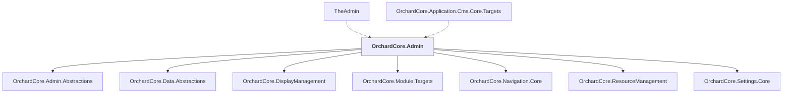

# OrchardCore.Admin

## Overview

| Property | Value |
|----------|-------|
| Category | Library |
| Repository | src |
| Path | `OrchardCore.Modules/OrchardCore.Admin/OrchardCore.Admin.csproj` |
| Project References | 7 |
| NuGet Dependencies | 0 |
| Consumers | 2 |

## Dependency Diagram

## Project References
- OrchardCore.Admin.Abstractions
- OrchardCore.Data.Abstractions
- OrchardCore.DisplayManagement
- OrchardCore.Module.Targets
- OrchardCore.Navigation.Core
- OrchardCore.ResourceManagement
- OrchardCore.Settings.Core

## Consumed By
- TheAdmin
- OrchardCore.Application.Cms.Core.Targets

---

*[Back to Index](../../index.md)*
