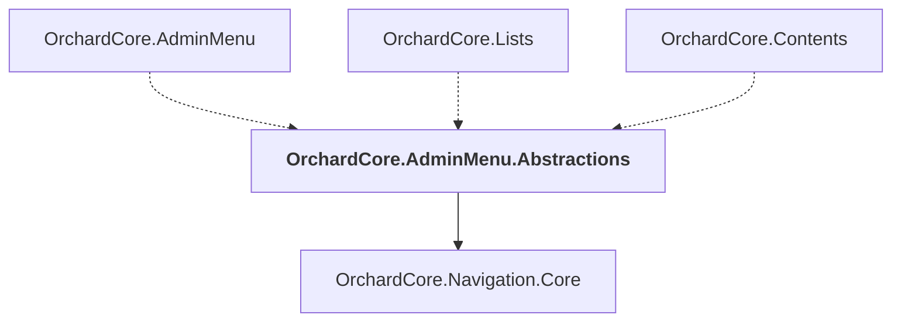

# OrchardCore.AdminMenu.Abstractions

## Overview

| Property | Value |
|----------|-------|
| Category | Library |
| Repository | src |
| Path | `OrchardCore/OrchardCore.AdminMenu.Abstractions/OrchardCore.AdminMenu.Abstractions.csproj` |
| Project References | 1 |
| NuGet Dependencies | 0 |
| Consumers | 3 |

## Dependency Diagram

## Project References
- OrchardCore.Navigation.Core

## Consumed By
- OrchardCore.AdminMenu
- OrchardCore.Lists
- OrchardCore.Contents

---

*[Back to Index](../../index.md)*
