# OrchardCore.Alias

## Overview

| Property | Value |
|----------|-------|
| Category | Library |
| Repository | src |
| Path | `OrchardCore.Modules/OrchardCore.Alias/OrchardCore.Alias.csproj` |
| Project References | 11 |
| NuGet Dependencies | 0 |
| Consumers | 1 |

## Dependency Diagram

```mermaid
graph TD
    OrchardCore_Alias["<strong>OrchardCore.Alias</strong>"]
    OrchardCore_Apis_GraphQL_Abstractions["OrchardCore.Apis.GraphQL.Abstractions"]
    OrchardCore_Alias --> OrchardCore_Apis_GraphQL_Abstractions
    OrchardCore_ContentLocalization_Abstractions["OrchardCore.ContentLocalization.Abstractions"]
    OrchardCore_Alias --> OrchardCore_ContentLocalization_Abstractions
    OrchardCore_ContentManagement_Abstractions["OrchardCore.ContentManagement.Abstractions"]
    OrchardCore_Alias --> OrchardCore_ContentManagement_Abstractions
    OrchardCore_ContentManagement_GraphQL["OrchardCore.ContentManagement.GraphQL"]
    OrchardCore_Alias --> OrchardCore_ContentManagement_GraphQL
    OrchardCore_ContentTypes_Abstractions["OrchardCore.ContentTypes.Abstractions"]
    OrchardCore_Alias --> OrchardCore_ContentTypes_Abstractions
    OrchardCore_Data_Abstractions["OrchardCore.Data.Abstractions"]
    OrchardCore_Alias --> OrchardCore_Data_Abstractions
    OrchardCore_DisplayManagement["OrchardCore.DisplayManagement"]
    OrchardCore_Alias --> OrchardCore_DisplayManagement
    OrchardCore_Indexing_Abstractions["OrchardCore.Indexing.Abstractions"]
    OrchardCore_Alias --> OrchardCore_Indexing_Abstractions
    OrchardCore_Liquid_Abstractions["OrchardCore.Liquid.Abstractions"]
    OrchardCore_Alias --> OrchardCore_Liquid_Abstractions
    OrchardCore_Module_Targets["OrchardCore.Module.Targets"]
    OrchardCore_Alias --> OrchardCore_Module_Targets
    OrchardCore_ResourceManagement["OrchardCore.ResourceManagement"]
    OrchardCore_Alias --> OrchardCore_ResourceManagement
    OrchardCore_Application_Cms_Core_Targets["OrchardCore.Application.Cms.Core.Targets"]
    OrchardCore_Application_Cms_Core_Targets -.-> OrchardCore_Alias
```

## Project References
- OrchardCore.Apis.GraphQL.Abstractions
- OrchardCore.ContentLocalization.Abstractions
- OrchardCore.ContentManagement.Abstractions
- OrchardCore.ContentManagement.GraphQL
- OrchardCore.ContentTypes.Abstractions
- OrchardCore.Data.Abstractions
- OrchardCore.DisplayManagement
- OrchardCore.Indexing.Abstractions
- OrchardCore.Liquid.Abstractions
- OrchardCore.Module.Targets
- OrchardCore.ResourceManagement

## Consumed By
- OrchardCore.Application.Cms.Core.Targets

---

*[Back to Index](../../index.md)*
